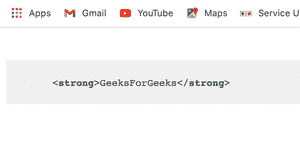

# 如何使用 Node.js 突出显示文件中的语法？

> 原文:[https://www . geesforgeks . org/how-highlight-in-files-in-syntax-use-node-js/](https://www.geeksforgeeks.org/how-to-highlight-syntax-in-files-using-node-js/)

[<u>Node.js</u>](https://www.geeksforgeeks.org/introduction-to-nodejs/) 支持可以使用[<u>【NPM】</u>](https://www.geeksforgeeks.org/node-js-npm-node-package-manager/)进行安装的模块和包，允许我们开发各种功能。一个这样的功能是使用 Node.js 的语法高亮显示，它帮助我们将高亮显示的代码呈现为静态 HTML，或者我们也可以将其用于动态语法高亮显示。以下方法介绍了如何使用 ***高亮显示. js*** 模块高亮显示 Node.js 中的语法文件。

**Highlight.js** 作为语法荧光笔，具有自动语言检测功能。它是用 JavaScript 编写的，在浏览器和服务器上都受支持。

**模块安装:**使用以下命令从您的终端使用 npm 安装 ***高亮. js*** 模块。

```js
npm install highlight.js
```

从 npm 安装后，我们可以在代码中使用该包，如下所示:

```js
const hljs = require('highlight.js');
```

**CDN 导入:**我们可以使用以下方式在 HTML 页面上导入模块。

> <link rel="”stylesheet”" href="”https://cdnjs.cloudflare.com/ajax/libs/highlight.js/10.7.1/styles/default.min.css”">

**示例:**我们在下面的示例中突出显示了 *GeeksForGeeks* 文本。我们使用[<u>【CDN】</u>](https://cdnjs.com/libraries/highlight.js)将*高光. js* 导入到我们的代码中，然后我们将所需的代码写入到 *< pre >* 标签中。

## 超文本标记语言

```js
<!DOCTYPE html>
<html lang="en" dir="ltr">

<head>
    <meta charset="utf-8">

    <!-- Using highlight.js through CDN link -->
    <link rel="stylesheet" href=
"https://cdnjs.cloudflare.com/ajax/libs/highlight.js/10.7.1/styles/default.min.css">

    <!-- Installing highlight.js through CDN -->
    <script src=
"https://cdnjs.cloudflare.com/ajax/libs/highlight.js/10.7.1/highlight.min.js">
    </script>
</head>

<body>
    <pre>

        <!-- Here we have used < and > 
        because using angle brackets will be
        interpreted as actual HTML code -->
        <code class="html">
            <strong>GeeksForGeeks</strong>
        </code>
    </pre>

    <script type="text/javascript">

        // Using highlightAll method to
        // highlight the code
        hljs.highlightAll();
    </script>
</body>

</html>
```

**输出:**



**参考文献:**T2】https://highlightjs.org/usage/