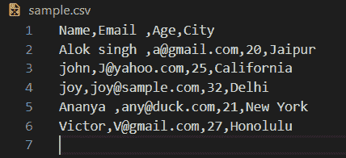
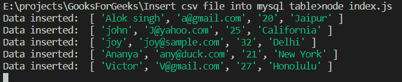

# 如何从导入数据。使用 Node.js 将 CSV 文件导入 MySQL 表？

> 原文:[https://www . geesforgeks . org/如何将数据从-CSV-file-导入到-MySQL-table-use-node-js/](https://www.geeksforgeeks.org/how-to-import-data-from-csv-file-into-mysql-table-using-node-js/)

**是什么。CSV 文件？**T2**。CSV** (逗号分隔值)文件是包含由逗号(，)分隔的数据列表的纯文本文件。它是一种最适合用于表格数据、行和列的格式，与电子表格完全一样，只是不同之处在于文件是纯文本形式。CSV 文件的思想是执行复杂数据从一个应用程序到另一个应用程序的导出和导入。

**注意:**这里，我们使用 sample.csv 来演示我们的程序和过程。在 sample.csv 中，我们存储了用户的姓名、年龄、电子邮件和城市。



样本 csv 中的数据

**使用 Node.js 将 CSV 导入 MySQL】**

1.  使用“***【NPM init】***创建一个 node.js 项目并保存您的。同一目录下的 csv 文件。
2.  Install two packages “mysql” and “csvtojson” using the following command:

    ```
    npm i mysql csvtojson
    ```

    [**mysql**](https://www.npmjs.com/package/mysql#introduction) ***驱动:*** 这是一个针对 mysql 的 node.js 驱动。它是用 JavaScript 编写的，不需要编译。我们正在使用它来建立与我们的 MYSQL 数据库的连接并执行查询。
    [**csvtojson:**](https://www.npmjs.com/package/csvtojson)它是一个将 csv 转换为 json 或列数组的 csv 解析器。

3.  现在只需创建一个类似 **index.js** 的文件，并写下以下代码:

```
// Importing mysql and csvtojson packages
// Requiring module
const csvtojson = require('csvtojson');
const mysql = require("mysql");

// Database credentials
const hostname = "localhost",
    username = "root",
    password = "root",
    databsename = "csvtomysql"

// Establish connection to the database
let con = mysql.createConnection({
    host: hostname,
    user: username,
    password: password,
    database: databsename,
});

con.connect((err) => {
    if (err) return console.error(
            'error: ' + err.message);

    con.query("DROP TABLE sample", 
        (err, drop) => {

        // Query to create table "sample"
        var createStatament = 
        "CREATE TABLE sample(Name char(50), " +
        "Email char(50), Age int, city char(30))"

        // Creating table "sample"
        con.query(createStatament, (err, drop) => {
            if (err)
                console.log("ERROR: ", err);
        });
    });
});

// CSV file name
const fileName = "sample.csv";

csvtojson().fromFile(fileName).then(source => {

    // Fetching the data from each row 
    // and inserting to the table "sample"
    for (var i = 0; i < source.length; i++) {
        var Name = source[i]["Name"],
            Email = source[i]["Email"],
            Age = source[i]["Age"],
            City = source[i]["City"]

        var insertStatement = 
        `INSERT INTO sample values(?, ?, ?, ?)`;
        var items = [Name, Email, Age, City];

        // Inserting data of current row
        // into database
        con.query(insertStatement, items, 
            (err, results, fields) => {
            if (err) {
                console.log(
    "Unable to insert item at row ", i + 1);
                return console.log(err);
            }
        });
    }
    console.log(
"All items stored into database successfully");
});
```

使用以下命令运行 **index.js** 文件:

```
node index.js
```

### 输出:



控制台中程序的输出


MYSQL 数据库中的示例表

**代码说明:**

*   在前两行代码中，我们导入了 *mysql* 和 *csvtojson* 。

    ```
    const csvtojson = require('csvtojson');
    const mysql = require("mysql")
    ```

*   **第 10-23 行**:我们创建了一个到数据库的连接。

    ```
    hostname = "localhost", 
    username = "root",         // Username of Mysql local server 
    password = "root",         // Password of Mysql local server
    databsename = "csvtomysql" // Database we are connecting to
    ```

*   **第 23–38 行:**我们已经连接到我们的数据库“ *csvtomysql* ，并根据我们的 sample.csv 文件创建了一个名为“sample”的表，其中包含所需的字段。
*   **第 42-64 行**:我们获取了位于当前目录下的 *sample.csv* ，并将所有数据转换为 JSON。
    *   在第 43 行， *sample.csv* 中的所有数据被转换为 JSON 并存储在变量“source”中
    *   然后我们循环遍历每一行，并从该行中提取姓名、电子邮件、年龄和城市值。
        *   在第 53 行，我们在姓名、电子邮件、年龄和城市中创建了一个值数组，即第一行的列数据。
        *   然后，我们使用查询“插入样本值(姓名、电子邮件、年龄、城市)”将该数据插入到表中
        *   在第 62 行，我们向控制台显示插入的数据。

因此，通过这种方式，我们可以将任何数据从. csv 文件导入到 MYSQL 数据库中。