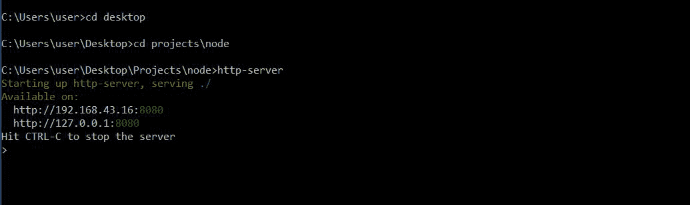

# 如何在 web 服务器上安装 Node.js？

> 原文:[https://www . geesforgeks . org/如何安装-node-js-on-a-webserver/](https://www.geeksforgeeks.org/how-to-install-node-js-on-a-webserver/)

为了访问任何 web 应用程序上的网页，我们需要一个 web 服务器来处理 web 应用程序的所有 HTTP 请求。Node.js 提供了创建我们自己的 web 服务器的功能，该服务器将异步处理 HTTP 请求。

下面是使用 NodeJS 在本地机器上安装一个简单的 HTTP web 服务器的步骤:

**第一步:下载并安装 Node.js:**使用此[链接](https://nodejs.org/en/)下载 Node . js 的最新版本，然后使用所有默认选项将其安装在本地机器上。

**步骤 2:从 npm 安装 http-server 包:**可以直接从命令提示符或命令行窗口运行 Node.js 应用程序。现在，您需要安装 http-server 模块，它应该作为一个全局 npm 包安装。

打开命令提示符/命令行，输入以下命令:

```js
npm install -g http-server
```

**第三步:从包含静态网站文件的目录启动 web 服务器:**现在，安装完模块后，需要启动服务器。为此，您首先需要更改到包含静态 web 文件(HTML/CSS/JS 等)的目录。为此请使用 cd 命令。

在命令提示符/命令行中，输入以下命令:

```js
cd projects\node
```

现在，使用以下命令启动服务器:

```js
http-server
```

现在，您将在屏幕上看到以下输出:

 **第四步:用浏览器浏览本地网站:**打开任意浏览器，转到 *http://localhost:8080/* (执行上述命令后，我们得到的输出网址)。

现在我们可以看到我们的本地网站正在运行，这就是我们如何在网络服务器上安装 Node.js。