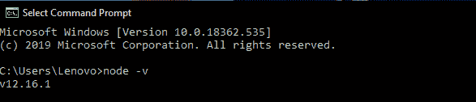
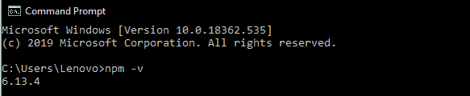
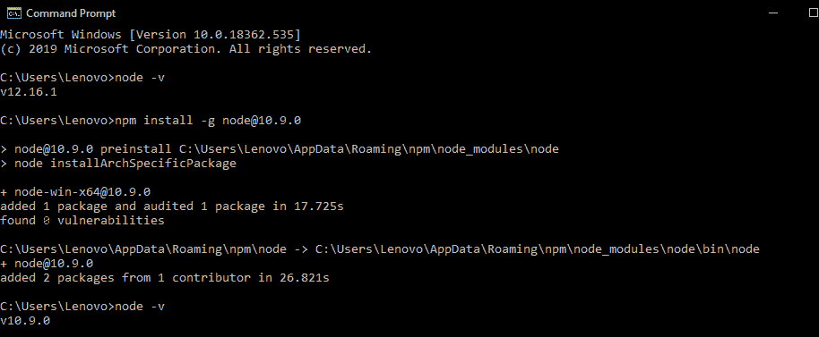
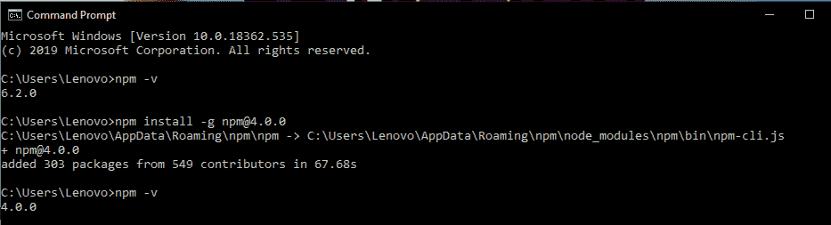

# 如何安装 node.js 和 npm 的旧版？

> 原文:[https://www . geesforgeks . org/如何安装以前版本的节点 js 和 npm/](https://www.geeksforgeeks.org/how-to-install-the-previous-version-of-node-js-and-npm/)

**[Node.js:](https://www.geeksforgeeks.org/installation-of-node-js-on-windows/)** 它是一个建立在谷歌 Chrome V8 JavaScript 引擎上的 JavaScript 运行时(服务器端)。它是由瑞安·达尔在 2009 年开发的。Node.js 使用一个事件驱动的、非阻塞的输入/输出模型，这使得它轻量级且高效。它非常适合数据密集型实时应用。Node 就像是 V8 的包装器，内置模块提供了许多在异步 API 中易于使用的特性。

**[NPM:](https://www.geeksforgeeks.org/node-js-npm-node-package-manager/)**NPM(Node Package Manager)为 Node.js 安装并管理包的版本和依赖关系，NPM 随 Node 一起安装。NPM 的目标是自动化的依赖和包管理，任何时候或任何人需要开始这个项目，他们可以简单地安装 NPM 和所有的依赖，他们将立即拥有。可以指定项目所依赖的版本，以避免项目因更新而中断。

**安装以前版本的 Node.js 和 NPM:** 要从最新版本安装以前的版本，应该在你的电脑上安装最新版本的 Node.js，或者你可以从 Node.js 的官方网站安装。

**步骤 1:** 分别使用以下命令检查计算机上已安装的 Node 和 NPM 版本

*   **In windows:**

    ```js
    node -v
    ```

    

    ```js
    npm -v
    ```

    

*   **在 linux 中:**

    ```js
    node --version
    ```

    ```js
    npm --version
    ```

**步骤 2:** 要安装早期版本的节点，请使用以下命令:

*   **In windows:**

    ```js
    npm install -g node@version
    ```

    **示例:**

    ```js
    npm install -g node@10.9.0 
    ```

    

*   **In linux:**

    ```js
    sudo  apt-get install nodejs=version-1chl1~precise1
    ```

    **示例:**

    ```js
    sudo  apt-get install nodejs=10.9.0-1chl1~precise1
    ```

**步骤 3:** 要安装 NPM 的早期版本，请使用以下命令:

*   **In windows:**

    ```js
    npm install -g npm@version 
    ```

    **示例:**

    ```js
    npm install -g npm@4.0.0
    ```

    

*   **In linux:**

    ```js
    sudo  apt-get install npm=version-1chl1~precise1
    ```

    **示例:**

    ```js
    sudo  apt-get install npm=4.0.0-1chl1~precise1
    ```