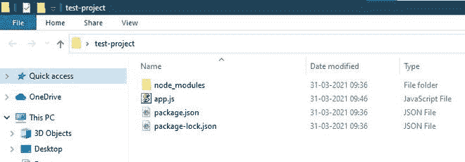
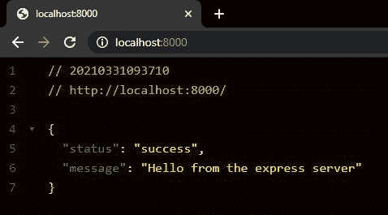
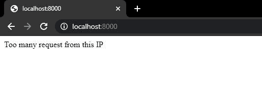
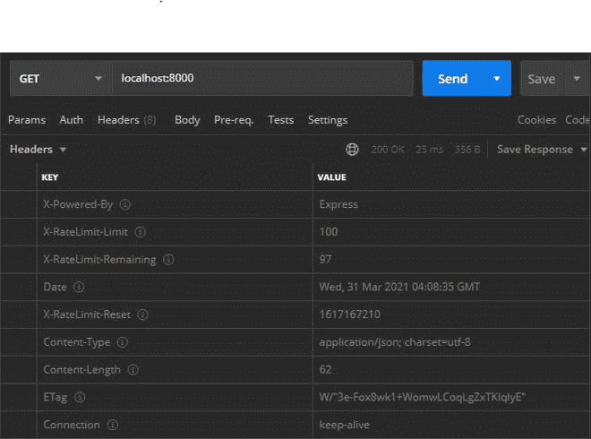

# 如何在 Node.js 中整合快递限速？

> 原文:[https://www . geesforgeks . org/如何集成-快速-节点内速率限制-js/](https://www.geeksforgeeks.org/how-to-integrate-express-rate-limit-in-node-js/)

速率限制防止同一个 IP 发出太多请求，这将有助于我们防止暴力攻击。**是限制用户请求的 npm 包。**

****项目设置:**运行以下几组命令创建一个文件夹并初始化项目。**

```
mkdir test-project
cd test-project
npm init -y
```

****模块安装:**运行以下命令安装快速和快速费率限制模块:**

```
npm i express express-rate-limit
```

****项目目录:**项目结构会是这样的:**

****

## **app.js**

```
// Express is node framework that helps 
// in setting up the server and routing.
const express = require("express");

// The express-rate-limit is for 
// limiting the incoming request.
const rateLimit = require("express-rate-limit");

// App variable store the express module.
const app = express();

// Creating a limiter by calling rateLimit function with options:
// max contains the maximum number of request and windowMs 
// contains the time in millisecond so only max amount of 
// request can be made in windowMS time.
const limiter = rateLimit({
    max: 100,
    windowMs: 60 * 60 * 1000,
    message: "Too many request from this IP"
});

// Add the limiter function to the express middleware
// so that every request coming from user passes 
// through this middleware.
app.use(limiter);

// GET route to handle the request coming from user
app.get("/", (req, res) => {
    res.status(200).json({
        status: "success",
        message: "Hello from the express server"
    });
});

// Server Setup
const port = 8000;
app.listen(port, () => {
    console.log(`app is running on port ${port}`);
});
```

**使用以下命令运行 **app.js** 文件:**

```
node app.js
```

****输出:**我们将在终端屏幕上看到以下输出。**

```
app is running on http://localhost:8000/
```

*   **当请求没有超过速率限制器的最大限制时输出:**

    ****

*   **当请求超过速率限制器的最大限制时输出:**

    ****

**响应对象的标题有两个字段 *X-RateLimit-Limit* 和 *X-RateLimit-Remaining* ，存储用户的最大和剩余请求:**

****