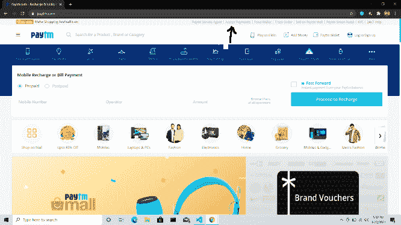
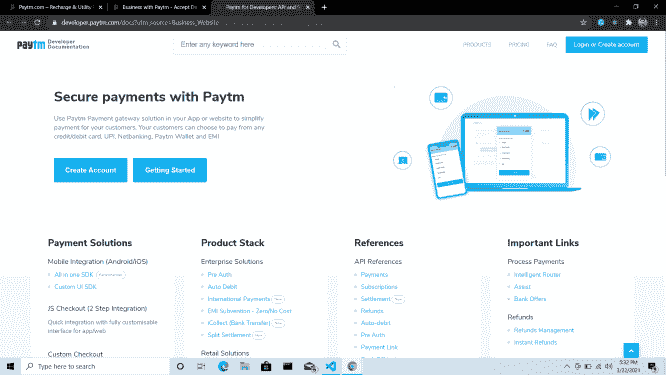
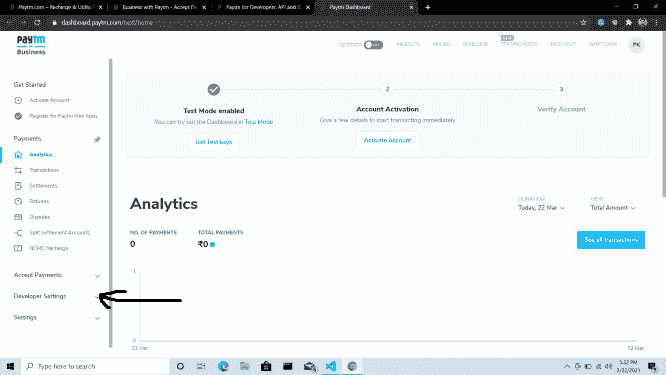
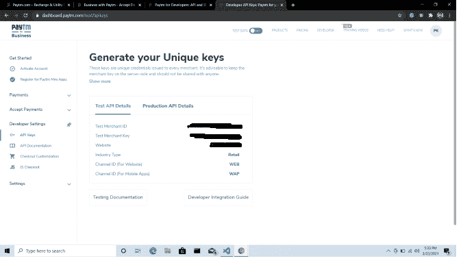
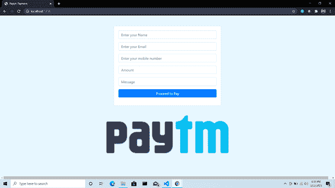
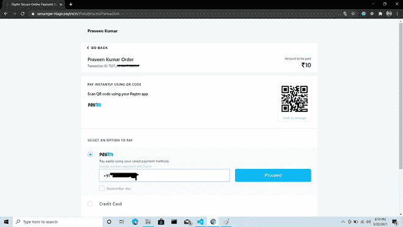
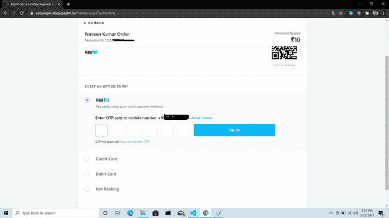
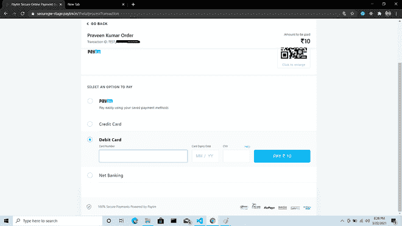

# 如何在 Node.js 中集成 Paytm 测试 API？

> 原文:[https://www . geesforgeks . org/如何集成-paytm-test-api-in-node-js/](https://www.geeksforgeeks.org/how-to-integrate-paytm-test-api-in-node-js/)

**Paytm** 代表移动支付用于**线上交易**。我们可以使用 **Paytm 开发者 API** 将其与我们的 node.js 应用程序集成。

该 **API** 可用于测试，也可用于开发目的。有两种方法可以做到这一点:**测试原料药**和**生产原料药。**只有当**商家**账户链接到银行账户时，生产应用编程接口才会工作。在本文中，我们将使用**测试应用编程接口来实现。**

#### 设置环境:

**初始化 NPM 包:**

```
npm init -y
```

**安装依赖项:**

```
npm install express ejs
```

## app.js

```
const express= require('express');
var app= express();
var bodyParser= require('body-parser');
const ejs= require('ejs');

app.use(express.static(__dirname + '/views'));
app.engine('html', require('ejs').renderFile);
app.set("view engine", "html"); 
app.set("views", __dirname + "/views"); 
app.use(bodyParser.urlencoded({extended:true}));
app.use(bodyParser.json());

app.use('/', require('./routes/server'));

let port = process.env.PORT || 1234;

app.listen(port,()=>{
    console.log("Server is started");
});
```

*   在/routes/server.js 文件中创建路由:
*   在/view 文件夹中创建视图
*   连接 app.js 文件中的视图

```
app.use('/', require('./routes/server'));
```

*   若要整合 Paytm，请以网页模式前往 paytm.com，然后单击“**接受付款**”:



*   选择“**开发者”**选项:


*   **使用您的 Paytm 帐户登录/注册**:



*   登录后将显示**开发者仪表盘**。之后，**点击开发者设置:**



*   在 node.js 应用程序中使用您的**商家标识、商家密钥**。
    *   有两种方法可以做到这一点:
        *   **测试 API** :测试模式。
        *   **生产 API** :处于生产模式。*只有当* *商户账户链接到其银行账户时，生产模式才有效。*



*   创建应用程序后，运行服务器并输入详细信息，如*姓名、电子邮件、手机、金额等。*



*   下一步，点击继续支付，您将在您的**手机号码**上收到一个**动态口令**。进入 **OTP** 流程，交易就完成了

 

*   我们也可以使用信用卡、借记卡和网上银行支付。



*   用您的 mid 和钥匙将 **config.js** 文件放入 **/routes/Paytm/** 文件夹中。

**文件名:config.js**

## java 描述语言

```
var PaytmConfig = {
    mid: "YOUR MERCHANT ID",
    key: "YOUR MERCHANT KEY",
    website: "WEBSTAGING",
  };
  module.exports.PaytmConfig = PaytmConfig;
```

**完整代码可在**上获得