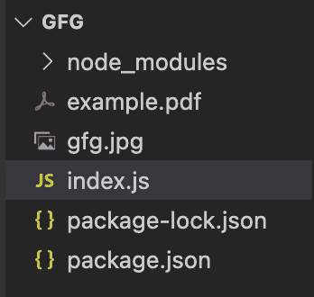
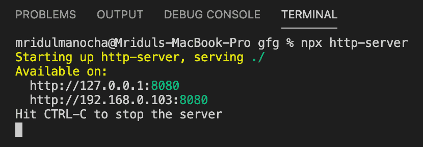
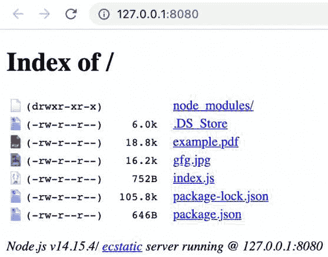
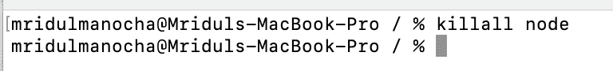

# 如何通过命令行杀死 Node.js 进程的所有实例？

> 原文:[https://www . geesforgeks . org/如何通过命令行杀死节点-js-process 的所有实例/](https://www.geeksforgeeks.org/how-to-kill-all-instances-of-a-node-js-process-via-command-line/)

Node.js 是一个开源的跨平台运行时环境，用于在浏览器之外执行 JavaScript 代码。它被广泛用于从小公司到大公司开发 API 和微服务。

**为什么我们需要杀死所有的实例？**

有时，节点可能会有一些问题，比如服务器正在侦听其他端口，或者可能有一些服务您想要运行，但是它会显示一个错误，比如服务已经在运行或者进程已经在运行。那时，您需要杀死 NodeJS 服务器的所有实例。这个方法将帮助您杀死 NodeJS 中的所有实例。

**命令/CMD:** 通过命令行杀死 NodeJS 进程的所有实例。

```
killall node
```

**示例:**打开我们要启动服务器的文件夹。



启动服务器并获取相同的列表。

```
npx http-server
```



**运行过程:**我们可以看到这个网络服务器运行在第一个网址的节点上。



现在让我们使用命令提示符下的终止命令来查看结果。



这是一条成功消息，表明流程已终止。

让我们再次打开网络服务器。现在我们可以在同一个网址看到，由于上面的命令已经杀死了所有的节点实例，所以进程现在没有运行。


所以在同一个本地地址上有一个错误。通过在 CMD 中使用上述命令，我们可以终止或终止 NodeJS 进程运行的所有实例。