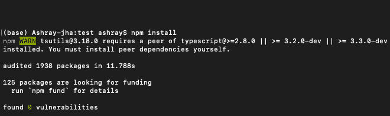
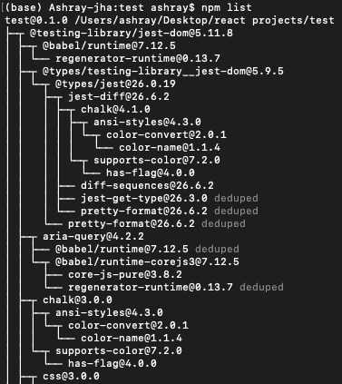
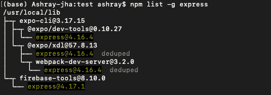

# 如何在 Node.js 中列出 npm 用户安装的包？

> 原文:[https://www . geesforgeks . org/how-to-list-NPM-user-installed-packages-in-node-js/](https://www.geeksforgeeks.org/how-to-list-npm-user-installed-packages-in-node-js/)

**什么是 Node.js？**

Node.js 是一个开源的跨平台运行时环境，用于在浏览器之外执行 JavaScript 代码。点击此处了解更多。

**什么是 npm？**

在这里，“ **npm** ”代表“**节点包管理器**”，它是 Node.js 的包管理器，作为与 npm 交互的命令行工具，将不同的在线包和依赖项安装到项目或本地环境中。

要使用 npm 运行命令，必须检查 Node.js 是否安装在本地机器上。如果不是真的，那么请从这里安装最新版本的 node . js:-https://nodejs.org/en/download/.

之后，打开一个终端，并按照一步一步的程序。

使用以下命令将当前目录更改为工作目录后，首先在项目中全局或本地安装 npm:

> npm 安装-g NPM//适用于全球
> 
> 或者
> 
> npm 安装//适用于本地

示例输出:



现在，检查 npm 用户安装的软件包列表。我们必须在安装 npm 的当前工作目录中使用“npm-list”命令。每个安装的软件包都将安装在树状结构中。

```js
$ npm list
```

要放弃依赖项列表，请使用: **$ npm 列表-g–深度= 0**

示例输出:



要检查是否全局安装了特定的包，请执行: **npm 列表-g[包名]**

示例输出:

