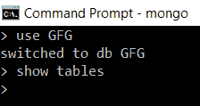
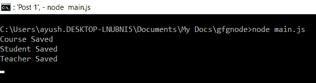
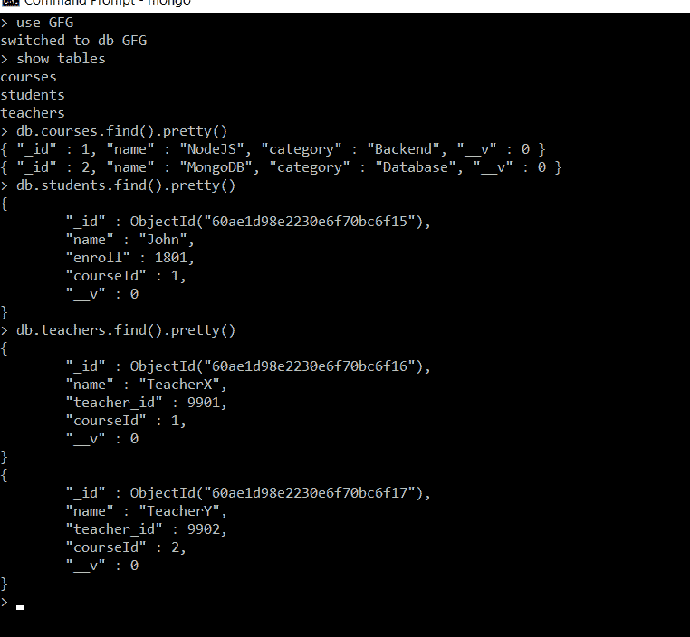

# 如何用 Node.js 制作 Mongoose 多个集合？

> 原文:[https://www . geesforgeks . org/how-make-mongose-multi-collections-use-node-js/](https://www.geeksforgeeks.org/how-to-make-mongoose-multiple-collections-using-node-js/)

**mongose**是 MongoDB 的对象数据建模(ODM)库。它定义了一个强类型模式，带有默认值和模式验证，这些值和验证稍后会映射到 MongoDB 文档。

要用 Mongoose 创建一个集合，您必须创建两个必要的东西:

1.  **Schema:** 它是一个包含属性及其类型(默认值、验证等)的文档结构。当需要时)作为键值对。
2.  **模型:**它是一个借助已定义的 Schema 创建的类，MongoDB 文档是模型的一个实例。因此，它充当 MongoDB 数据库的接口，用于创建、读取、更新和删除文档。

**安装猫鼬:**

**第一步:**可以访问[安装猫鼬](https://www.npmjs.com/package/mongoose)链接安装猫鼬模块。您可以使用此命令安装此软件包。

```js
npm install mongoose
```

**步骤 2:** 现在，您可以使用以下命令导入文件中的猫鼬模块:

```js
const mongoose = require('mongoose');
```

**实施:**

**第一步:**创建一个文件夹，将 *model.js* 和 *main.js* 文件添加到其中。

*   **model.js:** 它包含所有您想要创建的集合的*模式*和*模型*，然后我们导出所有创建的模型，以便它们可以导入到我们将在其中创建集合的文件中。
*   **main.js:** 这里是主服务器文件，我们已经将数据插入到一个集合中。

**第二步:**在 *model.js* 文件中写下以下代码。

## model.js

```js
// Requiring module
const mongoose = require('mongoose');

// Course Modal Schema
const courseSchema = new mongoose.Schema({
    _id: Number,
    name: String,
    category: String
});

// Student Modal Schema
const studentSchema = new mongoose.Schema({
    name: String,
    enroll: Number,
    courseId: Number
});

// Teacher Modal Schema
const teacherSchema = new mongoose.Schema({
    name: String,
    teacher_id: Number,
    courseId: Number
})

// Creating model objects
const Course = mongoose.model('course', courseSchema);
const Student = mongoose.model('student', studentSchema);
const Teacher = mongoose.model('teacher', teacherSchema);

// Exporting our model objects
module.exports = {
    Student, Course, Teacher
}
```

**步骤 3:** 使用猫鼬可以轻松建立数据库连接，例如:

```js
mongoose.connect('mongodb://localhost:27017/GFG',
{  
   useNewUrlParser: true,  
   useUnifiedTopology: true,  
   useFindAndModify: false
});
```

如果 GFG 数据库已经存在，将建立连接，否则将创建第一个数据库并建立连接。这里，我们最初有一个空的 GFG 数据库，如下图所示:



最初数据库是空的

创建你想要插入的数据对象，对于所有的集合然后插入如 **main.js** 所示的文件。一旦我们插入数据，我们的集合就会自动创建。

**第四步:**在 *main.js* 文件中写下以下代码。

## main.js

```js
const mongoose = require('mongoose');
const { Student, Course, Teacher } = require('./model.js');

// Connecting to database
mongoose.connect('mongodb://localhost:27017/GFG',
    {
        useNewUrlParser: true,
        useUnifiedTopology: true,
        useFindAndModify: false
    });

// Creating array of course data object
const courseData = [{
    _id: 01,
    name: "NodeJS",
    category: "Backend"
},
{
    _id: 02,
    name: "MongoDB",
    category: "Database"
}]

// Creating array of student data objects
const studentData = [{
    name: "John",
    enroll: 1801,
    courseId: 01
}]

// Creating array of teacher data object
const teacherData = [{
    name: "TeacherX",
    teacher_id: 9901,
    courseId: 01
},
{
    name: "TeacherY",
    teacher_id: 9902,
    courseId: 02
}]

// Inserting course data
Course.insertMany(courseData)
    .then(value => {
        console.log("Saved Successfully");
    })
    .catch(error => {
        console.log(error);
    })

// Inserting student data
Student.insertMany(studentData)
    .then(value => {
        console.log("Saved Successfully");
    })
    .catch(error => {
        console.log(error);
    })

// Inserting teacher data
Teacher.insertMany(teacherData)
    .then(value => {
        console.log("Saved Successfully");
    })
    .catch(error => {
        console.log(error);
    })
```

**步骤 5:** 使用以下命令运行 **main.js** 文件:

```js
node main.js
```

**输出:**我们可以在控制台看到所有的数据都保存成功。



执行 main.js 后的输出

**数据库:**现在我们可以看到三个集合*课程、学生、老师*都是在我们的数据库 GFG 中创建的。



创建多个集合后的数据库