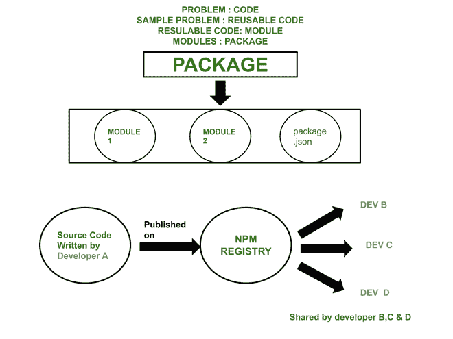
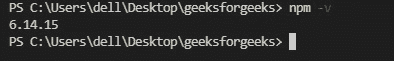
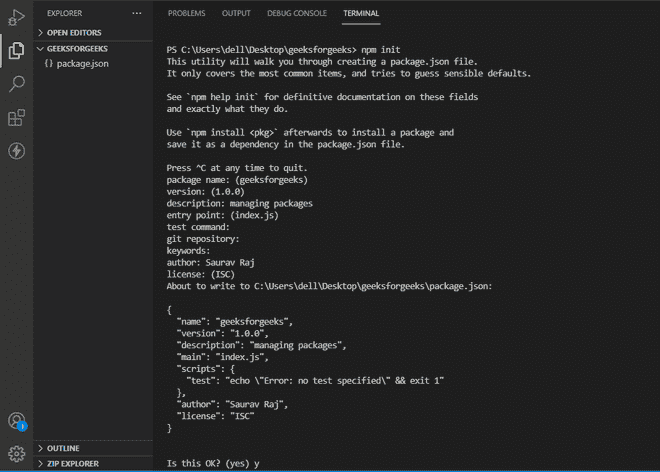
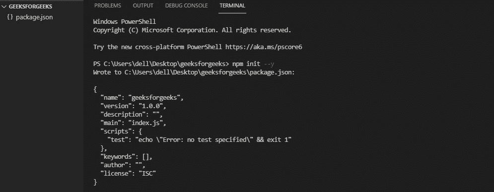
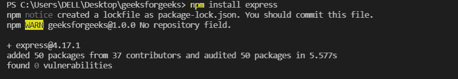
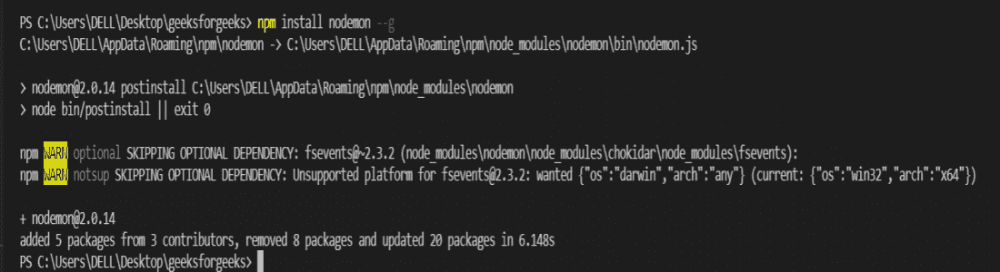
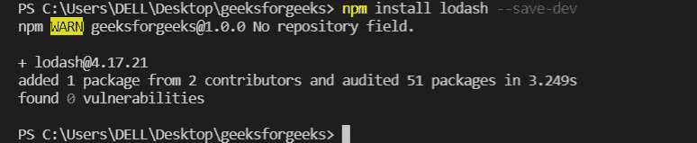
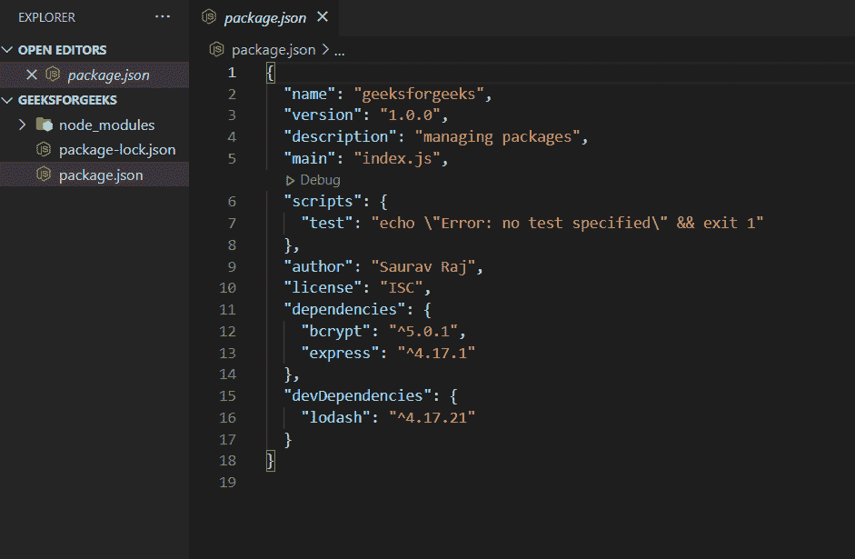
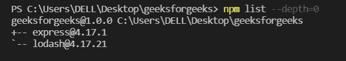
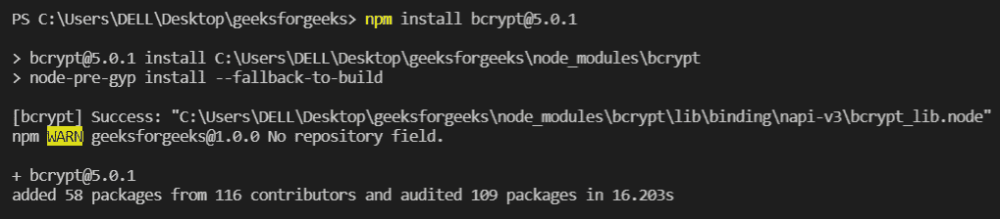

# 如何管理 Node.js 项目中的包？

> 原文:[https://www . geesforgeks . org/如何管理节点中的包-js-project/](https://www.geeksforgeeks.org/how-to-manage-the-packages-in-node-js-project/)

[**Node.js**](https://www.geeksforgeeks.org/introduction-to-nodejs/) 是一个开源、跨平台、后端的 JavaScript 运行时环境，构建在 V8 引擎之上，在浏览器之外执行 JavaScript 代码。在 Node.js 中处理项目时，您可以编写代码来实现特定的功能或解决特定的问题。有些代码可以在类似的情况下重用。

**模块**是由 Javascript 函数和对象组成的可重用代码块，它们基于功能与外部应用程序通信。一个**包**经常和模块混淆，但它只是一个模块(库)的集合。假设你正在尝试设计一辆汽车。你可以试着自己制造汽车的每一个零件，从开采金属到熔化铸件以及所有其他过程。然而，这将花费你大量的时间并且相当昂贵。相反，我们将购买预制零件，并将它们组装成一辆工作车。同样，您可以根据自己的需求，在项目中集成来自另一个开发人员的可重用代码。让我们看看如何使用另一个开发人员创建的包并管理它们。一切从 **NPM** 开始。

NPM 代表节点包管理器。它是 Node JavaScript 平台的包管理器，由一个名为 npm 注册表的在线包数据库组成，允许世界各地的开源开发者发布和共享他们的代码。

NPM 有三个基本组成部分:

*   你可以在**网站**上找到第三方发来的包裹，设置档案，管理。
*   **NPM 命令行界面**是一个命令行界面，允许您从终端与 NPM 进行交互。
*   **注册表**–Javascript 代码共享的中心。



**npm 包**

*开发者 **A** 可以在 **NPM 注册表**上共享代码，开发者 **B** 、 **C** 和 **D** 可以通过安装合适的包来重用代码。*

1.现在，您可以依赖其他人编写的预构建代码。为此，您必须在设备上安装 NPM。NPM 包捆绑了 node . js**要集成 NPM，请下载 Node.js** 。一旦下载了 Node.js 运行时环境，您就可以前往终端了。

检查您系统上的当前 NPM 版本。

```js
npm -v
```



**NPM 的安装版本为 6.14.15**

2.通过使用 npm，您可以从注册表安装新的软件包。您的项目可能需要多个包。在我们的根项目中，我们有一个 ***package.json*** 文件来跟踪所有安装的包。 *package.json* 包含与项目相关的重要元数据，还定义了 npm 用来安装依赖项、运行脚本和识别我们包的入口点的项目的功能属性。

要创建 package.json 文件，请转到项目的根目录并执行以下命令:

```js
npm init
```

当您运行 npm init 命令时，系统会提示您输入有关项目的信息，例如:

*   包名
*   版本
*   测试命令
*   Git 存储库
*   关键词
*   作者
*   许可证



**运行命令并输入项目的所有信息后**

您可以通过运行以下命令来使用默认值:

```js
npm init --y
```



**通过运行上述命令，可以跳过输入信息。**

稍后，您可以修改 package.json 中的默认值。

3.现在让我们集成一些包。您可以在本地和全局系统上安装 npm 包。

**本地:**通过运行以下命令，将包安装到只能从该文件夹访问的项目文件夹中:

```js
npm install <package_name>
```

```js
*for exampl*e : npm install express
```



**安装快递框架**

*Express 是一个 node.js 框架，为 web 应用*提供服务器端逻辑。

**全局:**包功能可以从任意目录访问。要全局安装软件包，请运行以下命令。

```js
npm install <package_name> --g
```

```js
*for example :* npm install nodemon --g
```



**全局安装 nodemon 包**

*nodemon 在文件中检测到更改时自动重新启动 node.js 应用程序。*

4.在某些情况下，您可能希望安装一个仅在开发环境中运行的包。为此，运行以下命令。

```js
npm install <package_name> --save-dev
```

```js
*for example*: npm install lodash --save-dev
```



**安装吸泥**

*lodash 是一个 Javascript 库，它为编程提供了实用函数，使编程变得更加容易和高效。*除了元数据，package.json 文件还包含**依赖项**，它们是安装在应用程序中的包。**这是你的项目所依赖的一套功能**。安装一个包后，会注意到已经创建了一个 ***包-lock.json*** 文件和 ***节点*** _ ***模块*** 文件夹。



**创建 node_modules 文件夹和包-lock.json 文件。**

5.NPM 将所有包存储在 ***节点 _ 模块*** 文件夹中。除了您安装的软件包，您还可以看到许多其他文件。安装使用他人代码的包会使您的项目依赖于该包。这些包又使用其他包的代码。这些是您的包所依赖的文件夹。因此，node_modules 文件夹被认为是宇宙中密度最大的对象。

要将所有已安装的软件包视为依赖关系树，请运行 ***npm 列表*** 。

```js
npm list
```


**npm 列表将已安装的软件包显示为依赖关系树。**

6.要查看已安装的软件包，请运行以下命令:

```js
npm list --depth=0
```



**快线和 lodash 安装完毕。**

要理解 package-lock.json 文件，首先让我们看看 npm 是如何使用**语义版本**的。每次安装软件包时，您都会获得最新的公开版本。在 package.json 的 dependencies 部分，您会发现每个包都是作为 key: value 对(“package”:* 1 . 0 . 0”)安装的，包名后跟版本号。包由不同的作者创建，并且相互依赖。但是，它们是独立更新的，这可能会导致冲突和错误。因此，NPM 软件包遵循语义版本化，这是一个软件版本编号系统，每个编号包含三个数字，用点分隔，表示主要、次要和补丁版本。

在**主版本**中，您进行了主要的和不兼容的 API 更改。在**小版本**中，您以向后兼容的方式添加功能，而**补丁版本**包括所有的错误修复。默认情况下，包版本以 **^(插入符号)字符**作为前缀，该字符指示 NPM 如何处理下一个包更新。它将允许补丁和小版本更新。

要安装特定版本的软件包，请运行:

```js
npm install [package-name]@[version-number]
```

```js
*for example* : npm install brcypt@5.0.1
```



**安装 brcypt(加密用 npm 包)5.0.1 版**