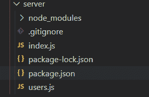
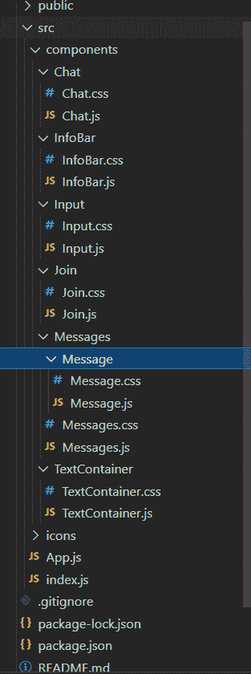

# 如何在 Node.js 中管理 socket.io 中的用户？

> 原文:[https://www . geesforgeks . org/如何管理节点中的套接字用户-io-js/](https://www.geeksforgeeks.org/how-to-manage-users-in-socket-io-in-node-js/)

插座。IO 是一个库，支持浏览器和服务器之间的实时、双向和基于事件的通信。

**方法:**首先，需要注意的是，当一个新的套接字被创建时，它会被分配一个唯一的 id，这个 id 是通过调用 socket.id 来检索的。这个 Id 可以存储在一个用户对象中，我们可以分配一个标识符，比如用户名。对于前端，我们将使用 React，对于后端 node.js 和 express。在主目录名服务器(后端)和客户端(前端)中创建两个文件夹。Socket.on 将是一个在任何需要的时候都会被调用的事件，这个事件由 socket.emit 调用，在这里我们调用这个事件，如果需要的话传递参数。

**首先我们将创建应用程序的后端部分:**

**步骤 1:** 为后端安装依赖项

```
npm init
npm install cors
npm install express
npm install nodemon
npm install socket.io
npm install http
```

**项目结构:**如下图。



**第二步:**创建 **Index.js.** Socket.on 用于加入每当用户要加入时前端都会发出加入事件，后端会发出消息事件并发送用户已经加入的消息。

index.js 内部使用了三种方法:

*   **连接:**每当用户将从主页加入房间时，连接事件将被触发，房间中的每个人都将获得该用户已经加入的消息，并且该用户被添加到该房间数据中。
*   **sendMessage:** 现在，当任何一个用户通过聊天中的输入发送消息时，sendMessage 事件将被触发，消息将被添加到带有用户名的消息数组中。
*   **断开连接:**当用户离开聊天时，断开连接事件将被触发，用户将从该房间的用户列表中移除，并且将发送用户已经离开聊天的消息。

**文件名:index.js**

## java 描述语言

```
const express = require('express');
const socketio = require('socket.io');
const http = require('http');
const cors = require('cors');
const { addUser, removeUser, getUser,
        getUsersInRoom } = require("./users");

const app = express();
const server = http.createServer(app);
const io = socketio(server);
app.use(cors())

io.on("connection", (socket) => {
    socket.on('join', ({ name, room }, callback) => {

        const { error, user } = addUser(
            { id: socket.id, name, room });

        if (error) return callback(error);

        // Emit will send message to the user
        // who had joined
        socket.emit('message', { user: 'admin', text:
            `${user.name},
            welcome to room ${user.room}.` });

        // Broadcast will send message to everyone
        // in the room except the joined user
        socket.broadcast.to(user.room)
            .emit('message', { user: "admin",
            text: `${user.name}, has joined` });

        socket.join(user.room);

        io.to(user.room).emit('roomData', {
            room: user.room,
            users: getUsersInRoom(user.room)
        });
        callback();
    })

    socket.on('sendMessage', (message, callback) => {

        const user = getUser(socket.id);
        io.to(user.room).emit('message',
            { user: user.name, text: message });

        io.to(user.room).emit('roomData', {
            room: user.room,
            users: getUsersInRoom(user.room)
        });
        callback();
    })

    socket.on('disconnect', () => {
        const user = removeUser(socket.id);
        if (user) {
            io.to(user.room).emit('message',
            { user: 'admin', text:
            `${user.name} had left` });
        }
    })

})

server.listen(process.env.PORT || 5000,
    () => console.log(`Server has started.`));
```

**步骤 3:** 创建一个 User.js 文件，该文件包含以下功能。

这些是存储用户、获取用户、删除用户的功能，用在 index.js 文件中。

*   **添加用户:**每当建立连接或新用户加入，并且用户名存储在该房间的数组中，并且如果用户名已经被该房间内的任何用户使用，则该用户将无法进入聊天。
*   **removeUser:** 每当连接被破坏或用户离开，用户名从该房间的数组中删除时，都会调用该函数。
*   **getUser:** 该函数以 id 为参数，通过从数组中查找返回用户名。
*   **getUsersInRoom:** 该功能将返回房间内所有用户的姓名，在聊天中显示。

**文件名:User.js**

## java 描述语言

```
const users = [];

const addUser = ({id, name, room}) => {
    name = name.trim().toLowerCase();
    room = room.trim().toLowerCase();

    const existingUser = users.find((user) => {
        user.room === room && user.name === name
    });

    if(existingUser) {
        return{error: "Username is taken"};
    }
    const user = {id,name,room};

    users.push(user);
    return {user};

}

const removeUser = (id) => {
    const index = users.findIndex((user) => {
        user.id === id
    });

    if(index !== -1) {
        return users.splice(index,1)[0];
    }
}

const getUser = (id) => users
        .find((user) => user.id === id);

const getUsersInRoom = (room) => users
        .filter((user) => user.room === room);

module.exports = {addUser, removeUser,
        getUser, getUsersInRoom};
```

**现在我们将处理应用程序的前端部分:**

**步骤 1:** 安装前端反应。

```
npx create react-app "client" 
```

**步骤 2:** 反应安装后，在客户端文件夹中安装项目的依赖项。

```
  npm install query-string;
  npm install react-emoji;
  npm install react-router;
  npm install socket.io-client;
```

**项目结构:**如下图。



**第三步:**在 App.js 内部，为页面加入页面和聊天页面创建路由，并导入两个页面的组件以在该路由上显示。

**文件名:App.js**

## java 描述语言

```
import React from 'react';

import Chat from './components/Chat/Chat';
import Join from './components/Join/Join';

import { BrowserRouter as Router, Route }
        from "react-router-dom";

const App = () => {
  return (
    <Router>
      <Route path="/" exact component={Join} />
      <Route path="/chat" component={Chat} />
    </Router>
  );
}

export default App;
```

**步骤 4:** 在**内部，socket.emit 调用 join 和其他事件，socket.on 创建从后端调用的事件，比如存储消息、用户数据。这是主要组件，将通过发送参数(如用户名、聊天中显示的消息)来调用所有其他组件。每当用户访问此页面时，都会从后端调用 join 事件。每当消息或用户数据发生变化时，即如果任何用户加入或离开或任何用户发布消息，将调用一个消息事件，并在 useeffect 内部调用 roomdata 事件，以显示用户进入或离开的消息，并将其存储在消息数组中。信息栏将显示房间的名称。文本容器将显示房间中所有用户的姓名。消息将显示聊天中的所有消息。Input 将接受输入，将其存储在数组中，并激发 sendmessage 事件以用户名发送消息。**

**档案名称:Chat.js**

## java 描述语言

```
import React, {useState, useEffect} from "react";
import queryString from "query-string";
import io from 'socket.io-client';
import TextContainer from '../TextContainer/TextContainer';
import Messages from '../Messages/Messages';
import InfoBar from '../InfoBar/InfoBar';
import Input from '../Input/Input';

 import "./Chat.css";

var connectionOptions =  {
    "force new connection" : true,
    "reconnectionAttempts": "Infinity",
    "timeout" : 10000,                 
    "transports" : ["websocket"]
};

var socket = io.connect('https://localhost:5000',connectionOptions);

const Chat = ({location}) => {

    const [name, setName] = useState('');
    const [room, setRoom] = useState("");
    const [users, setUsers] = useState('');
    const [message, setMessage] = useState('');
    const [messages, setMessages] = useState([]);

    const ENDPOINT = 'localhost:5000';

    useEffect( () => {
        const {name, room} = queryString.parse(location.search);

        setName(name);
        setRoom(room);

        socket.emit('join',{name, room}, (error) => {
            if(error) {
                alert(error);
            }
        })
        return () => {
            socket.emit('disconnect');
            socket.off();
        }

    },[ENDPOINT, location.search]);

    useEffect( () =>  {
        socket.on('message', (message) => {
            setMessages([...messages,message]);
        })

        socket.on("roomData", ({ users }) => {
            setUsers(users);
        });
    },[messages, users])

    //Function for Sending Message
    const sendMessage = (e) => {
        e.preventDefault();
        if(message) {
            socket.emit('sendMessage', message, () => setMessage(''))
        }
    }

    console.log(message ,messages);

    return (
        <div className="outerContainer">
            <div className="container">

                <InfoBar room={room} />
                <Messages messages={messages} name={name} />
                <Input message={message} setMessage={setMessage}
                 sendMessage={sendMessage} />
            </div>
            <TextContainer users={users}/>
        </div>
    )
};

export default Chat;
```

**第五步:**创建 Chat.css 为 Chat.js 添加样式

**档案名称:Chat.css**

## 半铸钢ˌ钢性铸铁(Cast Semi-Steel)

```
.outerContainer {
    display: flex;
    justify-content: center;
    align-items: center;
    height: 100vh;
    background-color: #1A1A1D;
  }

  .container {
    display: flex;
    flex-direction: column;
    justify-content: space-between;
    background: #FFFFFF;
    border-radius: 8px;
    height: 60%;
    width: 35%;
  }

  @media (min-width: 320px) and (max-width: 480px) {
    .outerContainer {
      height: 100%;
    }

    .container {
      width: 100%;
      height: 100%;
    }
  }

  @media (min-width: 480px) and (max-width: 1200px) {
    .container {
      width: 60%;
    }
  }
```

**第六步:**在页面的页眉显示房间名称，我们从聊天组件中获取房间名称。

**档案名称:InfoPath . js**

## java 描述语言

```
import React from 'react';

import './InfoBar.css';

const InfoBar = ({ room }) => (
  <div className="infoBar">
    <div className="leftInnerContainer">
      <h3>{room}</h3>
    </div>
    <div className="rightInnerContainer">
      <a href="/">Leave</a>
    </div>
  </div>
);

export default InfoBar;
```

**第七步:**创建 Infobar.css 文件。

**档案名称:InfoPath . CSS**

## 半铸钢ˌ钢性铸铁(Cast Semi-Steel)

```
.infoBar {
    display: flex;
    align-items: center;
    justify-content: space-between;
    background: #2979FF;
    border-radius: 4px 4px 0 0;
    height: 60px;
    width: 100%;
  }

  .leftInnerContainer {
    flex: 0.5;
    display: flex;
    align-items: center;
    margin-left: 5%;
    color: white;
  }

  .rightInnerContainer {
    display: flex;
    flex: 0.5;
    justify-content: flex-end;
    margin-right: 5%;
  }

  .onlineIcon {
    margin-right: 5%;
  }
```

**第 8 步:**用户给出输入并发送消息，然后从消息数组的后端和数据存储中调用 sendmessage 事件。

**文件名:Input.js**

## java 描述语言

```
import React from 'react';

import './Input.css';

const Input = ({ setMessage, sendMessage, message }) => (
  <form className="form">
    <input
      className="input"
      type="text"
      placeholder="Type a message..."
      value={message}
      onChange={({ target: { value } }) => setMessage(value)}
      onKeyPress={event => event.key === 'Enter'
              ? sendMessage(event) : null}
    />
    <button className="sendButton"
        onClick={e => sendMessage(e)}>Send</button>
  </form>
)

export default Input;
```

**第九步:**创建 Input.css 文件。

**文件名:Input.css**

## 半铸钢ˌ钢性铸铁(Cast Semi-Steel)

```
.form {
    display: flex;
    border-top: 2px solid #D3D3D3;
  }

  .input {
    border: none;
    border-radius: 0;
    padding: 5%;
    width: 80%;
    font-size: 1.2em;
  }

  input:focus, textarea:focus, select:focus{
    outline: none;
  }

  .sendButton {
    color: #fff !important;
    text-transform: uppercase;
    text-decoration: none;
    background: #2979FF;
    padding: 20px;
    display: inline-block;
    border: none;
    width: 20%;
  }
```

**第 10 步:**从主页获取用户输入他们的姓名和要加入的房间，当用户加入时，将用户发送到聊天页面。

### 文件名:Join.js

## java 描述语言

```
import React, {useState} from "react";
import {Link} from 'react-router-dom';

import './Join.css';

const Join = () => {

    const [name, setName] = useState('');
    const [room, setRoom] = useState("");

    return (
        <div className="joinOuterContainer">
            <div className="joinInnerContainer">
                <h1 className="heading">Join</h1>
                <div>
                    <input placeholder="Name"
                        className="joinInput"
                        type="text"
                        onChange=
        {(event) => setName(event.target.value)} />
                </div>

                <div>
                    <input placeholder="Room"
                        className="joinInput mt-20"
                        type="text" onChange=
        {(event) => setRoom(event.target.value)} />
                </div>

                <Link onClick={e => (!name || !room) ?
                    e.preventDefault() : null}
                    to={`/chat?name=${name}&room=${room}`
                               }>
                    <button className={'button mt-20'}
                        type="submit">Sign In
                    </button>
                </Link>
            </div>
        </div>
    );
};

export default Join;
```

**第 11 步:**创建一个 Join.css 文件，为 Join.js 组件添加样式。

**文件名:Join.css**

## 半铸钢ˌ钢性铸铁(Cast Semi-Steel)

```
html, body {
    font-family: 'Roboto', sans-serif;
    padding: 0;
    margin: 0;
}

#root {
    height: 100vh;
}

* {
    box-sizing: border-box;
}

.joinOuterContainer {
    display: flex;
    justify-content: center;
    text-align: center;
    height: 100vh;
    align-items: center;
    background-color: #1A1A1D;
}

.joinInnerContainer {
    width: 20%;
}

.joinInput {
    border-radius: 0;
    padding: 15px 20px;
    width: 100%;
}

.heading {
    color: white;
    font-size: 2.5em;
    padding-bottom: 10px;
    border-bottom: 2px solid white;
}

.button {
    color: #fff !important;
    text-transform: uppercase;
    text-decoration: none;
    background: #2979FF;
    padding: 20px;
    border-radius: 5px;
    display: inline-block;
    border: none;
    width: 100%;
}

.mt-20 {
    margin-top: 20px;
}

@media (min-width: 320px) and (max-width: 480px) {
    .joinOuterContainer {
        height: 100%;
    }

    .joinInnerContainer {
        width: 90%;
    }
}

button:focus {
    outline: 0;
}
```

**第 12 步:**在聊天框中显示消息，如果消息来自当前用户，那么它将在右侧显示不同的背景颜色，否则它将在左侧显示不同的背景颜色。

**文件名:Message.js**

## java 描述语言

```
import React from 'react';

import './Message.css';

import ReactEmoji from 'react-emoji';

const Message = ({ message: { text, user }, name }) => {
  let isSentByCurrentUser = false;

  const trimmedName = name.trim().toLowerCase();

  if(user === trimmedName) {
    isSentByCurrentUser = true;
  }

  return (
    isSentByCurrentUser
      ? (
        <div className="messageContainer justifyEnd">
          <p className="sentText pr-10">{trimmedName}</p>

          <div className="messageBox backgroundBlue">
            <p className="messageText colorWhite">
              {ReactEmoji.emojify(text)}
            </p>

          </div>
        </div>
        )
        : (
          <div className="messageContainer justifyStart">
            <div className="messageBox backgroundLight">
              <p className="messageText colorDark">
                {ReactEmoji.emojify(text)}
              </p>

            </div>
            <p className="sentText pl-10 ">{user}</p>

          </div>
        )
  );
}

export default Message;
```

**步骤 13: Message.css**

## 半铸钢ˌ钢性铸铁(Cast Semi-Steel)

```
.messageBox {
    background: #F3F3F3;
    border-radius: 20px;
    padding: 5px 20px;
    color: white;
    display: inline-block;
    max-width: 80%;
  }

  .messageText {
    width: 100%;
    letter-spacing: 0;
    float: left;
    font-size: 1.1em;
    word-wrap: break-word;
  }

  .messageText img {
    vertical-align: middle;
  }

  .messageContainer {
    display: flex;
    justify-content: flex-end;
    padding: 0 5%;
    margin-top: 3px;
  }

  .sentText {
    display: flex;
    align-items: center;
    font-family: Helvetica;
    color: #828282;
    letter-spacing: 0.3px;
  }

  .pl-10 {
    padding-left: 10px;
  }

  .pr-10 {
    padding-right: 10px;
  }

  .justifyStart {
    justify-content: flex-start;
  }

  .justifyEnd {
    justify-content: flex-end;
  }

  .colorWhite {
    color: white;
  }

  .colorDark {
    color: #353535;
  }

  .backgroundBlue {
    background: #2979FF;
  }

  .backgroundLight {
    background: #F3F3F3;
  }
```

**步骤 14:** 从消息数组和消息组件中的名称中逐一发送消息，然后显示给用户。

**文件名:Messages.js**

## java 描述语言

```
import React from 'react';

import Message from './Message/Message';

import './Messages.css';

const Messages = ({ messages, name }) => (
    <div>
    {messages.map((message, i) => <div key={i}>
       <Message message={message} name={name}/>
    </div>)}

  </div>
);

export default Messages;
```