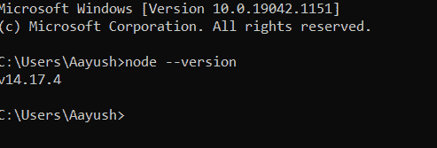
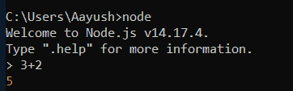
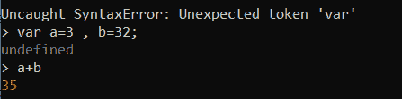
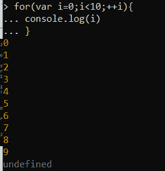
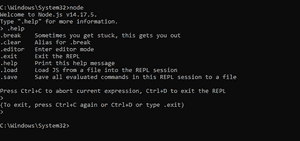

# 如何打开 Node.js 命令提示符？

> 原文:[https://www . geesforgeks . org/how-open-node-js-command-prompt/](https://www.geeksforgeeks.org/how-to-open-node-js-command-prompt/)

[Node js](https://www.geeksforgeeks.org/introduction-to-nodejs/) 帮助我们在网页浏览器外执行 JavaScript 代码。它既不是一个框架，也不是一种编程语言，而是一个后端的 JavaScript 运行时环境，有助于在浏览器之外执行脚本。你可以从网上安装节点 js。您可以访问链接[下载节点](https://nodejs.org/en/download/)并在您的机器上下载该节点的最新版本。在本文中，我们将讨论如何使用命令提示符打开 node.js。

**在机器上安装 Node.js:**首先我们要检查我们的机器上是否安装了 node . js。要检查，请在命令提示符下键入“node–version”。如果机器上出现已安装的版本，说明你的机器上已经安装了 Node.js，否则我们要安装最新版本的 node.js，参考[这篇](https://www.geeksforgeeks.org/installation-of-node-js-on-windows/)文章，了解你机器上安装 Node.js 的过程。



**如何在命令提示符**中打开节点 js:节点 js 自带一个名为 [REPL](https://www.geeksforgeeks.org/node-js-repl-read-eval-print-loop/) 的虚拟环境(READ、EVAL、PRINT、LOOP)。这是一个与命令提示符相同的计算机环境，也是测试简单 Node.js/javascript 代码的简单方法，并且允许执行多个 JavaScript 代码。我们可以简单地使用命令提示符下的 node 命令在命令提示符下运行 REPL。

**语法:**

```js
node
```

**对 REPl 执行一些操作:**

*   **两个数相加:我们可以用“+”运算符** r 将两个数相加。



*   **定义变量并给变量赋值**:当你打印值或者写一些有效的语句，比如定义变量等，它也返回未定义。JavaScript 函数总是返回一些东西，因此默认情况下会返回 undefined。



*   **在 REPL 上执行循环:**我们可以在 Node.js REPL 上以与 javascript 相同的多行方式执行循环。这称为多行表达式。



**REPL 命令:**这些命令有助于操纵 REPL

<figure class="table">清除

| **Command** | **Description** |
| . help | List all commands |
| Ctrl+C | Termination order |
| Ctrl+C {两次}} / Ctrl + D | Exit command prompt |
| Tab | Show all functions and objects. |
| 。 | To clear multiline expressions |

</figure>

**执行 REPL 命令:**



参考:[https://nodejs.dev/learn/how-to-use-the-nodejs-repl](https://nodejs.dev/learn/how-to-use-the-nodejs-repl)