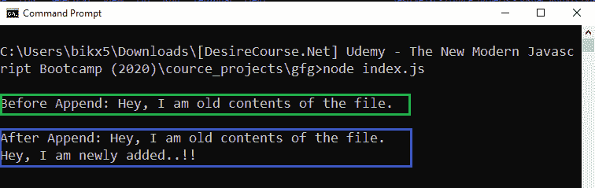
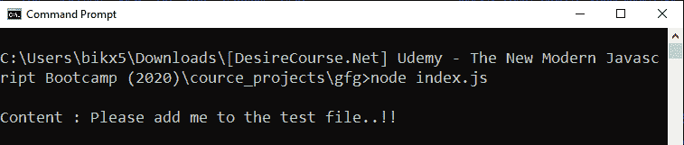

# 如何操作 Node.js 中带有承诺的基于回调的 fs.appendFile()方法？

> 原文:[https://www . geeksforgeeks . org/操作方法-基于回调-fs-appendfile-方法-带节点中的承诺-js/](https://www.geeksforgeeks.org/how-to-operate-callback-based-fs-appendfile-method-with-promises-in-node-js/)

**fs.appendFile()** 方法是在 Node.js 的 File System 模块中定义的，File System 模块基本上就是和用户电脑的硬盘进行交互。appendFile()方法用于在现有文件中追加新数据，或者如果该文件不存在，则首先创建该文件，然后给定数据被追加到该文件中。

fs.appendFile()方法基于回调。使用回调方法导致回调嵌套或回调地狱问题的可能性很大。因此为了避免这种情况，我们几乎喜欢使用基于承诺的方法。使用一些额外的 node.js 方法，我们可以用 promise 方式操作一个基于回调的方法。

**语法:**

```
fs.appendFile(path, data, options)
```

**参数:**

*   **路径:**它是一个字符串、缓冲区或网址，指定给定数据要附加到的目标文件的路径。
*   **数据:**它是一个字符串或缓冲区，将附加到目标文件。
*   **选项:**它是一个可选参数，以某种方式影响输出，因此我们是否将其提供给函数调用。
    *   **编码:**指定编码技术，默认为‘UTF8’。
    *   **模式:**指定文件模式。文件模式允许我们创建、读取、写入或修改文件。默认值为“0o666”。
    *   **标志:**指定追加到文件时使用的标志。默认值为“a”。

**方法:**基于回调的 fs.appendFile()方法。为了用承诺来操作它，首先，我们使用在实用程序模块中定义的 promisify()方法将其转换为基于承诺的方法。

**例 1:**

```
// Importing File System and Utilities module
const fs = require('fs')
const util = require('util')

// Convert callback based methods to
// promise based methods
const appendContent = util.promisify(fs.appendFile)
const readFileContent = util.promisify(fs.readFile)

// The readFileContent() method reads the
// file and returns buffer form of the data 
readFileContent('./testFile.txt')
.then(buff => {

    // File content before append 
    const oldContent = buff.toString()
    console.log(`\nBefore Append: ${oldContent}\n`)

    // Append operation
    return appendContent('./testFile.txt', 
            '\nHey, I am newly added..!!')
})

.then(() => {

    // Getting new file content
    return readFileContent('./testFile.txt')
})

.then(buff => {

    // File content after append 
    const newContent = buff.toString()
    console.log(`After Append: ${newContent}\n`)
})

.catch(err => {
  console.log(`Error Occurs, 
    Error code -> ${err.code}, 
    Error NO -> ${err.errno}`)
})
```

使用异步等待实现相同的功能。

```
// Importing File System and Utilities module
const fs = require('fs')
const util = require('util')

// Convert callback based methods to
// promise based methods
const appendContent = util.promisify(fs.appendFile)
const readFileContent = util.promisify(fs.readFile)

const appendDataToFile = async (path, data) => {

  // The readFileContent() method reads the file
  // and returns buffer form of the data 
  const oldBuffer = await readFileContent(path)

  // File content before append 
  const oldContent = oldBuffer.toString()

  // Append operation
  await appendContent(path, data)

  const newBuffer = await readFileContent(path)

  // File content after append 
  const newContent = newBuffer.toString()

  console.log(`\nBefore Append: ${oldContent}\n`)
  console.log(`After Append: ${newContent}`)
}

appendDataToFile('./testFile.txt', 
    '\nHey, I am newly added..!!')
.catch(err => {
  console.log(`Error Occurs, 
    Error code -> ${err.code}, 
    Error NO -> ${err.errno}`)
})
})
```

**输出:**


**示例 2:** 当给定的文件名路径不存在时。

```
// Importing File System and Utilities module
const fs = require('fs')
const util = require('util')

// Convert callback based methods to 
// promise based methods
const appendContent = util.promisify(fs.appendFile)
const readFileContent = util.promisify(fs.readFile)

// Append operation if given file does not exist
// it will be created first then data is appended
appendContent('./testFile.txt', 
    'Please add me to the test file..!!')
.then(() => {

    // readFileContent() method reads the file
    // and returns buffer form of the data 
    return readFileContent('./testFile.txt')
})

.then(buff => {

    // Appended data
    const content = buff.toString()
    console.log(`\nContent : ${content}`)
})

.catch(err => {
  console.log(`Error Occurs, 
    Error code -> ${err.code}, 
    Error NO -> ${err.errno}`)
})
```

实现与异步等待相同的功能。

```
// Importing File System and Utilities module
const fs = require('fs')
const util = require('util')

// Convert callback based methods to 
// promise based methods
const appendContent = util.promisify(fs.appendFile)
const readFileContent = util.promisify(fs.readFile)

const appendDataToFile = async (path, data) => {

  // Append operation if given file does not exist
  // it will created first then data is appended
  await appendContent(path, data)

  // readFile() method reads the file
  // and returns buffer form of the data 
  const buff = await readFileContent(path)

  // File content after append 
  const content = buff.toString()
  console.log(`\nContent : ${content}`)
}

appendDataToFile('./testFile.txt', 
    'Please add me to the test file..!!')

.catch(err => {
  console.log(`Error Occurs, 
    Error code -> ${err.code}, 
    Error NO -> ${err.errno}`)
})
```

**运行程序前的目录结构:**


**运行程序后的目录结构:**


**输出:**
