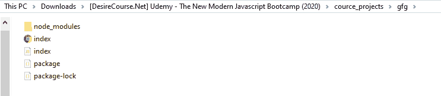
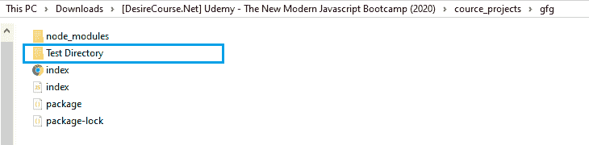

# 如何在 Node.js 中操作带有承诺的基于回调的 fs.mkdir()方法？

> 原文:[https://www . geesforgeks . org/操作方法-基于回调的-fs-mkdir-带节点承诺的方法-js/](https://www.geeksforgeeks.org/how-to-operate-callback-based-fs-mkdir-method-with-promises-in-node-js/)

**fs.mkdir()** 方法是在 Node.js 的 File System 模块中定义的，File System 模块基本上就是和用户电脑的硬盘进行交互。mkdir()方法用于异步创建目录。

fs.mkdir()方法基于回调。使用回调方法导致回调嵌套或回调地狱问题的可能性很大。因此，为了避免这种情况，我们几乎总是喜欢使用基于承诺的方法。使用一些额外的 node.js 方法，我们可以用 promise 方式操作一个基于回调的方法。

**语法:**

```
fs.mkdir(path, options)
```

**注意:**不需要回调，因为我们是用承诺的方式操作的。

**参数:**该方法接受两个参数，如上所述，如下所述:

*   **路径:**它是一个字符串、缓冲区或网址，用于指定必须创建的目录的路径。
*   **选项:**它是一个可选参数，以某种方式影响输出，因此我们是否将其提供给函数调用。
    *   **模式:**用于设置目录权限的字符串或整数。默认情况下，其值为 0.777
    *   **递归:**是一个布尔值，指定是否应该创建父目录。默认情况下，它的值为 false。

**方法:**基于回调的 fs.mkdir()方法。为了用承诺来操作它，首先，我们使用在 utilities 模块中定义的 promisify()方法将其转换为基于承诺的方法。

**示例 1:** **文件名:index.js**

```
// Importing File System and Utilities module
const fs = require('fs')
const util = require('util')

// Convert callback based methods to promise
// based methods
const makeDir = util.promisify(fs.mkdir)
const readDir = util.promisify(fs.readdir)

// Create new directory
makeDir(dir='./Test Directory')
.then(() => {
  console.log(`Directory '${dir}' is created`)
})

// If promise gets rejected
.catch(err => {
    console.log(`Error occurs, 
    Error code -> ${err.code},
    Error No -> ${err.errno}`);
})
```

使用异步等待实现相同的功能:

```
// Importing File System and Utilities module
const fs = require('fs')
const util = require('util')

// Convert callback based methods to promise
// based methods
const makeDir = util.promisify(fs.mkdir)
const readDir = util.promisify(fs.readdir)

const createDirectory = async path => {
  await makeDir(path)
  console.log(`Directory '${path}' is created`)
}

createDirectory('./TestDirectory')

// If promise gets rejected
.catch(err => {
    console.log(`Error occurs, 
    Error code -> ${err.code},
    Error No -> ${err.errno}`);
})
```

使用以下命令运行 index.js 文件:

```
node index.js
```

**运行程序前的文件内容:**


**运行程序后文件内容:**


**输出:**

```
Directory './Test Directory' is created
```

**示例 2:** **文件名:index.js**

```
// Importing File System and Utilities module
const fs = require('fs')
const util = require('util')

// Convert callback based methods to 
// promise based methods
const makeDir = util.promisify(fs.mkdir)
const readDir = util.promisify(fs.readdir)

console.log(`\nBefore creating new Directory : \n`)
readDir(process.cwd())
.then(filenames => {

   // Fetch the contents of current working
   // directory before creating new directory
   for(let filename of filenames){
      console.log(filename)
   }
})
.catch(err => {
   console.log(`Error occurs, 
   Error code -> ${err.code},
   Error No -> ${err.errno}`);
})

// Create new directory
makeDir('./Test Directory')
.then(() => {

   // Fetch the contents of current working
   // directory after creating new directory
   console.log(`\nAfter creating new directory : \n`)

   return readDir(process.cwd())
})

.then(filenames => {
  for(let filename of filenames) {
    console.log(filename)
  }
})

// If promise gets rejected
.catch(err => {
  console.log(`Error occurs, 
  Error code -> ${err.code},
  Error No -> ${err.errno}`)
})
```

使用异步等待实现相同的功能:

```
// Importing File System and Utilities module
const fs = require('fs')
const util = require('util')

// Convert callback based methods to promise
// based methods
const makeDir = util.promisify(fs.mkdir)
const readDir = util.promisify(fs.readdir)

const createDirectory = async path => {
  console.log(`\nBefore creating new Directory : \n`)

  // Fetch the contents of current working directory
  // before creating new directory
  const oldContents = await readDir(process.cwd())  
  for(let filename of oldContents) {
    console.log(filename)
  }

  // Create new directory
  await makeDir('./Test Directory')
  console.log(`\nAfter creating new directory : \n`)

  // Fetch the contents of current working directory
  // after creating new directory
  const newContents = await readDir(process.cwd())
  for(let filename of newContents) {
    console.log(filename)
  }
}

createDirectory('./TestDirectory')
// If promise gets rejected
.catch(err => {
   console.log(`Error occurs, 
   Error code -> ${err.code},
   Error No -> ${err.errno}`);
});
```

使用以下命令运行 index.js 文件:

```
node index.js
```

**运行程序前的文件内容:**


**运行程序后文件内容:**


**输出:**
