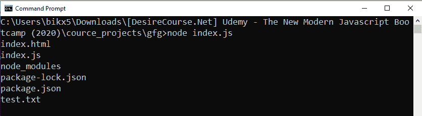

# 如何操作 Node.js 中带有承诺的基于回调的 fs.readdir()方法？

> 原文:[https://www . geesforgeks . org/操作方法-基于回调的-fs-readdir-带节点承诺的方法-js/](https://www.geeksforgeeks.org/how-to-operate-callback-based-fs-readdir-method-with-promises-in-node-js/)

**fs.readdir()** 方法是在 Node.js 的 File System 模块中定义的，File System 模块基本上就是和用户电脑的硬盘进行交互。readdir()方法用于读取目录的内容。

fs.readdir()方法基于回调。使用回调方法导致回调嵌套或回调地狱问题的可能性很大。因此，为了避免这种情况，我们几乎总是喜欢使用基于承诺的方法。使用一些额外的 node.js 方法，我们可以用 promise 方式操作一个基于回调的方法。

**语法:**

```js
fs.readdir(path, options)
```

**注意:**不需要回调，因为我们是用承诺的方式操作的。

**参数:**该方法接受两个参数，如上所述，如下所述:

*   **路径:**它是一个字符串、缓冲区或 url，用于指定目录的路径，我们尝试读取该目录的内容。
*   **选项:**是可选参数，这里我们指定编码技术(默认-utf8)等。

**方法:**基于回调的 fs.readdir()方法。为了用承诺来操作它，首先，我们使用在实用程序模块中定义的 promisify()方法将其转换为基于承诺的方法。

**示例 1:** **文件名:index.js**

```js
// Program to read file and folders of 
// the current working directory

// Importing File System and Utilities module
const fs = require('fs')
const util = require('util')

// Convert callback based methods to promise
// based methods
const readDir = util.promisify(fs.readdir)

// Reading current working directory
readDir(process.cwd())
// If promise resolved and datas are fetched
.then(filenames => {
  for(let filename of filenames) {
    console.log(filename)
  }
})

// If promise is rejected
.catch(err => {
   console.log(`Error occurs, 
   Error code -> ${err.code},
   Error No -> ${err.errno} `);
})
```

使用异步等待实现相同的功能:

```js
// Program to read file and folders of the
// current working directory

// Importing File System and Utilities module
const fs = require('fs')
const util = require('util')

// Convert callback based methods to promise
// based methods
const readDir = util.promisify(fs.readdir)

const readDirectory = async (path) => {
  const filenames = await readDir(path)
  for(let filename of filenames){
    console.log(filename)
  }
}

readDirectory(process.cwd())
// If promise is rejected
.catch(err => {
   console.log(`Error occurs, 
   Error code -> ${err.code},
   Error No -> ${err.errno}`);
})
```

使用以下命令运行 index.js 文件:

```js
node index.js
```

**输出:**


**示例 2:** **文件名:index.js**

```js
// Program to read file and folders of the
// current working directory or as the path
// given by command line argument

// Importing File System and Utilities module
const fs = require('fs')
const util = require('util')

// Convert callback based methods to promise
// based methods
const readDir = util.promisify(fs.readdir)

// The process.cwd() gives current working directory
const targetDir = process.argv[2] || process.cwd()

readDir(targetDir)

// If promise resolved and datas are fetched
.then(filenames => {
  for(let filename of filenames) {
    console.log(filename)
  }
})

// If promise is rejected
.catch(err => {
  console.log(err)
})
```

使用异步等待实现相同的功能:

```js
// Program to read file and folders of the 
// current working directory or as the path
// given by command line argument

// Importing File System and Utilities module
const fs = require('fs')
const util = require('util')

// The process.cwd() gives current working directory
const targetDir = process.argv[2] || process.cwd()

// Convert callback based methods to promise
// based methods
const readDir = util.promisify(fs.readdir)

const readDirectory = async (path) => {
  const filenames = await readDir(path)
  for(let filename of filenames){
    console.log(filename)
  }
}

readDirectory(targetDir)
// If promise is rejected
.catch(err => {
   console.log(`Error occurs, 
   Error code -> ${err.code},
   Error No -> ${err.errno}`);
})
```

使用以下命令运行 index.js 文件:

```js
node index.js
```

**输出:**
