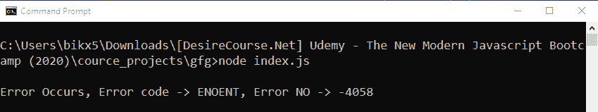
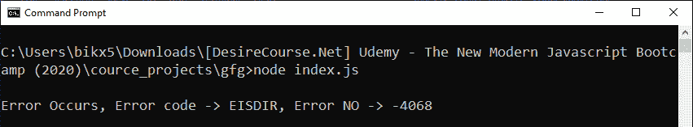

# 如何操作 Node.js 中带有承诺的基于回调的 fs.readFile()方法？

> 原文:[https://www . geeksforgeeks . org/操作方法-基于回调的-fs-readfile-带节点中承诺的方法-js/](https://www.geeksforgeeks.org/how-to-operate-callback-based-fs-readfile-method-with-promises-in-node-js/)

**fs.readFile()** 方法是在 Node.js 的 File System 模块中定义的，File System 模块基本上就是和用户电脑的硬盘进行交互。readFile()方法用于异步读取文件的全部内容，并返回数据的缓冲形式。

fs.readFile()方法基于回调。使用回调方法导致回调嵌套或回调地狱问题的可能性很大。因此，为了避免这种情况，我们几乎总是喜欢使用基于承诺的方法。使用一些额外的 node.js 方法，我们可以用 promise 方式操作一个基于回调的方法。

**语法:**

```js
fs.readFile(path, options)
```

**注意:**不需要回调，因为我们是用承诺的方式操作的。

**参数:**该方法接受两个参数，如上所述，如下所述:

*   **路径:**它是一个字符串、缓冲区或网址，指定了我们试图读取其内容的文件的路径。
*   **选项:**它是一个可选参数，以某种方式影响输出，因此我们是否将其提供给函数调用。
    *   **编码:**是指定编码技术的字符串，默认为空。
    *   **标志:**是指定文件系统标志的字符串。它的默认值是“r”。

**方法:**基于回调的 fs.readFile()方法。为了用承诺来操作它，首先，我们使用在实用程序模块中定义的 promisify()方法将其转换为基于承诺的方法。

**示例 1:** **文件名:index.js**

```js
// Importing File System and Utilities module
const fs = require('fs')
const util = require('util')

// Convert callback based methods to
// promise based methods
const readFileContent = util.promisify(fs.readFile)

// The readFileContent() method reads the file
// and returns buffer form of the data 
readFileContent('./testFile.txt')
// If promise resolved and datas are read 
.then(buff => {
  const contents = buff.toString()
  console.log(`\nContents of the file :\n${contents}`)
})

// If promise get rejected
.catch(err => {
   console.log(`Error occurs, Error code -> ${err.code}, 
   Error No -> ${err.errno}`);
});
```

使用异步等待实现相同的功能。

```js
// Importing File System and Utilities module
const fs = require('fs')
const util = require('util')

// Convert callback based methods to
// promise based methods
const readFileContent = util.promisify(fs.readFile)

const fetchFile = async (path) => {

  // The readFileContent() method reads the file
  // and returns buffer form of the data 
  const buff = await readFileContent(path)

  const contents = buff.toString()
  console.log(`\nContents of the file :\n${contents}`)
}

fetchFile('./testFile.txt')

// If promise get rejected
.catch(err => {
   console.log(`Error Occurs, Error code -> ${err.code}, 
   Error NO -> ${err.errno}`);
});
```

使用以下命令运行 index.js 文件:

```js
node index.js
```

**输出:**


**示例 2:** 如果给定的文件路径不存在。
T3】文件名:index.js

```js
// Importing File System and Utilities module
const fs = require('fs')
const util = require('util')

// Convert callback based methods to 
// promise based methods
const readFileContent = util.promisify(fs.readFile)

// The readFileContent() method reads the file
// and returns buffer form of the data 
readFileContent('./false/path.txt')
// If promise resolved and datas are read 
.then(buff => {
  const contents = buff.toString()
  console.log(`\nContents of the file :\n${contents}`)
})

// If promise get rejected
.catch(err => {
  console.log(`\nError occurs, Error code -> ${err.code}, 
  Error No -> ${err.errno}`);
})
```

使用异步等待实现相同的功能。

```js
// Importing File System and Utilities module
const fs = require('fs')
const util = require('util')

// Convert callback based methods to 
// promise based methods
const readFileContent = util.promisify(fs.readFile)

const fetchFile = async (path) => {

  // The readFileContent() method reads the file
  // and returns buffer form of the data 
  const buff = await readFileContent(path)

  const contents = buff.toString()
  console.log(`\nContents of the file :\n${contents}`)
}

fetchFile('./false/path')

// If promise get rejected
.catch(err => {
  console.log(`\nError Occurs, Error code -> ${err.code}, 
  Error NO -> ${err.errno}`);
});
```

使用以下命令运行 index.js 文件:

```js
node index.js
```

**输出:**


**解释:**fs . ReadFile()方法读取文件的内容，因此它需要存在的文件的路径。由于文件的给定路径不存在，出现错误代码为“ENOENT”，错误号为“-4058”。当指定的路径名不存在时，会出现“ENOENT”错误。

**示例 3:** 当给定的路径是文件夹而不是文件的路径时。
T3】文件名:index.js

```js
// Importing File System and Utilities module
const fs = require('fs')
const util = require('util')

// Convert callback based methods to 
// promise based methods
const readFileContent = util.promisify(fs.readFile)

// The readFileContent() method reads the file
// and returns buffer form of the data 
readFileContent('./testFolder')
// If promise resolved and datas are read 
.then(buff => {
  const contents = buff.toString()
  console.log(`\nContents of the file :\n${contents}`)
})

// If promise get rejected
.catch(err => {
  console.log(`\nError occurs, Error code -> ${err.code}, 
  Error No -> ${err.errno}`);
});
```

使用异步等待实现相同的功能。

```js
// Importing File System and Utilities module
const fs = require('fs')
const util = require('util')

// Convert callback based methods to 
// promise based methods
const readFileContent = util.promisify(fs.readFile)

const fetchFile = async (path) => {

  // The readFileContent() method reads the file
  // and returns buffer form of the data 
  const buff = await readFileContent(path)

  const contents = buff.toString()
  console.log(`\nContents of the file :\n${contents}`)
}

fetchFile('./testFolder')

// If promise get rejected
.catch(err => {
  console.log(`\nError Occurs, Error code -> ${err.code}, 
  Error NO -> ${err.errno}`);
});
```

使用以下命令运行 index.js 文件:

```js
node index.js
```

**输出:**


**解释:**fs . ReadFile()方法读取文件的内容，因此它需要一个文件的路径。由于给定的路径是文件夹的路径，因此出现错误，错误代码为“EISDIR”，错误号为“-4068”。当操作需要一个文件，但给出了目录的路径名时，就会出现“EISDIR”错误。