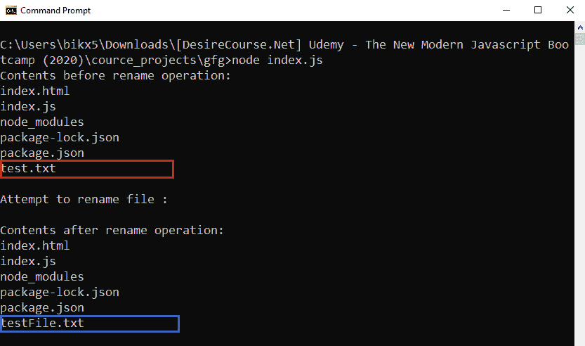

# 如何操作 Node.js 中带有承诺的基于回调的 fs.rename()方法？

> 原文:[https://www . geesforgeks . org/操作方法-基于回调-fs-rename-method-with-promises-in-node-js/](https://www.geeksforgeeks.org/how-to-operate-callback-based-fs-rename-method-with-promises-in-node-js/)

**fs.rename()** 方法是在 Node.js 的文件系统模块中定义的，文件系统模块基本上就是和用户电脑的硬盘进行交互。rename()方法用于将给定旧路径上的文件重命名为给定新路径。如果新路径文件已经存在，它将被覆盖，如果在新路径上存在一个目录，则会发生错误。

fs.rename()方法基于回调。使用回调方法导致回调嵌套或回调地狱问题的可能性很大。因此，为了避免这种情况，我们几乎总是喜欢使用基于承诺的方法。使用一些额外的 node.js 方法，我们可以用 promise 方式操作一个基于回调的方法。

**语法:**

```js
fs.rename(oldPath, newPath)
```

**注意:**如果用承诺的方式操作，不需要回调。

**参数:**该方法接受两个参数，如上所述，如下所述:

*   **oldpath:** 它是一个字符串、缓冲区或网址，用于指定必须重命名的文件的路径。
*   **newpath:** 它是一个字符串、缓冲区或网址，指定旧文件要替换的文件的路径。

**方法:**基于回调的 fs.rename()方法。为了用承诺来操作它，首先，我们使用在 utilities 模块中定义的 promisify()方法将其转换为基于承诺的方法。

**示例 1:** **文件名:index.js**

```js
// Importing File System and Utilities module
const fs = require('fs')
const util = require('util')

// Convert callback based methods to promise
// based methods
const readDir = util.promisify(fs.readdir)
const rename = util.promisify(fs.rename)

readDir(process.cwd())
.then(files => {
  console.log(`Contents before rename operation: `)

  // Contents of the current directory
  for(let file of files) {
      console.log(file)
  }

  console.log('\nAttempt to rename file : \n')

  // Rename operation
  return rename('test.txt', 'testFile.txt')
})

.then(() => {

  // The process.cwd() gives current working
  // directory
  return readDir(process.cwd())
})

.then(files => {
  console.log(`Contents after rename operation: `)

  // Contents of the current directory
  for(let file of files) {
    console.log(file)
  }
})

.catch(err => {
   console.log(`Error occurs, 
   Error code -> ${err.code}, 
   Error No -> ${err.errno}`);
})
```

使用异步等待实现相同的功能。

```js
// Importing File System and Utilities module
const fs = require('fs')
const util = require('util')

// Convert callback based methods to promise
// based methods
const readDir = util.promisify(fs.readdir)
const rename = util.promisify(fs.rename)

const renameOperation = async (oldpath, newpath) => {
  console.log(`Contents before rename operation: `)

  // Fetching contents of the directory before
  // rename operation. The process.cwd() gives
  // current working directory
  const oldFiles = await 
      fs.promises.readdir(process.cwd())

  // Contents of the current working directory
  for(let file of oldFiles){
    console.log(file)
  }

  console.log('\nAttempt to rename file : \n')

  // Rename operation
  await fs.promises.rename(oldpath, newpath)
  console.log(`Contents after rename operation: `)

  // Fetching contents of directory before
  // rename operation
  const newFiles = await 
      fs.promises.readdir(process.cwd())

  // Contents of the current working directory
  for(let file of newFiles) {
    console.log(file)
  }
}

renameOperation('test.txt', 'testFile.txt')
.catch(err => {
  console.log(`Error occurs, Error code -> ${err.code}, 
  Error No -> ${err.errno}`);
});
```

使用以下命令运行 **index.js** 文件:

```js
node index.js
```

**运行程序前的目录结构:**


**运行程序后的目录结构:**


**输出:**


**示例 2:** 给定时，newpath 不是文件的路径，而是目录。
T3】文件名:index.js

```js
// Importing File System and Utilities module
const fs = require('fs')
const util = require('util')

// Convert callback based methods to promise
// based methods
const readDir = util.promisify(fs.readdir)
const rename = util.promisify(fs.rename)

readDir(process.cwd())
.then(files => {
  console.log(`Contents before rename operation: `)

  // Contents of the current directory
  for(let file of files) {
    console.log(file)
  }

  console.log('\nAttempt to rename file : \n')

  // Rename operation
  return rename('testFile.txt', 'test')
})

.then(() => {

  // The process.cwd() gives current 
  // working directory
  return readDir(process.cwd())
})

.then(files => {
  console.log(`Contents after rename operation: `)

  // Contents of the current directory
  for(let file of files) {
    console.log(file)
  }
})

.catch(err => {
   console.log(`Error occurs, 
   Error code -> ${err.code}, 
   Error No -> ${err.errno}`);
})
```

用异步等待实现相同的功能。

```js
// Importing File System and Utilities module
const fs = require('fs')
const util = require('util')

// Convert callback based methods to promise
// based methods
const readDir = util.promisify(fs.readdir)
const rename = util.promisify(fs.rename)

const renameOperation = async (oldpath, newpath) => {
  console.log(`Contents before rename operation: `)

  // Fetching contents of directory before 
  // rename operation. The process.cwd() 
  // gives current working directory
  const oldFiles = await readDir(process.cwd())

  // Contents of the current working directory
  for(let file of oldFiles) {
    console.log(file)
  }

  console.log('\nAttempt to rename file : \n')

  // Rename operation
  await rename(oldpath, newpath)

  console.log(`Contents after rename operation: `)

  // Fetching contents of directory before rename operation
  const newFiles = await readDir(process.cwd())

  // Contents of the current working directory
  for(let file of newFiles) {
    console.log(file)
  }
}

renameOperation('testFile.txt', 'test')
.catch(err => {
   console.log(`Error occurs, 
   Error code -> ${err.code}, 
   Error No -> ${err.errno}`);
});
```

使用以下命令运行 **index.js** 文件:

```js
node index.js
```

**输出:**
