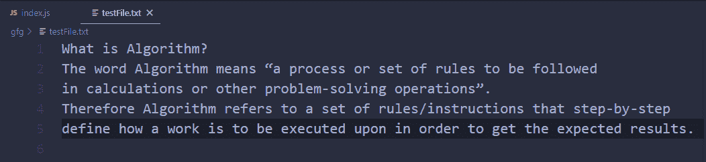
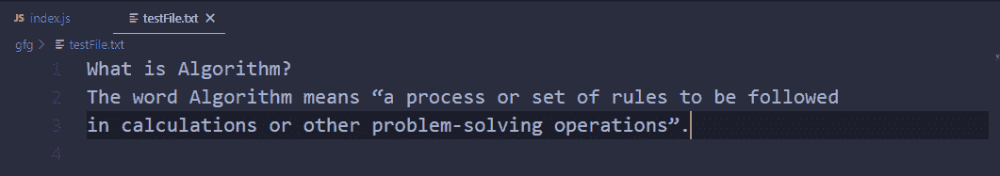
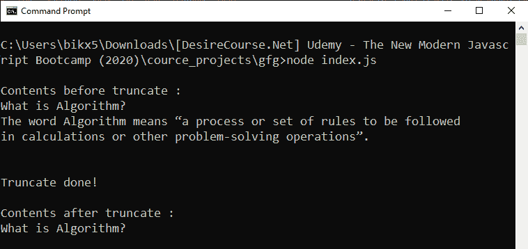

# 如何在 Node.js 中操作带有承诺的基于回调的 fs.truncate()方法？

> 原文:[https://www . geeksforgeeks . org/操作方法-基于回调-fs-truncate-带节点承诺的方法-js/](https://www.geeksforgeeks.org/how-to-operate-callback-based-fs-truncate-method-with-promises-in-node-js/)

Node.js 的文件系统模块中定义的 **fs.truncate()** 方法，文件系统模块基本上就是和用户电脑的硬盘进行交互。truncate()方法用于通过“len”字节修改文件的内部内容。如果 len 小于文件的当前长度，文件将被截断为 len 的长度，如果 len 大于文件长度，则通过附加空字节(x00)来填充文件，直到达到 len。

fs.truncate()方法基于回调。使用回调方法导致回调嵌套或回调地狱问题的可能性很大。因此，为了避免这种情况，我们几乎总是喜欢使用基于承诺的方法。使用一些额外的 node.js 方法，我们可以用 promise 方式操作一个基于回调的方法。

**语法:**

```
fs.truncate(path, len)
```

**注意:**不需要回调，因为我们是用承诺的方式操作的。

**参数:**该方法接受两个参数，如上所述，如下所述:

*   **路径:**它是一个字符串、缓冲区或 Url，用于指定目标文件的路径。
*   **len:** 是一个数字值，指定文件的长度，在该长度之后文件将被截断。这是一个可选参数，默认值为 0，即如果不提供 len 参数，将截断整个文件。

**返回值:**如果方法使用承诺进行操作，它将返回一个承诺，该承诺将在成功时被无参数地解析，或者在出现问题时被错误对象拒绝(前给定路径是指向目录的路径，或者给定路径不存在)。

**方法:**基于回调的 fs.truncate()方法。为了用承诺来操作它，首先，我们使用在实用程序模块中定义的 promisify()方法将其转换为基于承诺的方法。

**示例 1:**
**文件名:index.js**

```
// Importing File System and Utilities module
const fs = require('fs')
const util = require('util')

// Convert callback based methods to 
// promise based methods
const trunct = util.promisify(fs.truncate)

// The truncate operation
trunct('./testFile.txt')
// If file is successfully truncated
.then(() => {
  console.log('File contents are deleted!')
})

// If any error occurs
.catch(err => {
   console.log(`Error Occurs, 
   Error code -> ${err.code}, 
   Error NO -> ${err.errno}`);
});
```

使用异步等待实现相同的功能。

```
// Importing File System and Utilities module
const fs = require('fs')
const util = require('util')

// Convert callback based methods to
// promise based methods
const trunct = util.promisify(fs.truncate)

const truncateFile = async (path) => {

  // The truncate operation
  await trunct(path)
  console.log('File contents are deleted!')
}

truncateFile('./testFile.txt')
// If any error occurs
.catch(err => {
   console.log(`Error Occurs, 
   Error code -> ${err.code}, 
   Error NO -> ${err.errno}`);
});
```

**运行程序前的文件内容:**


**运行程序后文件内容:**


使用以下命令运行 index.js 文件:

```
node index.js
```

**输出:**

```
File contents are deleted!
```

**示例 2:**
**文件名:index.js**

```
// Importing File System and Utilities module
const fs = require('fs')
const util = require('util')

// Convert callback based methods to 
// promise based methods
const trunct = util.promisify(fs.truncate)
const readFileContent = util.promisify(fs.readFile)

// Fetching contents before truncate 
readFileContent('./testFile.txt')
.then(buff => {
  const oldContents = buff.toString()
  console.log(`\nContents before 
      truncate : \n${oldContents}`)

  // The truncate operation
  return trunct('./testFile.txt', 18)
})

// If file is successfully truncated
.then(() => {
  console.log('\nTruncate done!\n')

  // Fetching contents after truncate 
  return readFileContent('./testFile.txt')
})

.then(buff => {
  const newContents = buff.toString()
  console.log(`Contents after 
    truncate : \n${newContents}`)
})

// If any error occurs
.catch(err => {
   console.log(`Error Occurs, 
   Error code -> ${err.code}, 
   Error NO -> ${err.errno}`);
});
```

使用异步等待实现相同的功能。

```
// Importing File System and Utilities module
const fs = require('fs')
const util = require('util')

// Convert callback based methods 
// to promise based methods
const trunct = util.promisify(fs.truncate)
const readFileContent = util.promisify(fs.readFile)

// Function to fetch file contents
const fetchFileContents = async (path) => {
  const buff = await readFileContent(path)
  return buff.toString()
}

// Function to truncate
const truncateFile = async (path, len) => {

  // Fetching contents before truncate 
  const oldContents = await fetchFileContents(path)
  console.log(`\nContents before 
    truncate : \n${oldContents}`)

  // The truncate operation
  const buff = await trunct(path, len)
  console.log('\nTruncate done!\n')

  // Fetching contents before truncate 
  const newContents = await fetchFileContents(path)
  console.log(`Contents after 
    truncate : \n${newContents}`)
}

truncateFile('./testFile.txt', 18)

// If any error occurs
.catch(err => {
   console.log(`Error Occurs, 
   Error code -> ${err.code}, 
   Error NO -> ${err.errno}`);
})
```

使用以下命令运行 index.js 文件:

```
node index.js
```

**运行程序前的文件内容:**


**运行程序后文件内容:**


**输出:**
