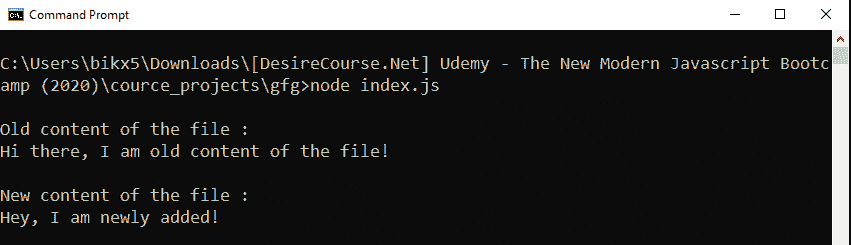
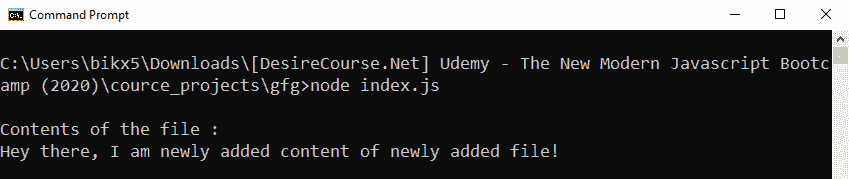

# 如何操作 Node.js 中带有承诺的基于回调的 fs.writeFile()方法？

> 原文:[https://www . geesforgeks . org/操作方法-基于回调-fs-write file-method-with-promises-in-node-js/](https://www.geeksforgeeks.org/how-to-operate-callback-based-fs-writefile-method-with-promises-in-node-js/)

**fs.writeFile()** 是 Node.js 的文件系统模块中定义的一种方法，文件系统模块基本上就是和用户电脑的硬盘进行交互。fs.writeFile()方法将数据异步写入文件，如果文件已经存在，则替换该文件。

fs.writeFile()方法基于回调。使用回调方法导致回调嵌套或回调地狱问题的可能性很大。因此，为了避免这种情况，我们几乎总是喜欢使用基于承诺的方法。使用一些额外的 node.js 方法，我们可以用 promise 方式操作一个基于回调的方法。

**语法:**

```
fs.writeFile(path, data, options)
```

**注意:**不需要回调，因为我们是用承诺的方式操作的。

**参数:**接受三个参数路径、数据和选项。选项是可选参数。

*   **路径:**它是一个字符串、缓冲区或网址，指定要执行写操作的文件的路径。
*   **数据:**它是字符串、缓冲区或 Uint8Array 实例。它是将要写入文件的数据。
*   **选项:**它是一个可选参数，以某种方式影响输出，因此我们是否将其提供给函数调用。
    *   **编码:**是指定编码技术的字符串，默认值为‘utf8’。
    *   **模式:**指定文件模式的整数值。默认值为 0o666。
    *   **标志:**是指定文件系统标志的字符串。默认值为“w”。

**方法:**基于回调的 fs.writeFile()方法。为了用承诺来操作它，首先，我们使用在实用程序模块中定义的 promisify()方法将其转换为基于承诺的方法。

**示例 1:** **文件名:index.js**

```
// Importing File System and Utilities module
const fs = require('fs')
const util = require('util')

// Convert callback based methods to 
// promise based methods
const writeFile = util.promisify(fs.writeFile)
const readFile = util.promisify(fs.readFile)

// The readFile method read the contents of
// the file and returns the buffer form of
// the data
readFile('./testFile.txt')
.then(buff => {
  const oldContent = buff.toString()
  console.log(`\nOld content of the file 
                     :\n${oldContent}`)

  // The writeFile method write to the file
  // If is already exist, replaces the file
  return writeFile('./testFile.txt', 
        "Hey, I am newly added!")
})

.then(() => {

  // Fetching contents of the file
  // after write operation
  return readFile('./testFile.txt')
})

.then(buff => {
  const newContent = buff.toString()
  console.log(`\nNew content of the 
            file :\n${newContent}`)
})

// If promise get rejected
.catch(err => {
   console.log(`\nError Occurs, 
          Error code -> ${err.code}, 
   Error NO -> ${err.errno}`)
})
```

使用异步等待实现相同的功能。

```
// Importing File System and Utilities module
const fs = require('fs')
const util = require('util')

// Convert callback based methods to 
// promise based methods
const writeFile = util.promisify(fs.writeFile)
const readFile = util.promisify(fs.readFile)

const writeFileContent = async (path, data) => {

  // The readFile method read the contents
  // of the file and returns the buffer 
  // form of the data
  const oldBuff = await readFile(path)
  const oldContent = oldBuff.toString()
  console.log(`\nOld content of the 
             file :\n${oldContent}`)

  // The writeFile method write to the file
  // If is already exist, replaces the file
  await writeFile(path, data)

  // Fetching contentsof the file after 
  // write operation
  const newBuff = await readFile(path)

  const newContent = newBuff.toString()
  console.log(`\nNew content of the 
             file :\n${newContent}`)
}

writeFileContent('./testFile.txt', 
          "Hey, I am newly added!")

// If promise get rejected
.catch(err => {
  console.log(`\nError Occurs, 
    Error code -> ${err.code},
    Error NO -> ${err.errno}`)
})
```

使用以下命令运行 index.js 文件:

```
node index.js
```

**输出:**


**示例 2:** 当给定的文件路径不存在时。
T3】文件名:index.js

```
// Importing File System and Utilities module
const fs = require('fs')
const util = require('util')

// convert callback based methods to 
// promise based methods
const writeFile = util.promisify(fs.writeFile)
const readFile = util.promisify(fs.readFile)

// The writeFile method write to the file if
// the file does not exist, creates the file
// and then write to the file
writeFile('./testFile.txt', 
"Hey there, I am newly added content of newly added file!")
.then(() => {

  // The readFile method read the contents of the file
  // and returns the buffer form of the data

  // Fetching contents of the file after write operation
  return readFile('./testFile.txt')
})

.then(buff => {
  const content = buff.toString()
  console.log(`\nContents of the file :\n${content}`)
})

// If promise get rejected
.catch(err => {
  console.log(`\nError Occurs, Error code -> ${err.code},
  Error NO -> ${err.errno}`);
})
```

使用异步等待实现相同的功能。

```
// Importing File System and Utilities module
const fs = require('fs')
const util = require('util')

// Convert callback based methods to 
// promise based methods
const writeFile = util.promisify(fs.writeFile)
const readFile = util.promisify(fs.readFile)

const writeFileContent = async (path, data) => {

  // The writeFile method write to the file
  // If the file does not exist, creates the
  // file and then write to the file
  writeFile(path, data)

  // The readFile method read the contents of
  // the file and returns the buffer form of
  // the data
  const buff = await readFile(path)

  const content = buff.toString()
  console.log(`\nContents of the file :\n${content}`)
}

writeFileContent('./testFile.txt', 
"Hey there, I am newly added content of"
           + " newly added file!")

// If promise get rejected
.catch(err => {
  console.log(`\nError Occurs, 
    Error code -> ${err.code},
    Error NO -> ${err.errno}`);
});
```

使用以下命令运行 index.js 文件:

```
node index.js
```

**运行程序前的目录结构:**


**运行程序后的目录结构:**


**输出:**
