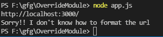

# 如何覆盖 Node.js 中模块的功能？

> 原文:[https://www . geesforgeks . org/如何覆盖节点中模块的功能-js/](https://www.geeksforgeeks.org/how-to-override-functions-of-module-in-node-js/)

**覆盖**意味着不改变任何对象或模块的原始定义，而是改变其在当前场景中的行为(在当前场景中，它已经被导入或继承)。为了实现覆盖，我们将覆盖 *nodeJS* 内置模块“ **url** ”的功能。让我们看看覆盖模块所涉及的步骤:

*   首先，*要求*我们要覆盖的模块。

```
const url = require('url')
```

*   然后删除我们想要覆盖的模块功能。这里我们将覆盖*模块的*格式()*功能*

```
delete url['format']
```

*   现在添加同名函数“*格式*，为模块的*格式()*函数提供新的定义

```
url.format = function(params...) {
    // statement(s)
}

```

*   现在重新导出“ *url* ”模块，以使更改生效

```
module.exports = url
```

让我们一步一步来实现完整的工作代码:

**步骤 1:** 创建一个“ **app.js** 文件，并使用 *npm* 初始化您的项目。

```
npm init
```

项目结构如下所示:


项目/文件结构

**第二步:**现在让我们对“ **app.js** 文件进行编码。在其中，我们按照上面提到的所有步骤来重写模块。完成这些步骤后，您将会成功地**覆盖**模块的*格式()*功能。在下面找到完整的工作代码，其中显示了*格式()*函数在覆盖之前和之后的行为。

## app.js

```
// Requiring the in-built url module
// to override
const url = require("url");

// The default behaviour of format()
// function of url
console.log(url.format("http://localhost:3000/"));

// Deleting the format function of url
delete url["format"];

// Adding new function to url with same
// name so that it would override
url.format = function (str) {
  return "Sorry!! I don't know how to format the url";
};

// Re-exporting the module for changes
// to take effect
module.exports = url;

// The new behaviour of export() function
// of url module
console.log(url.format("http://localhost:3000/"));
```

**步骤 3:** 使用以下命令运行您的节点应用程序。

```
node app.js
```

***输出:***



控制台中的输出