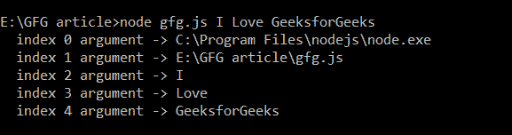
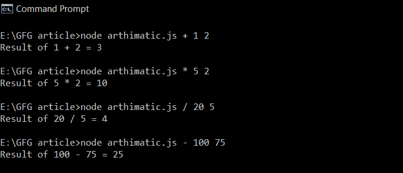
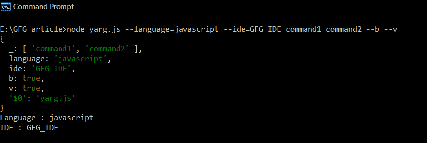

# 如何解析 node.js 中的命令行参数？

> 原文:[https://www . geeksforgeeks . org/如何解析-命令行-节点中的参数-js/](https://www.geeksforgeeks.org/how-to-parse-command-line-arguments-in-node-js/)

命令行参数是当应用程序通过操作系统的命令行界面运行时，用于向程序传递附加信息的文本字符串。在 Node.js 中，shell 接收的所有命令行参数都在一个名为 argv(argv-values)的数组中提供给进程。

我们将使用两种方法通过 **process.argv** 数组以及流行的包 **yargs** 解析命令行参数

**方法 1:使用 process.argv:** 借助 process.argv 数组接收参数是最简单的方法。Node.js 以 *process.argv* 的形式为每个正在运行的进程公开这个数组。process.argv 数组的第一个元素是指向 Node 可执行文件的文件系统路径。第二个元素是正在执行的 JavaScript 文件的路径，其余的数组元素是通过 *cmd* 传递的参数。

**注意:**即使我们不传递任何参数， *process.argv* 数组的前两个元素始终存在。

**示例 1:文件名:gfg.js**

## java 描述语言

```js
for(let i = 0; i < process.argv.length; ++i) {
    console.log(`index ${i} argument -> ${process.argv[i]}`);
}
```

通过传递参数，使用以下命令运行 **gfg.js** 文件:

```js
node gfg.js I Love GeeksforGeeks
```

**输出:**



使用 process.argv

**示例 2:** 根据通过 *cmd* 传递的参数执行算术运算的程序。

**文件名:artimatic . js**

## java 描述语言

```js
// To trim first 2 elements
const arg = process.argv.slice(2);

arg[1] = Number(arg[1]);
arg[2] = Number(arg[2]);

switch (arg[0]) {
    case '+':
        console.log(`Result of ${arg[1]} 
        + ${arg[2]} = ${arg[1] + arg[2]}`);
        break;

    case '*':
        console.log(`Result of ${arg[1]} 
        * ${arg[2]} = ${arg[1] * arg[2]}`);
        break;

    case '-':
        console.log(`Result of ${arg[1]} 
        - ${arg[2]} = ${arg[1] - arg[2]}`);
        break;

    case '/':
        if (arg[2] == 0) {
            console.log(
                'cannot be divided by zero!!');
        } else {
            console.log(`Result of ${arg[1]} 
            / ${arg[2]} = ${arg[1] / arg[2]}`);
        }
        break;

    case '%':
        if (arg[2] == 0) {
            console.log(
                'cannot be divided by zero!!');
        } else {
            console.log(`Result of ${arg[1]} 
            % ${arg[2]} = ${arg[1] % arg[2]}`);
        }
        break;

    default: console.log(
        `operation cannot be performed!!`);
}
```

通过传递以下参数运行**artimatic . js**文件:

**输出:**



根据通过 cmd 传递的参数执行算术运算的程序。

**方法 2:使用 yargs 模块:**通过 *cmd* 传递参数当我们开始处理标志或者如果您的服务器需要大量参数时，就会变得很乏味。

```js
app -h host -p port -r -v -b --quiet -x -o outfile
```

为了解决这个问题，我们可以使用第三个库模块，如 [yargs](http://yargs.js.org/docs/) 来解析通过 *cmd* 传递的参数。在本模块中，您可以将参数作为键值对传递，然后在键的帮助下访问它们。**。argv** 将参数作为一个普通的旧对象获取。

使用以下命令安装 **yargs** 模块:

```js
npm install yargs --save
```

**示例:文件名:yarg.js**

## java 描述语言

```js
const args = require('yargs').argv;
console.log(args);
console.log(`Language : ${args.language}`);
console.log(`IDE : ${args.ide}`);
```

要运行该文件，请执行以下命令:

> node yarg . js–language = JavaScript–IDE = GFG _ IDE 命令 1 命令 2–b–v

**输出:**



使用 yargs 模块

**注:**

*   argv。$0 包含要执行的脚本文件的名称。
*   argv。_ 是一个数组，包含没有附加到选项(或标志)的每个元素。这些元素在 yargs 中被称为命令。
*   argv.time、argv.b 等标志成为 argv 的属性。标志必须作为–标志传递。示例: ***节点***