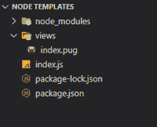
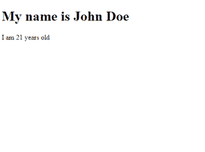

# 如何将 node.js 变量传递/访问到 html 文件/模板？

> 原文:[https://www . geesforgeks . org/如何传递访问节点-js-变量到 html 文件-模板/](https://www.geeksforgeeks.org/how-to-pass-access-node-js-variable-to-an-html-file-template/)

下面的方法介绍了如何将 node.js 变量传递/访问到一个 HTML 文件/模板。我们将构建一个基本的 Node.js 应用程序，让您在 HTML 页面上显示动态内容，即您的姓名和年龄。为了将姓名和年龄值添加到我们的 HTML 模板中，我们将使用 pug 包。

**Pug** 是一个模板引擎，可以用来向 HTML 页面注入动态数据。它的功能是将提供的数据转换成 HTML 内容，并将其作为静态页面。帕格的语法类似于传统的 HTML，但是要干净得多，并且优先考虑缩进和间距来控制逻辑流。

**创建 NodeJS 应用并安装模块:**

*   **步骤 1:** 我们可以使用以下命令创建一个带有[节点包管理器](https://nodejs.org/en/download/)的新项目。

    ```js
    npm init
    ```

*   **步骤 2:** 使用以下命令安装所需的项目依赖项，即 **express** 和 **pug** 模块。

    ```js
    npm install express pug --save
    ```

默认情况下，所有 HTML 模板都存储在项目中的**视图**文件夹中。我们将使用相同的结构创建模板文件**索引。**

**项目目录:**我们的项目目录会是这样的。



项目结构

## index.js

```js
const express = require('express');

// Initialize App
const app = express();

// Assign route
app.use('/', (req, res, next) => {
  res.render('index.pug', { name: 'John Doe', age: 21 });
});

// Start server
app.listen(5000, () => {
  console.log('App listening on port 5000');
});
```

**说明:**上面的代码将其拆分为 3 段:

1.  导入 express 并初始化其实例
2.  创建一条路线，为 HTML 模板提供服务，并向其中传递数据(用户的姓名和年龄)。
3.  正在启动服务器。

## 索引帕格

```js
doctype html
html(lang="en")
  head
    title= 'Node.js Template'
  body
    h1 My name is #{name}
    p I am #{age} years old
```

**解释:**在幕后，上面的 pub 代码连同提供的数据被翻译成一个 HTML 页面，然后通过 Node.js 应用程序提供服务。

**运行应用程序的步骤:**

使用以下命令运行 **index.js** 文件。

```js
node index.js
```

**输出:**现在打开浏览器，转到***http://localhost:5000/***，会看到如下输出:



<u>索引模板的可视化表示</u>