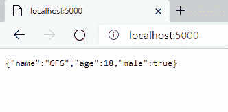

# 如何将 Node.js 输出传递到 Web 界面？

> 原文:[https://www . geesforgeks . org/how-pass-node-js-output-to-web-interface/](https://www.geeksforgeeks.org/how-to-pass-node-js-output-to-web-interface/)

当今大多数流行的浏览器都自动处理从应用编程接口输出的原始数据在网络界面上的显示。要做到这一点，我们只需要在 API 响应中直接发送所需的数据，浏览器将处理其余的数据。

**所需模块:**

*   处理路由

**设置环境和执行:**

*   **第一步:**初始化节点项目。

    ```
    npm init
    ```

*   **步骤 2:** 安装所需模块。

    ```
    npm install express
    ```

**示例:**现在创建一个文件，我们将在其中写下代码，以在 web 界面上显示输出。

## index.js

```
const express = require("express");

const app = express();

app.listen(5000, () => {
  console.log(`Server is up and running on 5000 ...`);
});

app.get("/", (req, res) => {

    let data = {
        name: "GFG",
        age: 18,
        male: true
    }

    res.send(data);
});
```

**输出:**要运行节点服务器，到浏览器中***http://localhost:5000***查看输出。

```
node index.js
```

