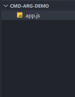
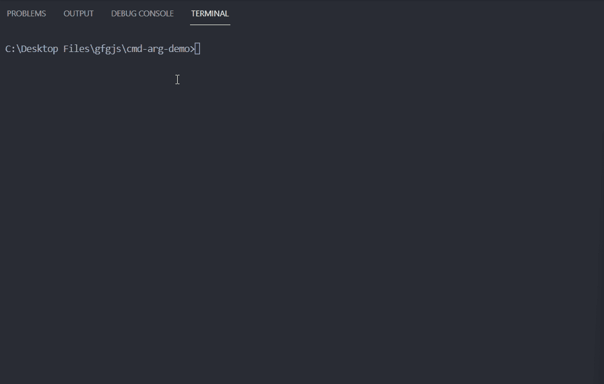

# 如何在 Node.js 中打印传递给脚本的命令行参数？

> 原文:[https://www . geesforgeks . org/如何打印-命令行-参数-传递给节点中的脚本-js/](https://www.geeksforgeeks.org/how-to-print-command-line-arguments-passed-to-the-script-in-node-js/)

[Node.js](https://www.geeksforgeeks.org/nodejs-tutorials/) 是一个开源的跨平台运行时环境，构建在 Chrome 的 V8 引擎之上，让我们可以在浏览器之外使用 JavaScript。Node.js 帮助我们使用 JavaScript 构建服务器端应用程序。

在 Node.js 中，如果你想打印命令行参数，那么我们可以访问[进程](https://www.geeksforgeeks.org/node-js-process-object/)对象上的 argv 属性。process.argv 返回一个数组，该数组包含 Node.js js 可执行文件的绝对路径作为第一个参数，运行脚本的绝对文件路径和命令行参数作为元素的其余部分。我们可以在命令行上使用下面的命令将命令行参数传递给我们的脚本。

**语法:**

```
node file-name.js argument1 argument2 argumentN
```

**打印命令行参数的步骤**:

**第一步:** [如果你的机器上没有安装 Node.js](https://www.geeksforgeeks.org/installation-of-node-js-on-windows/) 。

**步骤 2:** 在特定目录下创建 app.js 文件。

**项目结构:**按照步骤操作后，您的项目结构将如下所示。



## app.js

```
const args = process.argv;

console.log(args);
args.forEach((e, idx) => {
  // The process.argv array contains
  // Node.js executable absolute
  // path as first element
  if (idx === 0) {
    console.log(`Exec path: ${e}`);
  }

  // Absolute file path is the second element
  // of process.argv array
  else if (idx === 1) {
    console.log(`File Path: ${e}`);
  }

  // Rest of the elements are the command
  // line arguments the we pass
  else {
    console.log(`Argument ${idx - 1}: ${e}`);
  }
});
```

使用以下命令运行 **app.js** 文件:

```
node app.js geeks for geeks
```

**输出:**

