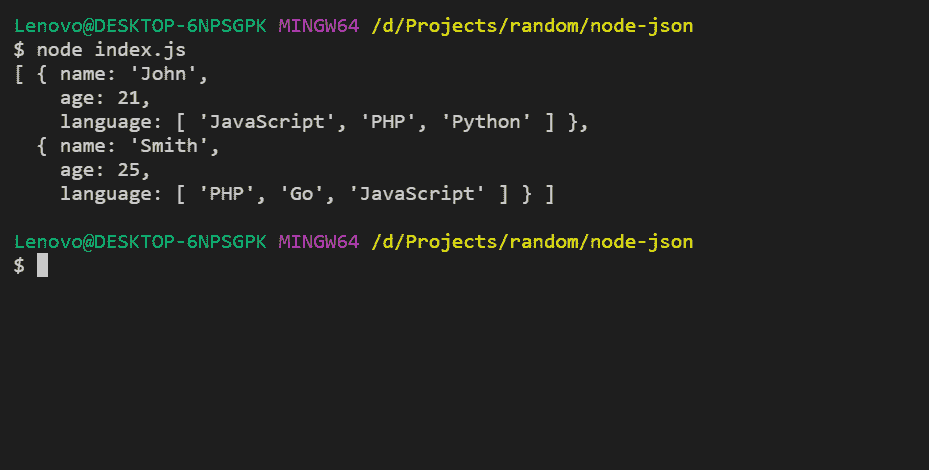
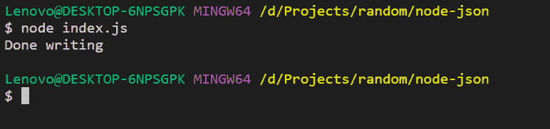
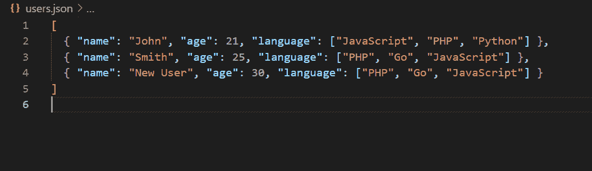

# 如何使用 Node.js 读写 JSON 文件？

> 原文:[https://www . geesforgeks . org/如何读写-JSON-file-use-node-js/](https://www.geeksforgeeks.org/how-to-read-and-write-json-file-using-node-js/)

**[Node.js](https://www.geeksforgeeks.org/introduction-to-nodejs/)** 是一个开源的跨平台运行时环境，用于在浏览器外执行 JavaScript 代码。它被广泛用于从小公司到大公司开发 API 和微服务。

**[【JSON】](https://www.geeksforgeeks.org/javascript-json/)**或 JavaScript 对象符号是一种轻量级的、基于文本的数据交换格式。像 XML 一样，它是应用程序之间交换信息的方式之一。这种数据格式被 web 应用程序/API 广泛用于相互通信。

**读取 JSON 文件:**

*   **Method 1: Using require method:** The simplest method to read a JSON file is to require it in a node.js file using `require()` method.

    **语法:**

    ```
    const data = require('path/to/file/filename');
    ```

    **示例:**在 **index.js** 文件所在的同一目录下创建一个 **users.json** 文件。将以下数据添加到 json 文件中。

    **users.json 文件:**

    ```
    [
      { 
        "name": "John", 
        "age": 21,
        "language": ["JavaScript", "PHP", "Python"] 
      },
      {
         "name": "Smith",
         "age": 25,
         "language": ["PHP", "Go", "JavaScript"] 
      }
    ]
    ```

    现在，将以下代码添加到您的`index.js`文件中。

    **index.js 文件:**

    ```
    // Requiring users file
    const users = require("./users");

    console.log(users);
    ```

    现在，使用以下命令运行文件:

    ```
    node index.js
    ```

    **输出:**
    

*   **Method 2: Using the fs module:** We can also use node.js **fs** module to read a file. The `fs` module returns a file content in string format so we need to convert it into JSON format by using **JSON.parse()** in-built method.
    Add the following code into your `index.js` file:
    **index.js file:**

    ```
    const fs = require("fs");

    // Read users.json file
    fs.readFile("users.json", function(err, data) {

        // Check for errors
        if (err) throw err;

        // Converting to JSON
        const users = JSON.parse(data);

        console.log(users); // Print users 
    });
    ```

    现在再次运行该文件，您将看到如下输出:
    **输出:**
    

**写入 JSON 文件:**我们可以使用 node.js **fs** 模块将数据写入 JSON 文件。我们可以使用 **writeFile** 方法将数据写入文件。

**语法:**

```
fs.writeFile("filename", data, callback);
```

**示例:**我们将在前面示例中创建的现有 JSON 文件中添加一个新用户。这项任务将分三步完成:

*   使用上述方法之一读取文件。
*   使用`.push()`方法添加数据。
*   使用`JSON.stringify()`方法将新数据写入文件，将数据转换为字符串。

```
const fs = require("fs");

// STEP 1: Reading JSON file
const users = require("./users");

// Defining new user
let user = {
    name: "New User",
    age: 30,
    language: ["PHP", "Go", "JavaScript"]
};

// STEP 2: Adding new data to users object
users.push(user);

// STEP 3: Writing to a file
fs.writeFile("users.json", JSON.stringify(users), err => {

    // Checking for errors
    if (err) throw err; 

    console.log("Done writing"); // Success
});
```

再次运行该文件，您将在控制台中看到一条消息:


现在检查你的**用户. json** 文件，它看起来如下所示:
