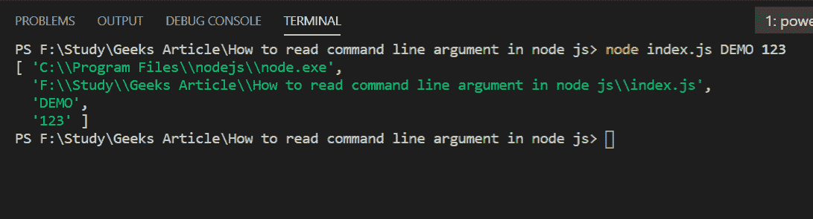

# 如何读取 Node.js 中的命令行参数？

> 原文:[https://www . geesforgeks . org/how-read-command-line-arguments-in-node-js/](https://www.geeksforgeeks.org/how-to-read-command-line-arguments-in-node-js/)

命令行参数是当应用程序通过操作系统的命令行界面运行时，用于向程序传递附加信息的文本字符串。我们可以通过节点中的全局对象(即进程对象)轻松读取这些参数。

以下是带有适当示例的方法。

**例 1:**

*   **第一步:**将文件另存为 **index.js** 并将下面的代码粘贴到文件中。

    ```
    var arguments = process.argv ;

    console.log(arguments) ;
    ```

*   **步骤 2:** 使用以下命令运行 **index.js** 文件:

    ```
    node index.js
    ```

*   **输出:** 

`process.argv`包含一个数组，其中第 0 <sup>个</sup>索引包含节点可执行路径，第 1 <sup>个</sup>索引包含当前文件的路径，其余索引包含传递的参数。

**示例 2:** 将作为参数传递的两个数字相加的程序。

*   **第一步:**将文件另存为 **index1.js** 并将下面的代码粘贴到文件中。

    ```
    var arguments = process.argv

    function add(a, b) {

        // To extract number from string
        return parseInt(a)+parseInt(b) 
    }

    var sum = add(arguments[2], arguments[3])

    console.log("Addition of 2, 3 is ", sum)
    ```

*   **步骤 2:** 使用以下命令运行**索引 1.js** 文件:

    ```
    node index1.js
    ```

*   **输出:** 

这就是我们在 Node.js 中处理参数的方式。它提供了各种功能，比如添加我们自己的命令来工作等等。