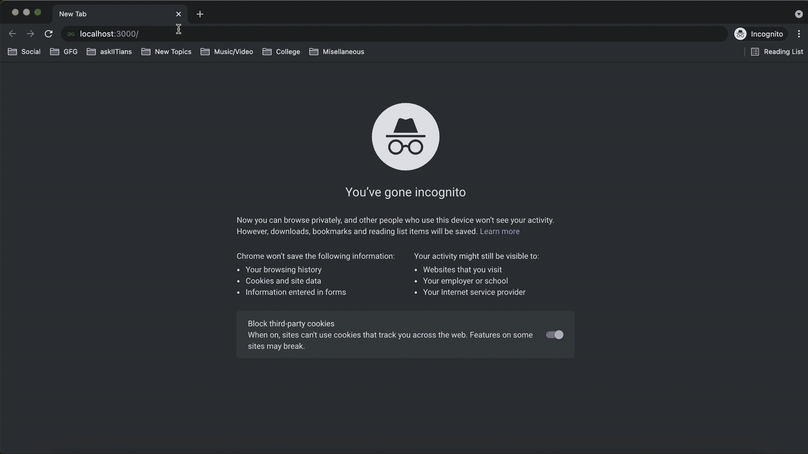
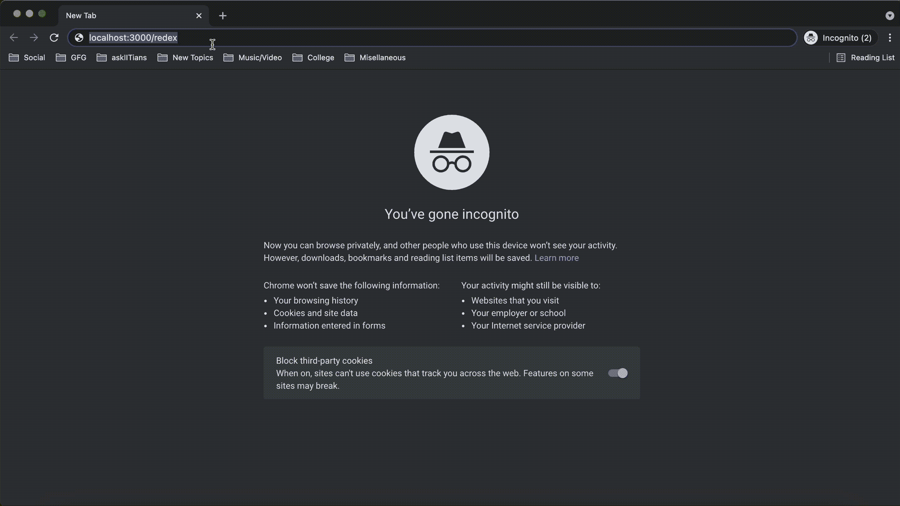

# 如何在 Node.js 中重定向回原 URL？

> 原文:[https://www . geesforgeks . org/how-redirect-back-to-original-URL-in-node-js/](https://www.geeksforgeeks.org/how-to-redirect-back-to-original-url-in-node-js/)

[<u>Node.js</u>](https://www.geeksforgeeks.org/introduction-to-nodejs/) 借助 [<u>Express</u>](https://www.geeksforgeeks.org/introduction-to-express/) ，支持网页路由。这意味着当客户端发出不同的请求时，应用程序将根据发出的请求和定义的路由方法被路由到不同的网页。要了解更多关于 Node.js 路由和实现的信息，请参考 [<u>这篇</u>](https://www.geeksforgeeks.org/routing-in-node-js/) 文章。

在本文中，我们将讨论如何在 Node.js 中重定向回原始 URL

[<u>res.redirect()</u>](https://www.geeksforgeeks.org/express-js-res-redirect-function/) 是一个帮助根据指定路径重定向网页的网址实用程序功能。

**语法:**

```js
return res.redirect([status], path)
```

对于第一个示例，我们将用户重定向到具有不同域的指定 URL。在运行代码之前，确保在您的项目中安装[](https://www.geeksforgeeks.org/introduction-to-express/)<u>。</u>

## <u>java 描述语言</u>

```js
const express= require('express');

var app= express();

app.get('/',function(req,res){
  // On getting the home route request,
  // the user will be redirected to GFG website
  res.redirect('https://www.geeksforgeeks.org');
});

app.listen(3000,function(req,res){
  console.log("Server is running at port 3000");
});
```

<u>当使用节点执行上述代码时，当我们在端口 3000 上请求归属路由时，我们将被重定向到 [<u>GeeksforGeeks</u>](https://www.geeksforgeeks.org) 网站。</u>

<u>**输出:**</u>

<u></u>

<u>**其他方法:**除了重定向到不同的域，我们还有一些其他方法可以重定向，如下所示。</u>

<u>**域相对重定向:**我们可以用这个方法重定向到同一个域下的不同页面。例如，如果用户在[<u>http://example.com/gfg/post1</u>](http://example.com/gfg/post1)，那么我们可以使用下面一行代码重定向到[<u>http://example.com/article</u>](http://example.com/gfg/post1)</u>

```js
res.redirect('/article');
```

<u>**路径名相对重定向:**我们可以用这个方法重定向到网站上的上一个路径。例如，如果用户在[<u>http://example.com/gfg/post1</u>](http://example.com/gfg/post1)，那么我们可以使用下面一行代码重定向到[<u>http://example.com/gfg</u>](http://example.com/gfg/post1)</u>

```js
res.redirect('..');
```

<u>**重定向回原网址:**</u>

<u>了解了 res.redirect()函数后，我们现在可以讨论如何在 NodeJS 中重定向回原始 URL。</u>

<u>**反向重定向:**</u>

<u>我们可以使用这种方法将请求重定向回 [<u>引用者</u>](https://en.wikipedia.org/wiki/HTTP_referer) 。如果没有*推荐人*出现，默认情况下，请求被重定向到“/”路由。</u>

```js
res.redirect('back');
```

<u>**示例:**</u>

<u>假设我们走的是“/example”路线。请求“/redex”路由时，我们将被自动重定向到下面代码中定义的“/路由”</u>

## <u>java 描述语言</u>

```js
const express= require('express');

var app= express();

//Defining '/' route
app.get('/',function(req,res){
  res.redirect('https://www.geeksforgeeks.org');
});

//Defining '/example' route
app.get('/example',function(req,res){
  res.redirect('https://www.geeksforgeeks.org/array-data-structure/');
});

//Defining '/redex' route
app.get('/redex',function(req,res){
  res.redirect('back');
})

app.listen(3000,function(req,res){
  console.log("Server is running at port 3000");
});
```

<u>**输出:**
</u>

<u>**参考:**[<u>https://expressjs . com/en/5x/API . html # RES .重定向</u>](https://expressjs.com/en/5x/api.html#res.redirect)</u>