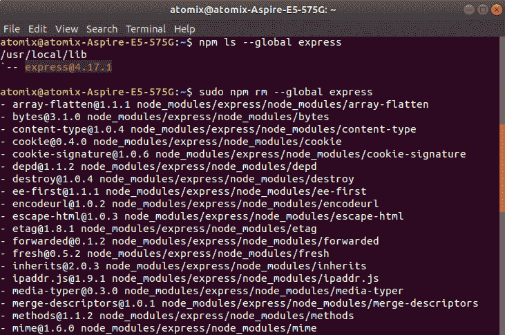
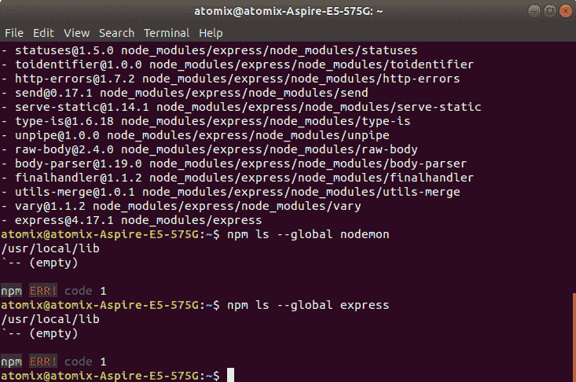
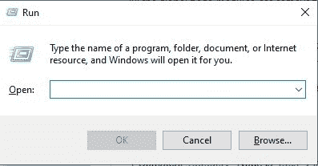
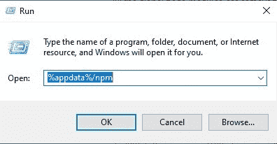
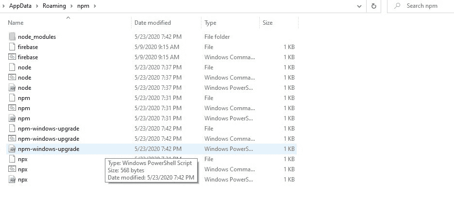

# 如何删除 Node.js 中的所有全局模块？

> 原文:[https://www . geesforgeks . org/how-to-remove-all-global-modules-in-node-js/](https://www.geeksforgeeks.org/how-to-remove-all-global-modules-in-node-js/)

Node.js 是一个开源的跨平台运行时环境，用于在浏览器之外执行 [JavaScript](https://www.geeksforgeeks.org/JavaScript-tutorial/) 代码。你需要记住 **Node.js 不是框架，也不是编程语言**。大多数人都很困惑，明白这是一个框架或者一种编程语言。我们经常使用 Node.js 来构建后端服务，比如像 Web App 或者移动 App 这样的 API。贝宝、优步、网飞、沃尔玛等大公司都在生产中使用。

我们可以通过以下方式全局移除 Node.js 中的所有模块:

**对于 Linux (Ubuntu)用户:**为了卸载全局安装的 package_name package，可以使用以下命令(必要时使用 sudo，具体取决于您的设置和权限)。

```
sudo npm rm --global package_name

```

要检查软件包是否已全局安装，请使用以下命令:

```
npm ls --global packae_name

```

下图显示使用以上命令卸载**快递**包裹全球:



**对于窗口用户:**窗口用户只需删除以下目录的内容，即可全局删除所有 Node.js 模块:

```
C:\Users\username\AppData\Roaming\npm
```

**移除全局模块的步骤:**

1.  从键盘上按下 **win + r** (win = Windows 按钮)，会出现如下所示的对话框:
    
2.  Now type **%appdata%/npm** in the text field and press enter button as shown below:
    

    目录中会有如下所示的文件和文件夹:
    

3.  现在删除这个目录的内容。

所有全局节点模块都已正确删除。