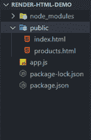
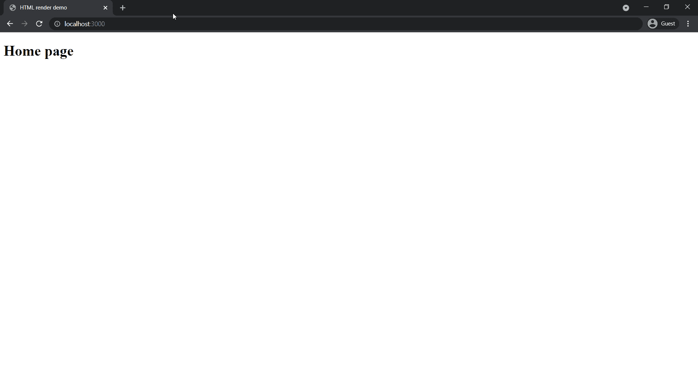

# 如何在 Node.js 中渲染 HTML 的纯文本？

> 原文:[https://www . geesforgeks . org/如何在节点中呈现纯文本格式的 html-js/](https://www.geeksforgeeks.org/how-to-render-plain-text-of-html-in-node-js/)

[Express Js](https://www.geeksforgeeks.org/introduction-to-express/) 是基于 Node.js web server 功能的 web 应用框架，帮助我们创建基于 HTTP 请求(POST、GET 等)方法和请求的路由进行响应的应用端点。express.js 模块的 [res.sendFile()](https://www.geeksforgeeks.org/express-js-res-sendfile-function/) 方法用于呈现本地机器中存在的特定 HTML 文件。

**语法:**

```js
res.sendFile(path,[options],[fn])
```

**参数**:path 参数描述路径，options 参数包含 maxAge、root 等各种属性，fn 为回调函数。

**返回**:返回一个对象。

**项目设置:**

**第一步:** [如果你的机器中没有安装 Node.js，安装 Node.js](https://www.geeksforgeeks.org/installation-of-node-js-on-windows/) 。

**步骤 2:** 在公共文件夹中创建一个名为 public 的新文件夹。在公共文件夹中创建两个名为 index.html 和 products.html 的文件。

**步骤 3:** 现在，使用命令行中的以下命令，用默认配置初始化一个新的 Node.js 项目。

```js
npm init -y
```

**步骤 5:** 现在使用命令行中的以下命令在项目内部安装 express。

```js
npm install express
```

**项目结构:**按照步骤操作后，你的项目结构会是什么样子。



## app.js

```js
// Importing modules
const express = require('express');
const path = require('path');
const app = express();

app.get('/', (req, res) => {

  // Sending our index.html file as 
  // response. In path.join() method
  // __dirname is the directory where
  // our app.js file is present. In 
  // this case __dirname is the root
  // folder of the project.
  res.sendFile(path.join(__dirname, '/public/index.html'));
});

app.get('/products', (req, res) => {
  res.sendFile(path.join(__dirname, '/public/products.html'));
});

app.listen(3000, () => {
  console.log('Server is up on port 3000');
});
```

## index.html

```js
<!DOCTYPE html>
<html lang="en">
  <head>
    <meta charset="UTF-8" />
    <meta http-equiv="X-UA-Compatible" content="IE=edge" />
    <meta name="viewport" content=
      "width=device-width, initial-scale=1.0" />
    <title>HTML render demo</title>
  </head>
  <body>
    <h1>Home page</h1>
  </body>
</html>
```

## products.html

```js
<!DOCTYPE html>
<html lang="en">
  <head>
    <meta charset="UTF-8" />
    <meta http-equiv="X-UA-Compatible" content="IE=edge" />
    <meta name="viewport" content=
      "width=device-width, initial-scale=1.0" />
    <title>HTML render demo</title>
  </head>
  <body>
    <h1>Products page</h1>
  </body>
</html>
```

使用以下命令运行 **app.js** 文件:

```js
node app.js
```

**输出:**打开浏览器，转到 **http://localhost:3000** ，手动切换到**http://localhost:3000/产品**，会看到如下输出。

