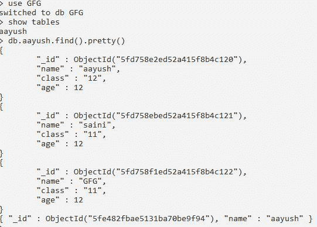
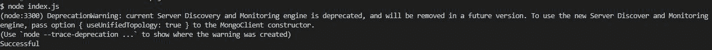
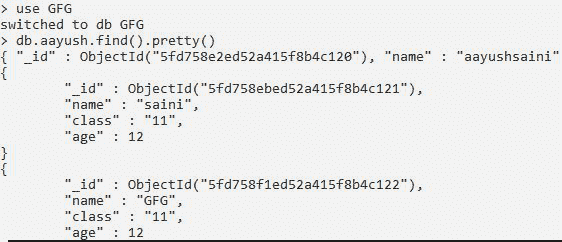

# 如何用 Node.js 替换 MongoDB 中的一个文档？

> 原文:[https://www . geesforgeks . org/how-to-replace-one-document-in-MongoDB-using-node-js/](https://www.geeksforgeeks.org/how-to-replace-one-document-in-mongodb-using-node-js/)

**MongoDB** ，最受欢迎的 NoSQL 数据库，我们可以使用 MongoDB Collection . count documents()函数统计 MongoDB Collection 中的文档数量。 **mongodb** **模块**用于连接 mongodb 数据库，也用于操作 MongoDB 中的集合和数据库。

**安装模块:**可以使用以下命令安装 **mongodb** 模块。

```
npm install mongodb
```

**项目结构:**


**在本地 IP 上运行服务器:**数据是 MongoDB 服务器所在的目录。

```
mongod --dbpath=data --bind_ip 127.0.0.1
```


**MongoDB 数据库:**

```
Database:GFG
Collection:aayush
```

以下是本示例中存储在数据库中的示例数据。



**文件名:index.js**

## java 描述语言

```
// Requiring module
const MongoClient = require("mongodb");

// Connection URL
const url = 'mongodb://localhost:27017/';

// Database name
const databasename = "GFG";

MongoClient.connect(url).then((client) => {
   const connect = client.db(databasename);

   // Connect to collection
   const collection = connect .collection("aayush");

   // Replacing document with our match condition
   collection.replaceOne({name:"aayush"},
   {name:"aayushsaini"}).then((ans) => {
       console.log("Successful");
   }).then((err) => {
       console.log(err);
   })    
}).catch((err) => {
   // Printing the error message
   console.log(err.Message);
})
```

使用以下命令运行 **index.js** 文件:

```
node index.js
```

**输出:**



以下是执行上述命令后更新的数据库。

