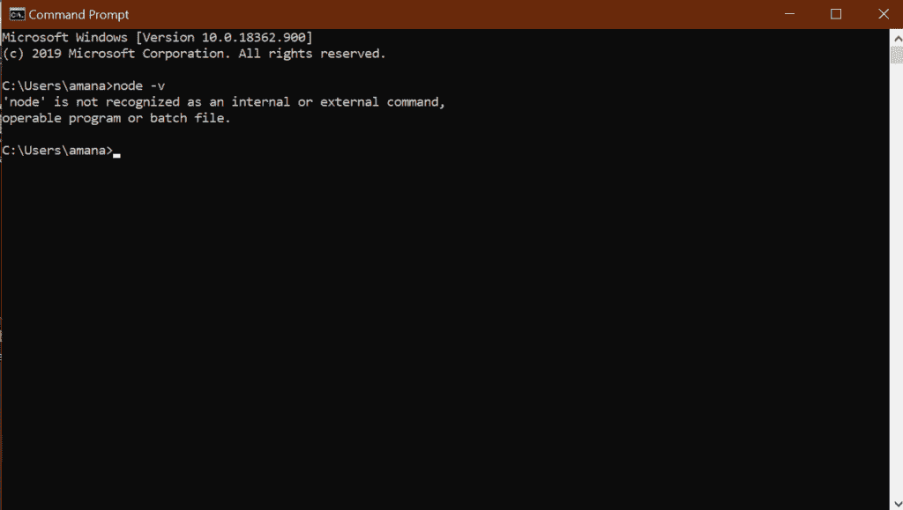
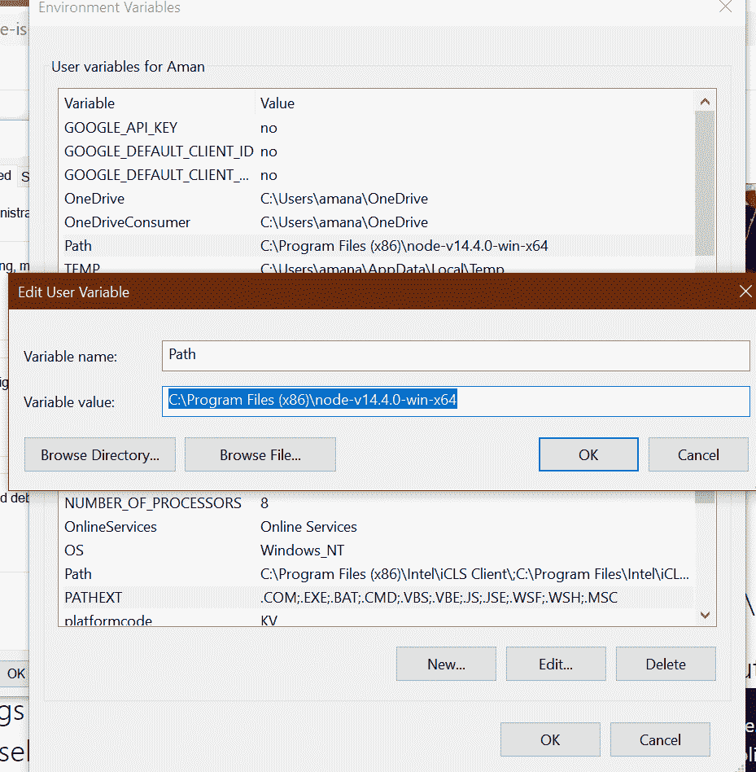
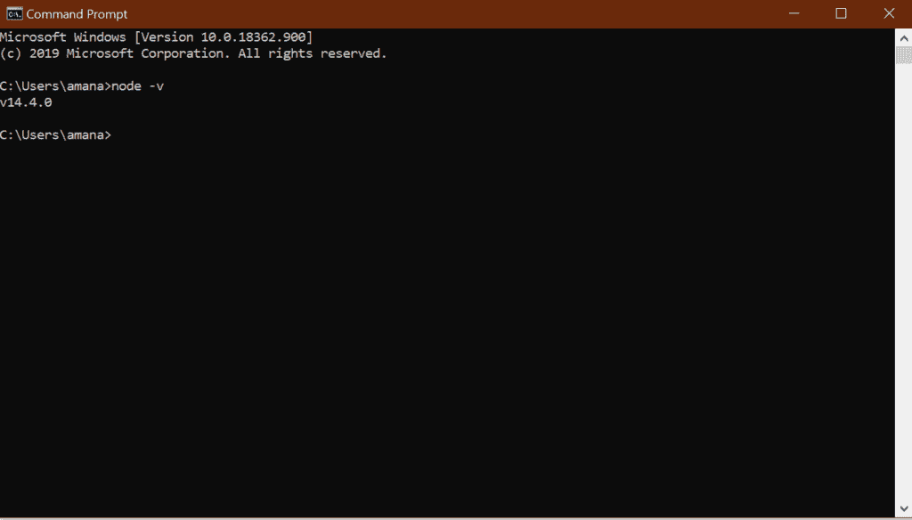

# 如何解决安装 Node.js 后‘node’不被识别为内部或外部命令错误？

> 原文:[https://www . geesforgeks . org/如何解决节点无法识别为内部或外部命令-安装后出错-节点-js/](https://www.geeksforgeeks.org/how-to-resolve-node-is-not-recognized-as-an-internal-or-external-command-error-after-installing-node-js/)

[在电脑上安装 node.js](https://www.geeksforgeeks.org/installation-of-node-js-on-windows/) 有很多不同的方法。验证 node.js 是否已正确安装在计算机中的最简单方法是在命令提示符或 Windows PowerShell 中键入 node-v。

但是很多时候，这种情况会发生，最常见的情况是，如果您是初学者，命令提示符会打印如下输出:

```js
'node' is not recognized as an internal or external command,
operable program or batch file.

```



这是最常见的错误，解决这个问题非常简单。这可能是一种用户可能已经从官方节点网站正确安装了节点的情况。但有时，原因是路径变量没有在您的系统中定义。因此，要正确定义路径变量并解决此错误，请执行以下简单步骤:

1.  Open the Environment Variables option in your Control Panel. (Go to Control Panel -> System and Security ->System -> Advanced System Settings-> Environment Variables ->User Variables or System Variables.)

    

2.  Select the variable named **Path**. A dialogue box named **Edit user variable** will appear. In the variable value option inside that dialogue box, paste the complete path of the location where node.js is installed in your system.Then click on OK.

    

3.  Restart the command prompt again and now verify by typing node-v in the command prompt. It will now display the version of the node which you’ve installed from the internet .

    