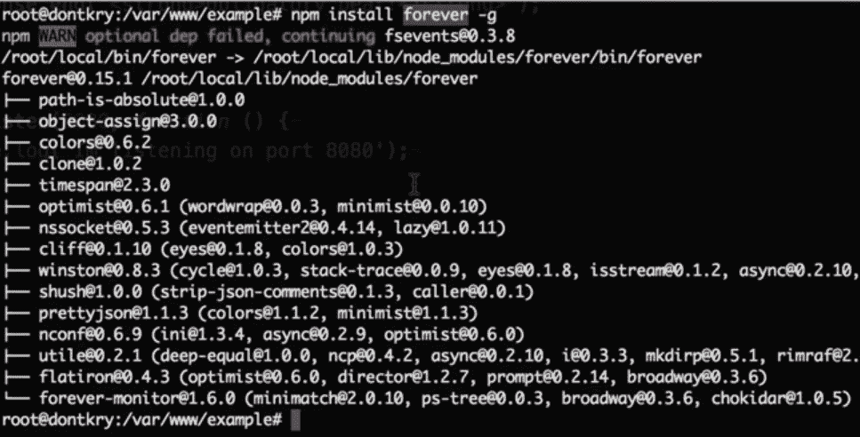
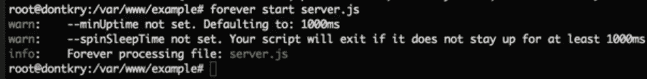
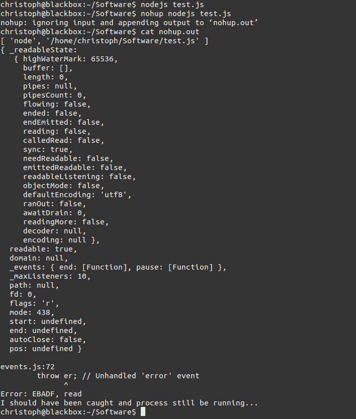

# 如何运行 node.js app 作为后台服务？

> 原文:[https://www . geesforgeks . org/如何运行节点-js-app-as-background-service/](https://www.geeksforgeeks.org/how-to-run-a-node-js-app-as-a-background-service/)

[节点。js](https://www.geeksforgeeks.org/nodejs-tutorials/) 是一个建立在 Chrome 的 JavaScript v8 引擎上的平台，用于轻松构建快速、可扩展的网络应用，JavaScript 使用事件驱动、无阻塞的 I/O 模型，使其轻量、高效，非常适合跨分布式设备运行的数据密集型实时应用，以及利用 Node 中的工具(或包)。js，我们需要能够安装在我们的机器上，并以一种有用的方式管理它们。

要将 node.js app 作为后台服务运行，即使在关闭节点终端后，app 服务器也需要保持运行。

**运行 node.js** **app 作为后台服务的方法:**

**方法 1:** 让 node.js app 作为后台服务运行最简单的方法就是使用**永远**工具。**永远**是一个简单的命令行界面工具，确保给定的特定脚本连续运行，没有任何交互。

**安装命令:**以下命令在 app 中安装**永远**工具。

```
$ npm install forever -g
```



永久安装示例

**命令永远启动:**要启动永远工具，运行以下命令，将 **< app_name >** 替换为 **node.js app** 的名称。

```
$ forever start /<app_name>/index.js
```



永远开始的例子

**方法二:**第二种方法是**创建一个服务文件**，手动启动 app，使服务在后台保持运行。

*   **第一步:**新建文件 **< app_name >。服务**文件将< app_name >替换为 node.js app 的名称。在文件中，输入以下**值**:

    ```
    ExecStart=/var/www/<app_name>/app.js
    Restart=always
    User=nobody
    Group=nogroup
    Environment=PATH=/usr/bin:/usr/local/bin
    Environment=NODE_ENV=production
    WorkingDirectory=/var/www/<app_name>
    ```

*   **第二步:****配置**服务文件后，

    复制 **< app_name >。服务**文件进入**/etc/system/system**。

*   **步骤 3:** 使用以下命令启动应用程序，使其使用服务文件运行:

    ```
    systemctl start <app_name>
    ```

**方法三:**另一种可以使用 **nohup** 运行 node.js app 作为后台的方法。 **nohup** 是另一个命令行界面工具，可以用来运行一个 node.js 应用作为**后台服务**。

运行以下命令启动 **nohup** ，用 node.js app 的名称替换 **< app_name >** :

```
$ nohup node /<app_name>/index.js &
```

即使命令终端关闭，nohup 命令也不会终止此过程。



使用 nohup 的示例