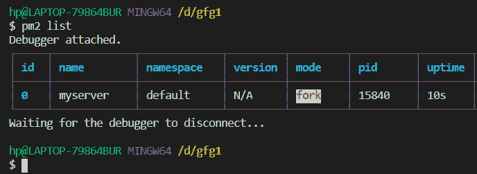
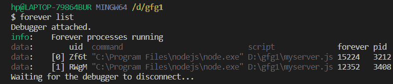

# 如何永久运行 node.js 应用？

> 原文:[https://www . geesforgeks . org/如何运行节点-js-应用程序-永久/](https://www.geeksforgeeks.org/how-to-run-a-node-js-application-permanently/)

[NodeJS](https://www.geeksforgeeks.org/introduction-to-nodejs/) 是 V8 引擎上的一个运行时环境，用于执行带有一些附加功能的 JavaScript 代码，允许开发快速且可扩展的 web 应用程序，但是我们不能在关闭终端或 application 后在本地运行 Node.js 应用程序，以永久运行 NodeJS 应用程序。我们使用[【NPM】](https://www.geeksforgeeks.org/node-js-npm-node-package-manager/)模块，如**或【PM2】**来确保给定的脚本连续运行。NPM 是 Node.js 的默认包管理器，它使我们能够访问许多包或模块，这使得开发 web 应用程序变得更加容易。

**方法 1:**

**使用 PM2 模块:**

*   **安装项目目录中的模块:**

```
npm install pm2 -g
```

*   **通过 pm2** 启动您的 Node.js 应用程序。

```
pm2 start [Your fileName]
```

*   **列出所有在 pm2** 注册的流程。

```
pm2 list
```

**控制台输出:**



*   **我们也可以通过 pm2 停止命令**停止任何进程运行

```
 pm2 stop all                  
 pm2 stop [id number]       
```

**方法二:**

**使用永久模块**

*   **在您的项目目录中安装模块:**

```
npm install forever -g
```

*   **通过永久模块启动您的 Node.js 应用程序。**

```
forever start [Your FileName]
```

*   **列出的所有流程，这些流程将永久注册**

```
forever list
```

**控制台输出:**



*   我们还可以删除或停止任何使用 index 注册的进程(例如本例中的 0)

```
forever stopall
forever stop [index]
```

因此，现在您的应用程序将永久运行，即使退出终端或应用程序。