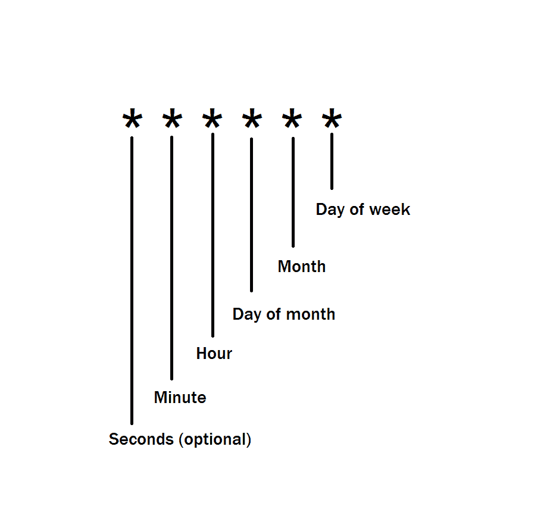
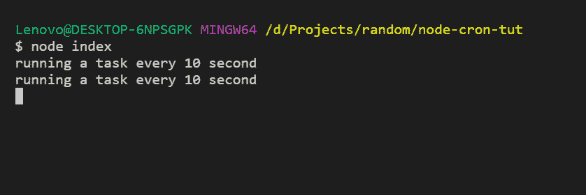
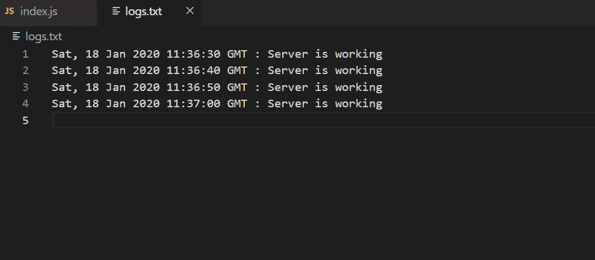
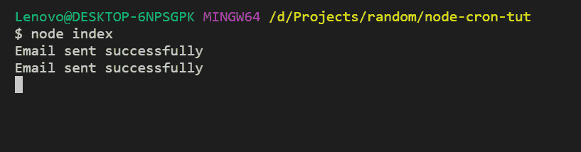
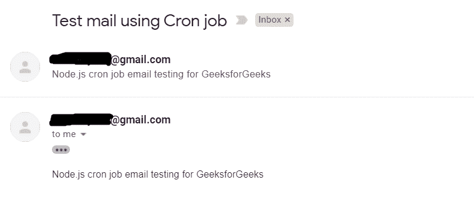

# 如何在 Node.js 中运行 Cron 作业？

> 原文:[https://www . geesforgeks . org/how-run-cron-jobs-in-node-js/](https://www.geeksforgeeks.org/how-to-run-cron-jobs-in-node-js/)

**Cron 作业:**这些是操作系统定期运行的任务。用户可以安排命令，操作系统会根据给定的时间自动运行这些命令。它通常用于系统管理工作，如**备份、日志记录、发送时事通讯、订阅电子邮件等。**

**先决条件:**

*   已安装 Node.js
*   NPM 安装
*   Node.js 语法的基本知识

我们将使用一个名为 **node-cron** 的包，这是一个纯 JavaScript 的 node.js 任务调度器。我们还使用 **express** 作为服务器。使用命令安装所需的软件包

```js
npm install express node-cron
```

**语法:**

```js
cron.schedule("* * * * *", function() {
    // Task to do
});
```

【Cron 作业的时间格式:


**描述符及其范围:**

*   **秒(可选):**0–59
*   **分钟:**0–59
*   **小时:**0–23
*   **一月中的某一天:**1–31
*   **月:**1-12
*   **一周中的某一天:**0–7(0 和 7 都代表周日)

**示例:**

*   **(*/10 * * * *)**–每 10 分钟运行一次
*   **(* 21 * *)**–每月 21 日<sup>运行</sup>
*   **(0 8 * * 1)**–每周一上午 8 点运行

**示例:**创建一个名为 **index.js** 的新文件，并添加以下代码:

```js
// Importing required libraries
const cron = require("node-cron");
const express = require("express");

app = express(); // Initializing app

// Creating a cron job which runs on every 10 second
cron.schedule("*/10 * * * * *", function() {
    console.log("running a task every 10 second");
});

app.listen(3000);
```

使用`node index`命令运行文件，会看到如下输出:


**写入日志文件:** Cron 作业可以用来调度系统中的**日志任务**。出于监控目的，我们可以记录给定时间的服务器状态。

**示例:**

```js
// Importing required packages
const cron = require("node-cron");
const express = require("express");
const fs = require("fs");

app = express();

// Setting a cron job
cron.schedule("*/10 * * * * *", function() {

    // Data to write on file
    let data = `${new Date().toUTCString()} 
                : Server is working\n`;

    // Appending data to logs.txt file
    fs.appendFile("logs.txt", data, function(err) {

        if (err) throw err;

        console.log("Status Logged!");
    });
});

app.listen(3000);
```

运行上述文件 30-40 秒后，您将看到一个名为`logs.txt`的文件，其内容类似于以下内容:


**每月简讯:**发送每月简讯也是 cron 作业的一个使用案例，在这种情况下，将每月向用户发送一封电子邮件，其中包含网站上的最新产品或博客信息。

可以在 Node.js [这里](https://www.geeksforgeeks.org/how-to-send-email-with-nodemailer-using-gmail-account-in-node-js/)了解更多发送邮件的信息。

**示例:**

```js
// Importing packages
const cron = require("node-cron");
const express = require("express");
const nodemailer = require("nodemailer");

app = express();

// Calling sendEmail() function every 1 minute
cron.schedule("*/1 * * * *", function() {
sendMail();
});

// Send Mail function using Nodemailer
function sendMail() {
    let mailTransporter = nodemailer.createTransport({
        service: "gmail",
        auth: {
        user: "<your-email>@gmail.com",
        pass: "**********"
        }
    });

    // Setting credentials
    let mailDetails = {
        from: "<your-email>@gmail.com",
        to: "<user-email>@gmail.com",
        subject: "Test mail using Cron job",
        text: "Node.js cron job email"
           + " testing for GeeksforGeeks"
    };

    // Sending Email
    mailTransporter.sendMail(mailDetails, 
                    function(err, data) {
        if (err) {
            console.log("Error Occurs", err);
        } else {
            console.log("Email sent successfully");
        }
    });
}

app.listen(3000);
```

上面的脚本每分钟都会发邮件。

**注意:**打开[这个](https://myaccount.google.com/lesssecureapps)链接到**允许不太安全的应用:开启**。

现在使用`node index.js`运行文件，您将看到如下输出:

**控制台中:**


**在 Gmail 收件箱:**
