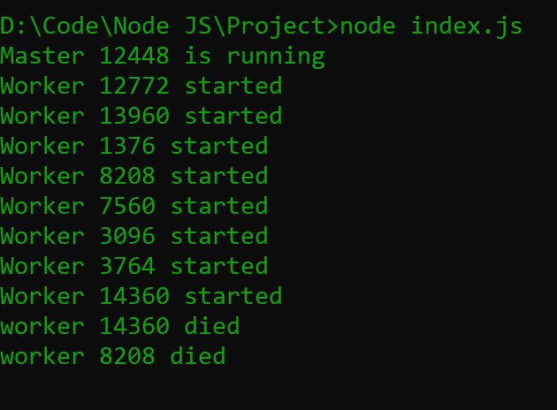

# 如何使用 Node.js 运行多个并行 HTTP 请求？

> 原文:[https://www . geesforgeks . org/how-to-run-multi-parallel-http-requests-use-node-js/](https://www.geeksforgeeks.org/how-to-run-many-parallel-http-requests-using-node-js/)

我们知道 NodeJS 应用程序是单线程的。比方说，如果处理涉及到需要 10 秒的*请求 A* ，并不意味着这个请求之后的请求需要等待 10 秒才能开始处理，因为 NodeJS 事件循环只是单线程的。整个 NodeJS 架构不是单线程的。

**NodeJS 如何处理多个客户端请求？**

NodeJS 接收多个客户端请求，并将其放入**事件队列**。NodeJS 是用事件驱动架构的概念构建的。NodeJS 有自己的**事件循环**，这是一个接收请求并处理它们的无限循环。事件循环是事件队列的侦听器。

如果节点可以在没有输入/输出阻塞的情况下处理请求，那么事件循环将自己处理请求并将响应发送回客户端。但是，可以使用 NodeJS **集群**模块或 **worker_threads** 模块并行处理多个请求。

**如何用集群模块扩展你的 NodeJS 应用？**

Node.js 的单个实例在一个线程中运行。如果你有一个多核系统，那么你可以利用每一个核。有时开发人员希望启动一个 NodeJS 进程集群来利用多核系统。

集群模块允许轻松创建共享相同服务器端口的子进程。

**步骤 1:** 创建一个 NodeJS 应用程序，安装所需的 **Express.js** 模块。

```
mkdir Project && cd Project
npm init -y 
npm i express
```

**步骤 2:** 在根目录下创建一个 ***index.js*** 文件，代码如下。

## java 描述语言

```
const express = require('express');
const cluster = require('cluster');

// Check the number of available CPU.
const numCPUs = require('os').cpus().length;

const app = express();
const PORT = 3000;

// For Master process
if (cluster.isMaster) {
  console.log(`Master ${process.pid} is running`);

  // Fork workers.
  for (let i = 0; i < numCPUs; i++) {
    cluster.fork();
  }

  // This event is firs when worker died
  cluster.on('exit', (worker, code, signal) => {
    console.log(`worker ${worker.process.pid} died`);
  });
}

// For Worker
else{

  // Workers can share any TCP connection
  // In this case it is an HTTP server
  app.listen(PORT, err =>{
    err ?
    console.log("Error in server setup") :
    console.log(`Worker ${process.pid} started`);
  });
}
```

**解释:**如果你的系统有 8 个 CPU，那么就会创建 8 个 NodeJS 实例，每个实例都有自己独立的事件循环。现在 NodeJS 可以并行处理所有请求。

它们都共享同一个端口(端口 3000)，但不是状态。主进程监听一个端口，接受新的连接，并以循环方式将它们分配给工作进程，同时内置一些智能功能以避免工作进程过载。

**第 3 步:**使用以下命令运行 ***index.js*** 文件。

```
node index.js
```

**输出:**



**使用 worker_threads 模块:**CPU 性能的最佳解决方案是 Worker Thread。这个模块用在 Node.js 中，因为它对执行繁重的 JavaScript 任务很有用。

而不是拥有:

*   openprocess
*   一根线
*   一个事件循环
*   一个 JS 引擎实例
*   一个节点. js 实例
*   工作线程有:

openprocess

*   多线程
*   每个线程一个事件循环
*   每个线程一个 JS 引擎实例
*   每个线程一个 Node.js 实例

**示例:**使用以下代码创建一个 *index.js* 文件。

**index.js**

## java 描述语言

```
const {Worker} = require('worker_threads');

const worker = new Worker(__filename);
worker.on('message', message => console.log(message));

worker.postMessage('GeeksforGeeks');
worker.emit(true)
```

使用以下命令运行服务器:

```
node --experimental-worker index.js
```

**注意:**我们必须使用**–实验工人**，因为工人线程模块仍然是实验性的。

**输出:**

```
{ name: ‘GeeksforGeeks’ }
```

**Worker _ Threads 的优点:**

*   传递本机句柄(http/https 请求)
*   死锁检测。
*   更多的是隔离，所以如果一个流程受到影响，不会影响到其他流程。

**Worker _ Threads 的缺点:**

*   不适合输入/输出操作。
*   产卵工人并不便宜。