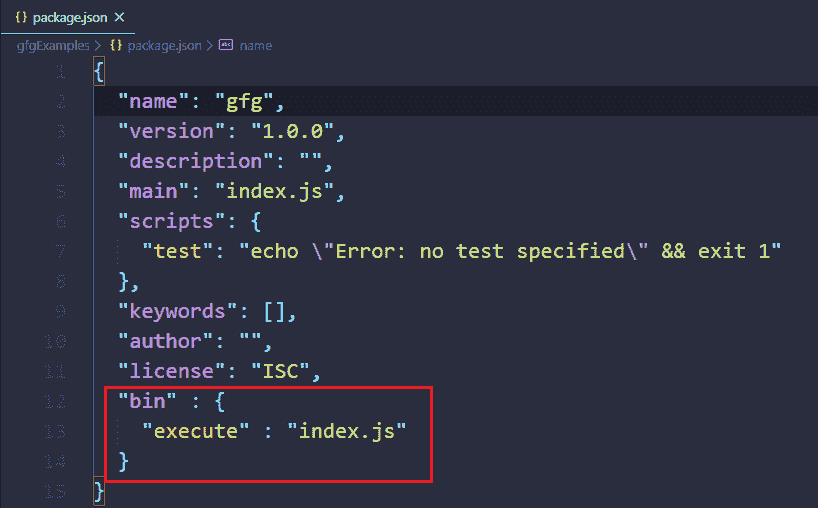
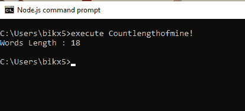
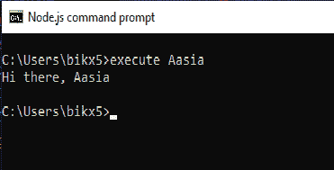

# 如何将 node.js 程序作为可执行文件运行？

> 原文:[https://www . geesforgeks . org/how-run-node-js-program-as-executive/](https://www.geeksforgeeks.org/how-to-run-node-js-program-as-an-executable/)

将 Node.js 程序作为可执行文件运行意味着我们不必去程序目录，从终端的任何地方，我们都可以用一个特定的**自注册**字来执行我们的程序。

将 node.js 程序作为可执行文件运行需要遵循四个步骤。

1.  在 package.json 中添加 **bin** 部分
2.  更改 index.js 文件权限(不适用于 windows 操作系统)。
3.  向 index.js 文件添加注释，以允许将其视为可执行文件。
4.  链接项目。

**在 package.json 文件中添加 bin 段:**

```
"bin" : {
    "execute" : "index.js"
} 
```



**注:**用任何合理的词代替“执行”。

**更改文件权限**

```
chmod +x index.js
```

**给 index.js 添加注释**

```
#!/usr/bin/env node
```

**链接项目的命令**

```
npm link
```

**例 1:**

## java 描述语言

```
// Adding comment to to index.js
#!/usr/bin / env node
// Code to count length of word
// passed as argument

// Receive argument via command line
const word = process.argv[2];

// Counting length
const length = word.length;

// Printing it to console
console.log(`Words Length : ${length}`);
```

**输入**

```
execute Countlengthofmine!
```

**输出:**



**例 2:**

## java 描述语言

```
// Adding comment to to index.js
#!/usr/bin / env node

// Receiving name as command
// line argument
const name = process.argv[2]

// Say greetings
console.log(`Hi there, ${name}`)
```

**输入**

```
execute Aasia
```

**输出:**



**注:**

*   您必须执行上述 4 个步骤才能将 node.js 程序作为可执行文件运行。
*   对于 Windows 用户，从 Node.js 命令提示符运行可执行文件。