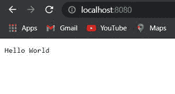

# 如何运行 Node.js 服务器？

> 原文:[https://www.geeksforgeeks.org/how-to-run-node-js-server/](https://www.geeksforgeeks.org/how-to-run-node-js-server/)

在本文中，我们将看到如何在本地系统中运行 NodeJS 服务器。NodeJS 只是您在浏览器之外运行 JavaScript 的一种方式。它可以用来运行桌面应用程序服务器，或者你想用 JavaScript 做的任何其他事情，我们要做的就是用 NodeJS 创建一个网络服务器。

**创建项目和模块安装:**

*   **第一步:**可以访问链接[下载节点](https://nodejs.org/en/)下载 LTS 版。安装节点后，您可以使用命令在命令提示符下检查节点版本。

    ```js
    node --version
    ```

*   **步骤 2:** 使用以下命令为项目创建新文件夹:

    ```js
    mkdir testApp
    ```

*   **步骤 3:** 使用以下命令导航到我们的文件夹:

    ```js
    cd testApp
    ```

*   **步骤 4:** 使用以下命令和服务器文件初始化 npm:

    ```js
    npm init -y
    ```

*   **第五步:**用下面的代码创建一个 app.js 文件。在这个文件中，我们需要创建我们的服务器，并告诉开始监听某个端口，所以首先我们需要一个名为 HTTP 的库，这将阻止 HTTP 库进入我们创建的 HTTP 变量中的代码。

**示例:**

## app.js

```js
const http = require('http')
const port = 8080

// Create a server object:
const server = http.createServer(function (req, res) {

    // Write a response to the client
    res.write('Hello World')

    // End the response 
    res.end()
})

// Set up our server so it will listen on the port
server.listen(port, function (error) {

    // Checking any error occur while listening on port
    if (error) {
        console.log('Something went wrong', error);
    }
    // Else sent message of listening
    else {
        console.log('Server is listening on port' + port);
    }
})
```

**运行步骤:**使用以下命令运行应用程序。

```js
node app.js
```

**输出:**现在打开浏览器，转到***http://localhost:8080/***，会看到如下输出。



输出

**说明:**

*   我们在这里创建了一个使用 HTTP 库的服务器变量，并在这个对象上调用了 create server 函数，这创建了一个具有两个参数的服务器函数，这两个参数是请求和响应参数。
*   设置我们的服务器，让它监听我们想要的端口，让这个服务器对象把我们创建的端口变量传递给它，告诉它监听端口 8080，然后如果有潜在的错误或者成功了，它会调用一个函数。