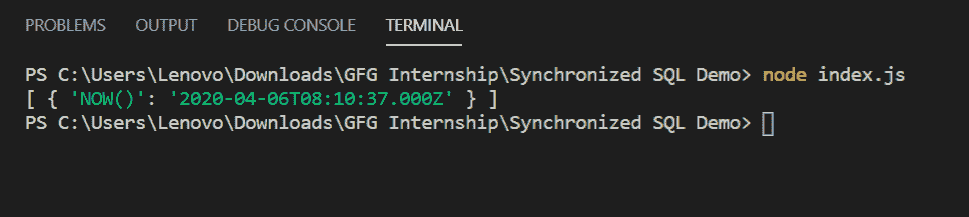

# 如何在 Node.js 中使用 sync-sql 模块运行同步查询？

> 原文:[https://www . geesforgeks . org/how-run-sync-query-using-SQL-module-in-node-js/](https://www.geeksforgeeks.org/how-to-run-synchronous-queries-using-sync-sql-module-in-node-js/)

sync-sql 模块旨在对数据库进行同步查询。由于普通的 SQL 查询在 node.js 中是异步的，但是如果您想同步运行它，那么可以使用这个模块。在同步的 SQL 中，执行查询时会返回结果集。

**注意:**不要将生产模式下的这个模块作为节点使用，js 是异步设计的。

**同步 sql 模块安装:**

1.  您可以访问链接[安装同步-sql 模块](https://www.npmjs.com/package/sync-sql)。您可以使用此命令安装此软件包。

    ```js
    npm install sync-sql
    ```

2.  安装 sync-sql 后，您可以使用命令在命令提示符下检查您的 sync-sql 版本。

    ```js
    npm version sync-sql
    ```

3.  之后，您可以创建一个文件夹并添加一个文件，例如 index.js。

    ```js
    node index.js
    ```

4.  现在打开 MySQL 并创建一个数据库，例如“演示”。

**文件名:index.js**

```js
const Mysql = require('sync-mysql')

const connection = new Mysql({
    host:'localhost',
    user:'root',
    password:'password',
    database:'demo'
})

var result = connection.query('SELECT NOW()')
console.log(result)
```

**运行程序的步骤:**

1.  项目结构会是这样的:
    
2.  确保使用以下命令安装 sync-SQL:

    ```js
    npm install sync-sql
    ```

3.  Run index.js file using below command:

    ```js
    node index.js
    ```

    

这就是如何使用 sync-sql 包在节点 js 中运行同步的 SQL 查询。