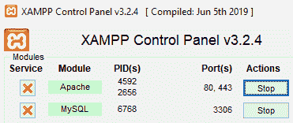
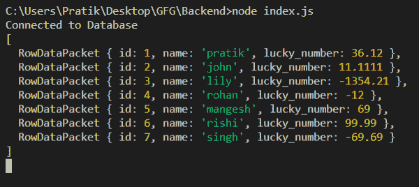

# 如何在 Node.js 中将连接结果保存在一个变量中？

> 原文:[https://www . geesforgeks . org/如何保存节点中变量的连接结果-js/](https://www.geeksforgeeks.org/how-to-save-connection-result-in-a-variable-in-node-js/)

我们将在 node.js 中使用 **MySQL** 库中的查询函数，该函数将按预期返回我们的输出。使用这种方法，我们可以将连接结果保存在 Node.js 中的一个变量中

**设置环境和执行:**

**步骤 1:** 使用以下命令初始化节点项目。

```js
npm init
```

**第二步:**打开 MySQL 数据库



**步骤 3:** 创建 NodeJS 应用程序后，使用以下命令安装 **mysql** 模块。

```js
npm install mysql
```

**数据库表:**我们的样本 **gfg_table** 数据库用的样子是这样的。


**第 4 步:**用以下代码创建一个 *index.js* 文件。

## index.js

```js
const mysql = require("mysql");

var db_con = mysql.createConnection({
    host: "localhost",
    user: "root",
    password: "",
    database: "gfg_db"
});

let output;

const setOutput = (rows) => {
    output = rows;
    console.log(output);
}

db_con.connect(async(err) => {
    if (err) {
        console.log("Database Connection Failed !!!", err);
        return;
    }

    console.log("Connected to Database");

    let query = 'SELECT * FROM users';
    db_con.query(query, (err, rows) => {
        if (err) {
            console.log("internal error", err);
            return;
        }

        // This is the important function
        setOutput(rows);
    });
});
```

**步骤 5:** 使用以下命令运行 **index.js** 文件。

```js
node index.js
```

**输出:**

