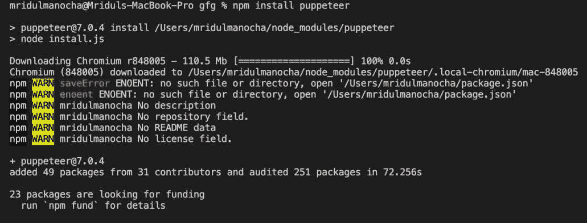

# 如何在 Node.js 中使用木偶师刮网站？

> 原文:[https://www . geeksforgeeks . org/如何使用节点中的木偶师创建网站-js/](https://www.geeksforgeeks.org/how-to-scrape-a-website-using-puppeteer-in-node-js/)

傀儡是一个 Node.js 库，它提供了一个高级应用编程接口来控制无头 Chrome 或 DevTools 协议上的 Chrome。它允许在无头/头戴式浏览器上自动化、测试和抓取网页。

**安装木偶师:**要使用木偶师，必须安装 Node.js。然后，可以使用 npm 包管理器在命令行中安装木偶师。

```
npm install puppeteer
```



**使用木偶师:**可以使用以下命令将木偶师库导入到您的脚本中:

```
const puppeteer = require('puppeteer');
```

重要的是要记住，木偶师是一个基于承诺的库，它执行对无头 Chrome 实例的异步调用。因此，我们用异步包装器包装它。这意味着代码会立即执行。

这里有一个简单的例子来截图一个页面:

## java 描述语言

```
import Puppeteer
const puppeteer = require('puppeteer');

(async () => {
    const browser = await puppeteer.launch();

    // Open new page in headless browser
    const page = await browser.newPage();

    // To visit page in browser
    await page.goto('https://scrapethissite.com');

    // Save Screenshot at Path
    await page.screenshot({path: 'screenshot.png'});

      // Close our browser instance
    await browser.close();
  })();
```

**运行您的代码:**将您的代码保存为 JavaScript 文件，并使用以下命令在命令行中运行它-

```
node filename.js
```

**示例:**下面的代码返回一个带有当年 NHL 曲棍球队名称和 Wins 的对象，

## java 描述语言

```
const puppeteer = require('puppeteer');

(async () => {
    const browser = await puppeteer.launch();
    const page = await browser.newPage();
    await page.goto('https://scrapethissite.com/pages/forms/');

    const textsArray = await page.evaluate(
        () => [...document.querySelectorAll(
            '#hockey > div > table > tbody > tr > td.name')]
            .map(elem => elem.innerText)
    );
    const WinArray = await page.evaluate(
        () => [...document.querySelectorAll(
            '#hockey > div > table > tbody > tr > td.wins')]
            .map(elem => elem.innerText)
    );
    var result = {};
    textsArray.forEach((textsArray, i) =>
        result[textsArray] = WinArray[i]);
    console.log(result);
    await browser.close();
})();
```

**输出:**

> { '波士顿布鲁因斯':' 36 '，'水牛军刀':' 31 '，'卡尔加里火焰':' 31 '，'芝加哥黑鹰':' 36 '，
> ，'底特律红翼':' 34 '，'埃德蒙顿石油人':' 37 '，'哈特福德捕鲸人':' 31 '，'洛杉矶国王':' 46 '，
> ，'明尼苏达北极星':' 27 '，'蒙特利尔加拿大人':' 39 '，'新泽西魔鬼':' 32 '，'纽约岛民':' 25 '，
> '纽约流浪者':' 36 '，'费城