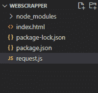
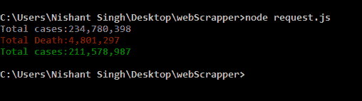

# 如何在 Node.js 中使用 cheerio 刮取 web 数据？

> 原文:[https://www . geeksforgeeks . org/如何使用节点中的 cheerio-in-js/](https://www.geeksforgeeks.org/how-to-scrape-the-web-data-using-cheerio-in-node-js/)刮擦网络数据

Node.js 是一个使用 chrome javascript 引擎构建的开源跨平台环境。Node.js 用于从浏览器外部执行 javascript 代码。

**Cheerio:** 其工作基于 jQuery。它完全工作在一致的 DOM 模型上。Cheerio 有时用于抓取网络数据，也用于自动化任务。

**方法:**在本文中，我们报废了世界米 a covid info 网站的数据，在该网站上，我们获得了确诊病例总数、死亡总数和迄今康复的患者总数。

**下面是分步实施:**

**第 1 步:**输入 cmd 并键入下面的命令，该命令将创建 package.json 文件

```
npm init
```

**第二步:**创建完包、JSON 文件后你需要安装 cheerio、request 和粉笔来自下面的命令:

```
npm install request cheerio chalk
```

**步骤 3:** 现在您的项目目录如下所示:



项目结构

**第 4 步:**现在我们创建 **index.js** 文件并编写下面的代码:

## index.js

```
const { Cheerio } = require("cheerio");
const request = require("request");
const cheerio = require("cheerio");
const chalk = require("chalk");

request("https://www.worldometers.info/coronavirus/", cb);

function cb(error, response, html) {
  if (error) {
    console.error("Error:", error);
  } else {
    handleItem(html);
  }
}
function handleItem(html) {
  let setTool = cheerio.load(html);
  let contentArr = setTool("#maincounter-wrap span");

  let total = setTool(contentArr[0]).text();
  let death = setTool(contentArr[1]).text();
  let recovered = setTool(contentArr[2]).text();

  console.log(chalk.gray("Total cases:" + total));
  console.log(chalk.red("Total Death:" + death));
  console.log(chalk.green("Total cases:" + recovered));
}
```

**输出:**打开命令提示符，输入以下命令

```
node index.js
```



**输出**