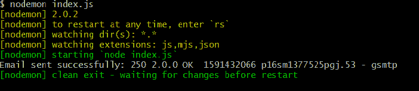
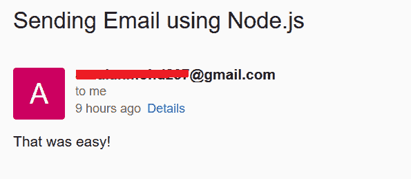

# 如何在 Node.js 中使用 nodemailer 发送附件和邮件？

> 原文:[https://www . geesforgeks . org/如何使用节点内邮件发送附件和电子邮件-js/](https://www.geeksforgeeks.org/how-to-send-attachments-and-email-using-nodemailer-in-node-js/)

为此，我们将使用名为**节点邮件程序**的包。这是一个让电子邮件发送变得非常容易的模块。要使用它，您需要使用以下命令进行安装:

```
$ npm install nodemailer
```

**节点邮件模块功能:**

*   它具有零依赖性和高度安全性。
*   无论是 Azure 还是 Windows 盒子，你都可以轻松使用。
*   它还带有自定义插件来支持操作消息。

为了发送电子邮件，创建一个名为 **index.js** 的文件，并写下以下代码:
**文件名:index.js**

## java 描述语言

```
var nodemailer = require("nodemailer");

var sender = nodemailer.createTransport({
  service: 'gmail',
  auth: {
    user: 'username@gmail.com',
    pass: 'your_password'
  }
});

var mail = {
  from: "username@gmail.com",
  to: "receiver's_username@gmail.com",
  subject: "Sending Email using Node.js",
  text: "That was easy!"
};

sender.sendMail(mail, function(error, info) {
  if (error) {
    console.log(error);
  } else {
    console.log("Email sent successfully: "
                 + info.response);
  }
});
```

**运行该程序的步骤:**为了运行该文件，只需将 Bash Git 放入您的工作目录中，并键入以下命令:

```
$ nodemon index.js
```

如果您没有安装 nodemon，那么只需运行以下命令:

```
$ node index.js
```



要再次检查其工作情况，您可以转到收件人的邮件，您将收到如下所示的邮件:



**如果你有多个接收器呢？**
既然如此，就在你的邮件功能中添加下面的代码:

```
to: 'first_username@gmail.com, second_username@gmail.com'
```

**如果你想发送 HTML 格式的文本给接收者怎么办？**
既然如此，就在你的邮件功能中添加下面的代码:

```
html: "<h1>GeeksforGeeks</h1><p>I love geeksforgeeks</p>"
```

**想给收件人发附件怎么办？**
既然如此，就在你的邮件功能中添加下面的代码:

```
attachments: [
    {
      filename: 'mailtrap.png',
      path: __dirname + '/mailtrap.png',
      cid: 'uniq-mailtrap.png' 
    }
  ]
```

最终 **index.js** 文件看起来是这样的:
T3】文件名:index . jsT5

## java 描述语言

```
var nodemailer = require("nodemailer");

var sender = nodemailer.createTransport({
    service: 'gmail',
    auth: {
        user: 'username@gmail.com',
        pass: 'your_password'
    }
});

var mail = {
    from: 'username@gmail.com',
    to:
'first_username@gmail.com, second_username@gmail.com',
    subject: 'Sending Email using Node.js',
    text: 'That was easy!',
  html:
"<h1>GeeksforGeeks</h1>
<p>I love geeksforgeeks</p>
",
  attachments: [
        {
            filename: 'mailtrap.png',
            path: __dirname + '/mailtrap.png',
            cid: 'uniq-mailtrap.png'
        }
    ]
};

sender.sendMail(mail, function (error, info) {
    if (error) {
        console.log(error);
    } else {
        console.log('Email sent successfully: '
                + info.response);
    }
});
```