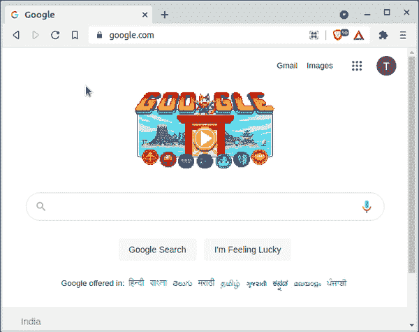
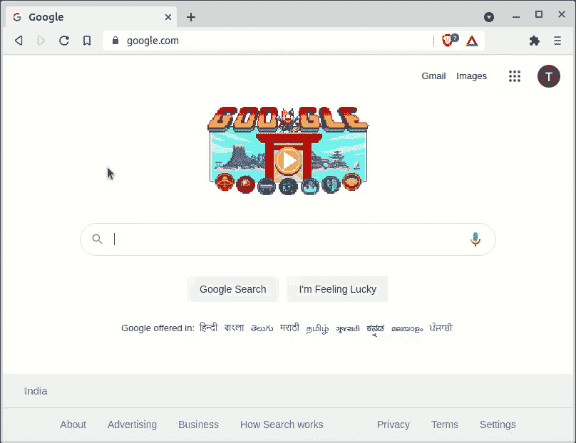
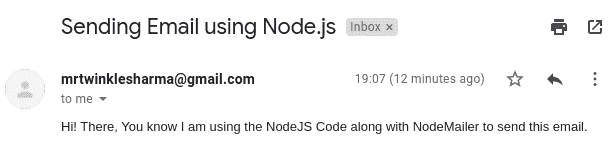
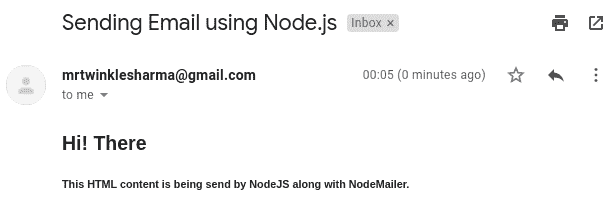
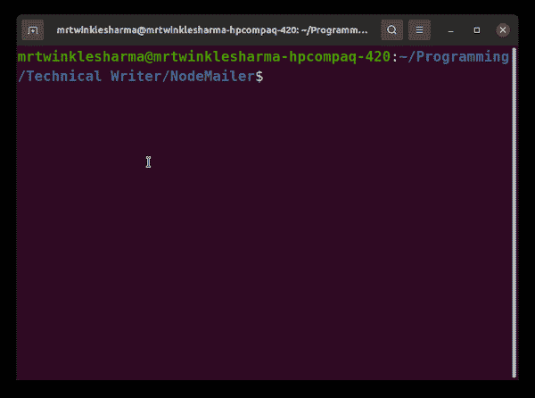

# 如何使用 Node.js 发送邮件？

> 原文:[https://www . geesforgeks . org/如何使用节点发送电子邮件-js/](https://www.geeksforgeeks.org/how-to-send-email-using-node-js/)

电子邮件是人们之间传递/交换信息的一种广泛使用的方法。我们通常使用任何软件或应用程序发送电子邮件，如 Gmail、outlook、雷鸟邮件和雅虎等。我们还可以使用任何第三方库在 node.js 应用程序中编码这些应用程序的基本概念，该库可以与网络系统交互并发送电子邮件。

**节点邮件器:**有各种各样的模块可以用来发送电子邮件，但是节点邮件器是最受欢迎的一个，它为我们提供了发送邮件的简单程序和功能。

**节点机的特点:**

*   它支持各种功能，如在邮件中添加 HTML、Unicode 字符、随文本发送附件等。
*   它使用简单邮件传输协议(SMTP)。下面是将这个模块集成到我们的应用程序中所要遵循的一步一步的方法。

**第一步:模块安装:**在终端写命令安装 nodemailer，然后在你的 nodejs 应用顶部导入。

```
npm install nodemailer
```

现在我们准备将它导入到我们的应用程序中。

```
const nodemailer = require('nodemailer');
```

**第二步:创建传输器对象:**在节点邮件程序中有一个**创建传输器**的方法，它接受一个具有某些配置的对象，最后返回一个传输器对象。稍后发送电子邮件时将需要此对象。

```
const transporter = nodemailer.createTransport(transport[, defaults]);
```

这里我们使用 **Gmail 作为服务只是出于示例的目的，**虽然节点邮件程序可以很容易地与任何其他邮件服务集成。在 Gmail 中，我们可以降低账户的安全性，也可以使用 Oauth2 安全认证，除非谷歌通常不允许通过 node.js 发送任何邮件。

**不太安全的帐户:**访问此链接，使您的帐户[不太安全](https://myaccount.google.com/lesssecureapps)，在此之后，我们可以只使用您的 Gmail 帐户的用户名和密码来创建我们的工作传输器对象。



## app.js

```
const nodemailer = require('nodemailer');

const transporter = nodemailer.createTransport({
  service: 'gmail',
  auth: {
    user: secure_configuration.EMAIL_USERNAME,
    pass: secure_configuration.PASSWORD
  }
});
```

**使用 Oauth2:** 根据[官方文档](https://nodemailer.com/smtp/oauth2/)这里我们需要提供客户端 id、客户端密码、刷新令牌和访问令牌以及用户名和密码。按照一步一步的方法从谷歌云控制台获取这些配置。

**1。打开谷歌云控制台:**在这一步，我们将获得我们的客户端 id 和客户端秘密。访问谷歌云控制台网站，自己注册/登录。然后从最左边的导航栏进入**应用编程接口&服务**部分。现在检查仪表板并创建一个项目。之后，访问 Oauth 同意屏幕注册您的申请。在此步骤中，确保选择用户类型**外部**并添加一些/一个**测试用户。**完成此步骤后，转到凭据部分，点击创建凭据，然后选择 Oauth2 ClientID，选择应用程序类型作为 web 应用程序，同时确保添加**将 URI 重定向为 Oauth 游乐场** ( [从这里复制链接](https://developers.google.com/oauthplayground/))。最后，您将成功获得您的**客户 id 和客户秘密。**



**2。打开 Oauth2 游乐场:**这里我们将获得我们的刷新令牌和访问令牌。访问 [OAuth2 游乐场](https://developers.google.com/oauthplayground/)，点击右侧的 oauth2.0 配置图标，然后勾选**使用您自己的凭据**复选框，并提供您从云控制台获得的相同客户端 id 和密码。现在选择 Gmail API 进行授权。单击授权应用编程接口，然后使用您在最后一步的凭据部分作为测试用户填写的相同 Gmail id 进行授权。最后，点击令牌的交换授权码，这将提供**刷新令牌和访问令牌。**


**注意:**我们建议您在单独的选项卡中打开这些 gif，并分别遵循这两种方法，不要在任何跨度上跳过这将为您节省很多混乱，也不要试图复制此客户端 id 和客户端机密等。这是行不通的。

## app.js

```
const nodemailer = require('nodemailer');

const transporter = nodemailer.createTransport({
  service: 'gmail',
  auth: {
    type: 'OAuth2',
    user: secure_configuration.EMAIL_USERNAME,
    pass: secure_configuration.PASSWORD,
    clientId: secure_configuration.CLIENT_ID,
    clientSecret: secure_configuration.CLIENT_SECRET,
    refreshToken: secure_configuration.REFRESH_TOKEN
  }
});
```

有了这个，我们的传送对象准备好了，现在我们可以发送我们的电子邮件。

**第三步:配置 eMail:** 在发送邮件之前，我们必须创建一些消息配置，比如发送什么，发送到哪里等。创建这些配置非常容易有几个[键-值对](https://nodemailer.com/message/)，您可以从这些键-值对中为预定义的键提供所需的键和一些其他值。

**向一封电子邮件发送简单文本:**

## java 描述语言

```
const mailConfigurations = {

    // It should be a string of sender email
    from: 'mrtwinklesharma@gmail.com',

    // Comma Separated list of mails
    to: 'smtwinkle451@gmail.com',

    // Subject of Email
    subject: 'Sending Email using Node.js',

    // This would be the text of email body
    text: 'Hi! There, You know I am using the'
      + ' NodeJS Code along with NodeMailer '
      + 'to send this email.'
};
```

**输出:**如果我们用这些配置发送电子邮件，类似这样的东西将被发送给接收者。虽然我们的代码目前还不完整，但这里我们只是向您展示当代码完成时，这个消息配置会是什么样子。



**发送到多个电子邮件:**我们可以用逗号作为分隔符来连接更多的电子邮件。

## java 描述语言

```
const mailConfigurations = {
    from: 'mrtwinklesharma@gmail.com',
    to: 'smtwinkle451@gmail.com, anyothergmailid@gmail.com',
      subject: 'Sending Email using Node.js',
    text: 'Hi! There, You know I am using the NodeJS Code'
       + ' along with NodeMailer to send this email.'
};
```

**发送一些 HTML 内容:**只需将纯文本替换为 HTML，提供给 *html* 键即可。

## java 描述语言

```
const mailConfigurations = {
  from: 'mrtwinklesharma@gmail.com',
  to: 'smtwinkle451@gmail.com',
  subject: 'Sending Email using Node.js',
  html: "<h2>Hi! There</h2> <h5> This HTML content is 
     being send by NodeJS along with NodeMailer.</h5>"
};
```

**输出:**



*   **发送一些附件，**节点邮件程序在发送[附件](https://nodemailer.com/message/attachments/)时非常灵活，你可以发送任何类型的被邮件服务接受的文件。

## java 描述语言

```
const mailConfigurations = {
  from: 'mrtwinklesharma@gmail.com',
  to: 'smtwinkle451@gmail.com',
  subject: 'Sending Email using Node.js', 
  text:'Attachments can also be sent using nodemailer',
  attachments: [
  {  
    // utf-8 string as an attachment
    filename: 'text.txt',
    content: 'Hello, GeeksforGeeks Learner!'
  },
  {   
    // filename and content type is derived from path
    path: '/home/mrtwinklesharma/Programming/document.docx'
  },
  {   
    path: '/home/mrtwinklesharma/Videos/Sample.mp4'
  },
  {   
    // use URL as an attachment
    filename: 'license.txt',
    path: 'https://raw.github.com/nodemailer/nodemailer/master/LICENSE'
  } 
]
};
```

**输出:**


不仅如此，节点邮件程序还有很多消息配置的可能性，您可以从[这里](https://nodemailer.com/message/)查看它们。

**第 4 步:发送 eMail:** 使用上述任意一种方法继续传送对象，然后选择任意一种 eMail 配置发送邮件。
在 transporter 对象中存在一个 **sendMail** 方法，该方法接受电子邮件配置和一个回调函数，该函数将在邮件已经发送或由于错误而执行。

```
transporter.sendMail(mailConfigurations[, callback]);
```

## java 描述语言

```
transporter.sendMail(mailConfigurations, function(error, info){
    if (error) throw Error(error);
       console.log('Email Sent Successfully');
    console.log(info);
});
```

#### 第五步:将它们结合起来

您可以从步骤 2 和 3 中选择任何选项。将它提供给 sendMail 方法后，您将能够成功地使用 node.js 发送电子邮件。

**说明:**这里我们一开始导入了节点邮件器模块，然后使用了 Oauth2 类型的认证，后面是正在使用的最基本的消息配置。最后，**发送邮件**方法将邮件发送给邮件配置中提供的收件人。
*注意:-*导入的安全模块*与此节点邮件器没有任何关系**，我*只是用它来保护我的凭证。

## app.js

```
const nodemailer = require('nodemailer');
const secure_configuration = require('./secure');

const transporter = nodemailer.createTransport({
  service: 'gmail',
  auth: {
    type: 'OAuth2',
    user: secure_configuration.EMAIL_USERNAME,
    pass: secure_configuration.PASSWORD,
    clientId: secure_configuration.CLIENT_ID,
    clientSecret: secure_configuration.CLIENT_SECRET,
    refreshToken: secure_configuration.REFRESH_TOKEN
  }
});

const mailConfigurations = {
    from: 'mrtwinklesharma@gmail.com',
    to: 'smtwinkle451@gmail.com',
    subject: 'Sending Email using Node.js',
    text: 'Hi! There, You know I am using the NodeJS '
     + 'Code along with NodeMailer to send this email.'
};

transporter.sendMail(mailConfigurations, function(error, info){
    if (error) throw Error(error);
       console.log('Email Sent Successfully');
    console.log(info);
});
```

**输出:**用 node 命令运行这段代码片段，这将是控制台和 Gmail 收件箱中的输出。

 