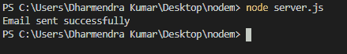
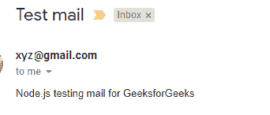

# 如何在 Node.js 中使用 Gmail 账号用 Nodemailer 发送邮件？

> 原文:[https://www . geesforgeks . org/how-to-e-mail-with-node mail-use-Gmail-account-in-node-js/](https://www.geeksforgeeks.org/how-to-send-email-with-nodemailer-using-gmail-account-in-node-js/)

Nodemailer 是 Node.js npm 模块，允许轻松发送电子邮件。在本文中，我们将介绍在 nodemailer 的帮助下使用 Gmail 帐户发送电子邮件的每个步骤。

**安装:**转到项目文件夹并使用以下命令。

*   创建 package.json 文件。

    ```
    npm init -y
    ```

*   安装 nodemailer〔t0〕
*   直接创建 server.js 文件或使用命令

    ```
    touch server.js
    ```

**进场:**

*   使用`require('nodemailer')`将节点邮件模块包含在代码中。
*   使用`nodemailer.createTransport()`功能创建一个传送邮件的传送者。它包含服务名称和身份验证详细信息(用户和密码)。
*   声明一个变量 mailDetails，它包含邮件的发件人和收件人电子邮件 id、主题和内容。
*   使用`mailTransporter.sendMail()`功能将电子邮件从发件人发送到收件人。如果消息发送失败或包含错误，它将显示错误消息，否则消息发送成功。

**示例:**

```
const nodemailer = require('nodemailer');

let mailTransporter = nodemailer.createTransport({
    service: 'gmail',
    auth: {
        user: 'xyz@gmail.com',
        pass: '*************'
    }
});

let mailDetails = {
    from: 'xyz@gmail.com',
    to: 'abc@gmail.com',
    subject: 'Test mail',
    text: 'Node.js testing mail for GeeksforGeeks'
};

mailTransporter.sendMail(mailDetails, function(err, data) {
    if(err) {
        console.log('Error Occurs');
    } else {
        console.log('Email sent successfully');
    }
});
```

现在打开链接[https://myaccount.google.com/lesssecureapps](https://myaccount.google.com/lesssecureapps)到**允许不太安全的应用:开启**。然后使用`node index.js`命令运行上述代码。它将使用 gmail 帐户发送电子邮件。
**输出:**

*   **终端运行代码:**
    
*   **发送邮件:**
    

**注 1:** 要在任何文件中使用该代码，我们只需导入该文件并调用 send()函数。

```
var mail = require('./config/mailer')();
mail.send();

```

**注意 2:** 要在电子邮件中发送 html 格式的文本，请使用“HTML”属性，而不是 sendMail 函数中的“text”属性。

```
{ from:'"admin" ',
  to: "user@gmail.com",
  subject:'GeeksforGeeks Promotion',
  html:' <p> html code </p>'
}

```

**注意 3:** 要向多个收件人发送电子邮件，请将他们添加到 sendMail 函数中的“To”属性中，并用逗号分隔。

> { from:“”admin”，
> to:“user1@gmail.com，user2@gmail.com，user3@yahoo.in”，
> 主题:“GeeksforGeeks Promotion”，
> 文本:“查看 geeks forgeeks”+“准备面试和竞争性考试的最佳网站。”
> }