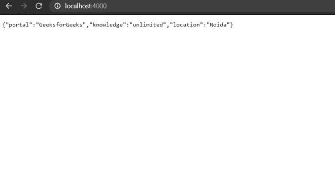

# 如何使用 Node.js 和 Express.js 从服务器向客户端发送响应？

> 原文:[https://www . geesforgeks . org/如何使用节点 js 和 express-js 从服务器向客户端发送响应/](https://www.geeksforgeeks.org/how-to-send-response-from-server-to-client-using-node-js-and-express-js/)

以下方法介绍了如何使用 node 和 express 从服务器发送响应。此外，我们将看到从服务器向客户端发送响应的不同方式。

**先决条件:**

*   **Node js:** 它是一个开源的 JavaScript 后端技术。
*   **Express.js:** 是一个 node.js 服务器框架。

**所需模块:**使用以下命令安装 *express* 模块:

```js
npm install express
```

**服务器向客户端发送响应的方法有:**

1.  使用 send()函数。
2.  使用 json()函数。

**示例 1:** 演示 status()函数的使用。

## index.js

```js
const express = require('express');
const app = express();

app.get('/' , (req,res)=>{
   // 200 status code means OK
   res.status().send(200); 
})

// Server setup
app.listen(4000 , ()=>{
    console.log("server running");
});
```

使用以下命令运行 **index.js** 文件:

```js
node index.js
```

**输出:**现在打开浏览器，转到***http://localhost:4000/***，会看到如下输出:


**示例 2:** 向客户端发送一些特定的数据，然后可以使用 send()函数。

## index.js

```js
const express = require('express');
const app = express();

var computerSciencePortal = "GeeksforGeeks";

app.get('/' , (req,res)=>{
   // Server will send GeeksforGeeks as response
   res.send(computerSciencePortal); 
})

// Server setup
app.listen(4000 , ()=>{
    console.log("server running");
});
```

使用以下命令运行 **index.js** 文件:

```js
node index.js
```

**输出:**现在打开浏览器，转到***http://localhost:4000/***，会看到如下输出:


**示例 3:** 使用 json()函数将 JSON 响应从服务器发送到客户端。

## index.js

```js
const express = require('express');
const app = express();

// Sample JSON data
var data = {
    portal : "GeeksforGeeks",
    knowledge : "unlimited",
    location : "Noida"  
}

app.get('/' , (req,res)=>{
   // This will send the JSON data to the client.
    res.json(data); 
})

// Server setup
app.listen(4000 , ()=>{
    console.log("server running");
});
```

使用以下命令运行 **index.js** 文件:

```js
node index.js
```

**输出:**现在打开浏览器，转到***http://localhost:4000/***，会看到如下输出:



因此，这些是您可以使用 node 和 express 从服务器向客户端发送响应的方法。