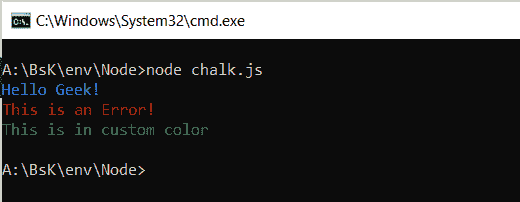
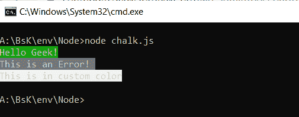
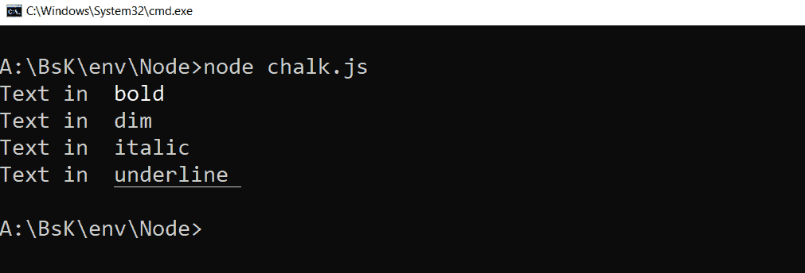

# 如何设置 node.js 控制台字体颜色？

> 原文:[https://www . geesforgeks . org/how-set-node-js-console-font-color/](https://www.geeksforgeeks.org/how-to-set-node-js-console-font-color/)

**粉笔**模块是可以用彩色文字自定义节点控制台的。通过使用它，人们可以使用它的一些特性来改变控制台的外观，如加粗文本、加下划线、突出文本的背景颜色等。

**命令安装粉笔:**

```
npm install chalk
```

**用粉笔给控制台文字上色.颜色:**文字颜色可以通过使用粉笔.颜色方法如粉笔.黑色，粉笔.红色等来改变。

```
const chalk = require('chalk'); 

// Printing the text in blue color
console.log(chalk.blue('Hello Geek!'));

// Printing the text in red color
console.log(chalk.red('This is an Error! '));

// Printing the text in green color
console.log(chalk.rgb(100, 150, 70)
        ('This is in custom color'));
```

**输出:**


**用粉笔给控制台文字背景上色. bgcolor:** 文字背景颜色可以用粉笔. bgcolor 的方法如粉笔. bgBlack，粉笔. bgRed 等来改变。

```
const chalk = require('chalk');

// Set background color to red
console.log(chalk.bgGreen('Hello Geek!'));

// Set background color to BlackBright
console.log(chalk.bgBlackBright('This is an Error! '));

// Set background color to WhiteBright
console.log(chalk.bgWhiteBright('This is in custom color'));
```

**输出:**


**修改控制台文本外观:**可以使用粉笔、粗体、粉笔、斜体等方法修改文本样式。

```
const chalk = require('chalk'); 
console.log("Text in ", chalk.bold('bold'));
console.log("Text in ", chalk.dim('dim '));

// Not widely supported
console.log("Text in ", chalk.italic('italic'));
console.log("Text in ", chalk.underline('underline '));
```

**输出:**
