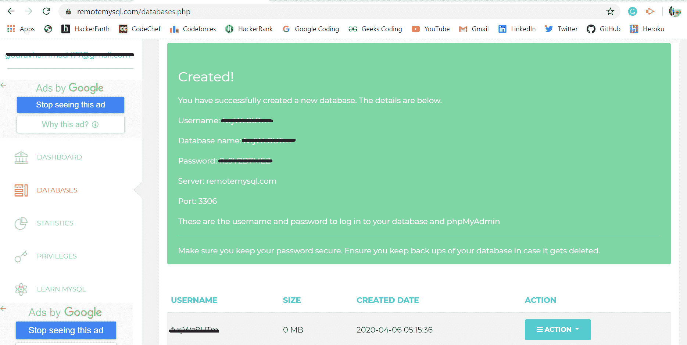
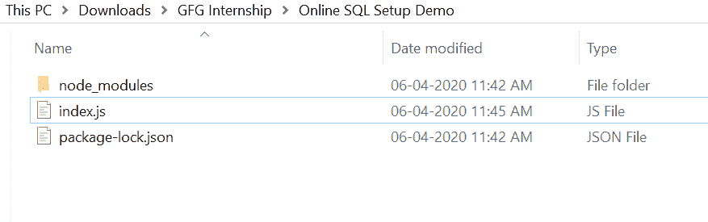
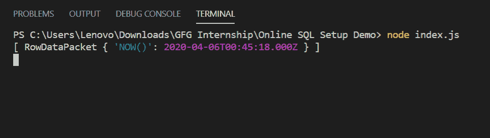

# 如何为 Node.js 设置在线 SQL Server？

> 原文:[https://www . geesforgeks . org/如何设置-online-SQL-server-for-node-js/](https://www.geeksforgeeks.org/how-to-set-online-sql-server-for-node-js/)

联机 SQL server 有助于将项目连接到联机服务器，而不是本地主机数据库设置。为了实现这一点，remotemysql 网站因提供在线数据库以安全的方式存储我们的数据而广受欢迎。

**SQL 模块安装:**

1.  您可以访问链接[安装 sql 模块](https://www.npmjs.com/package/sql)。您可以使用此命令安装此软件包。

    ```
    npm install sql
    ```

2.  安装 sql 后，您可以使用命令在命令提示符下检查您的 sql 版本。

    ```
    npm version sql
    ```

3.  之后，您可以创建一个文件夹并添加一个文件，例如 index.js。

    ```
    node index.js
    ```

4.  现在转到 [remotemysql](https://remotemysql.com/) 官方网站，创建一个帐户并登录，然后转到您的“数据库”部分，只需点击“创建新数据库”按钮。之后你会看到你的数据库详情如下所示:
    
5.  现在保存这些细节，因为这将是连接代码所必需的。现在点击你最近创建的数据库旁边的“动作”按钮，选择“phpMyAdmin”。现在，您将被重定向到您的 myPhpAdminn 门户。现在使用用户名和密码登录，就可以创建表并执行所有 SQL 操作了。
6.  现在要连接到这个数据库，在您的 index.js 文件中写下以下代码。

**文件名:index.js**

```
const mysql = require('mysql')

const connection = mysql.createConnection({
    host:'remotemysql.com',
    user:'Your_Username',
    password:'Your_Password',
    database:'Your_Database'
})

connection.query('SELECT NOW()', function(error, result){
    if(error) throw error
    console.log(result)
})
```

**运行程序的步骤:**

1.  项目结构会是这样的:
    
2.  确保您需要使用以下命令安装 SQL:

    ```
    npm install sql
    ```

3.  Run index.js file using below command:

    ```
    node index.js
    ```

    

这就是如何使用 remotemysql 网站设置一个在线 SQL server 安装程序。