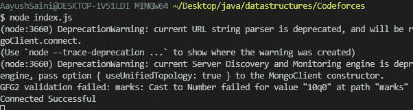
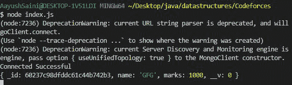

# 如何使用 Node.js 在 MongoDB 中设置文档值类型？

> 原文:[https://www . geesforgeks . org/如何设置 mongodb 中的文档值类型-使用节点-js/](https://www.geeksforgeeks.org/how-to-set-the-document-value-type-in-mongodb-using-node-js/)

**Mongoose . module**是 node.js 最强大的外部模块之一，mongose 是一个 MongoDB ODM，即 Object database Modelling，用于将代码及其表示从 MongoDB 翻译到 Node.js 服务器。Mongoose 模块提供了几个功能来操作 MongoDB 数据库集合中的文档(参见[这个](https://www.geeksforgeeks.org/tag/mongoose/)链接)。

**值类型:**mongose 模块允许我们向 MongoDB 的集合中添加值类型，即 String 和 Number 数据类型。这使得集合的模式变得僵化。

**安装模块:**

```js
npm install mongoose
```

**项目结构:**


**在本地 IP 上运行服务器:**数据是 MongoDB 服务器所在的目录。

```js
mongod --dbpath=data --bind_ip 127.0.0.1
```


**例 1:** 插入错误的单据值。

**文件名- index.js**

## java 描述语言

```js
// Importing mongoose module
const mongoose = require("mongoose");

// Database Address
const url = "mongodb://localhost:27017/GFG";

// Connecting to database
mongoose
  .connect(url)
  .then((ans) => {
    console.log("Connected Successful");
  })
  .catch((err) => {
    console.log("Error in the Connection");
  });

// Calling Schema class
const Schema = mongoose.Schema;

// Creating Structure of the collection
const collection_structure = new Schema({
  name: {
    type: String,
    required: true,
  },
  marks: {
    type: Number,
  },
});

// Creating collection
const collections = mongoose.model("GFG2", collection_structure);

// Inserting one document
collections
  .create({

    // Inserting value of only one key
    name: "GFG",
    marks: "10q0", // Inserting wrong value
  })
  .then((ans) => {
    console.log(ans);
  })
  .catch((err) => {
    console.log(err.message);
  });
```

使用以下命令运行 **index.js** 文件:

```js
node index.js
```

**控制台输出:**



**例 2:**

**Filename- index.js:** 插入有效值。

## java 描述语言

```js
// Importing mongoose module
const mongoose = require("mongoose");

// Database Address
const url = "mongodb://localhost:27017/GFG";

// Connecting to database
mongoose
  .connect(url)
  .then((ans) => {
    console.log("Connected Successful");
  })
  .catch((err) => {
    console.log("Error in the Connection");
  });
// Calling Schema class
const Schema = mongoose.Schema;

// Creating Structure of the collection
const collection_structure = new Schema({
  name: {
    type: String,
    required: true,
  },
  marks: {
    type: Number,
  },
});
// Creating collection
const collections = mongoose.model("GFG2", collection_structure);

// Inserting one document
collections
  .create({

    // Inserting value of only one key
    name: "GFG",
    marks: "1000",
  })
  .then((ans) => {
    console.log(ans);
  })
  .catch((err) => {
    console.log(err.message);
  });
```

使用以下命令运行 **index.js** 文件:

```js
node index.js
```

**控制台输出:**

