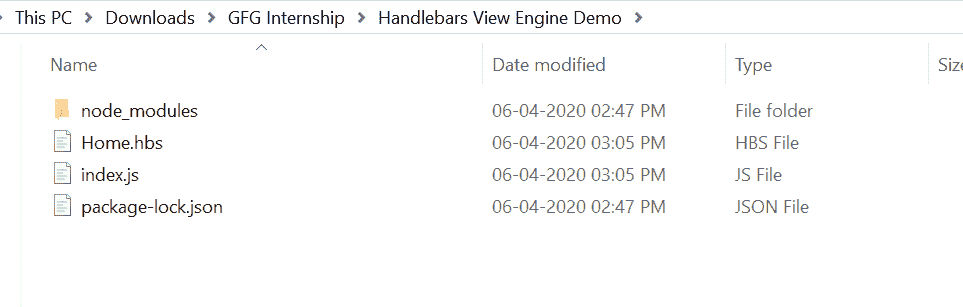
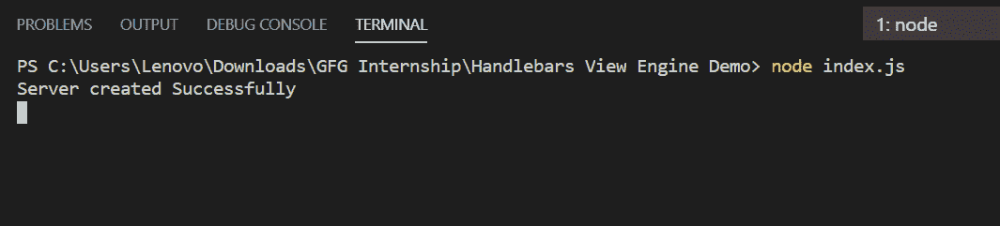
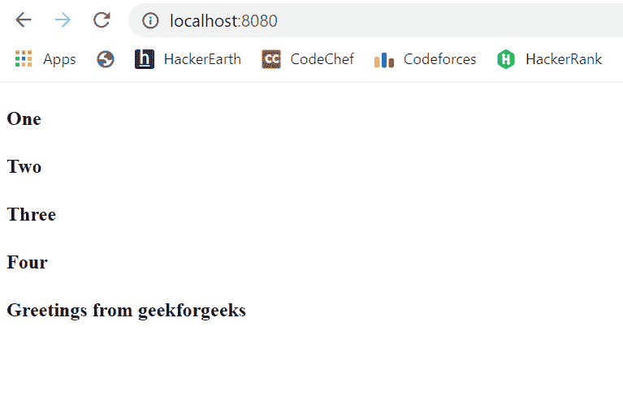

# 如何在 Node.js 中设置车把视图引擎？

> 原文:[https://www . geesforgeks . org/how-setup-handlers-view-engine-in-node-js/](https://www.geeksforgeeks.org/how-to-setup-handlebars-view-engine-in-node-js/)

车把是一个模板引擎，广泛使用，易于使用。这些页面包含。hbs 扩展，市场上还有很多其他的模板引擎，比如 EJS、小胡子等。

**HBS 模块安装:**

1.  您可以访问链接[安装 hbs 模块](https://www.npmjs.com/package/hbs)。您可以使用此命令安装此软件包。

    ```js
    npm install hbs
    ```

2.  安装 hbs 模块后，您可以使用命令在命令提示符下检查您的 hbs 版本。

    ```js
    npm version hbs
    ```

3.  之后，您可以创建一个文件夹并添加一个文件，例如 index.js。

    ```js
    node index.js
    ```

4.  要设置 hbs 视图引擎，您需要在您的 index.js 中编写这个中间件，如下所示:

    ```js
    app.set('views', path.join(__dirname))
    app.set('view engine', 'hbs')
    ```

5.  现在创建文件并运行代码。它会显示结果。

**文件名:Home.hbs**

```js
<!DOCTYPE html>
<html>
<head>
    <title>Handlebars Demo</title>
</head>
<body>

    <!-- For loop demo -->
    {{#each array}} 
      <h4>{{this}}</h4>
    {{/each}}
    <h4>{{message}}</h4>
</body>
</html>
```

**文件名:index.js**

```js
const express = require('express')
const path = require('path')
const hbs = require('hbs')
const app = express()

// View Engine Setup
app.set('views', path.join(__dirname))
app.set('view engine', 'hbs')

app.get('/', function(req, res){
    res.render('Home', {
       array: ['One', 'Two', 'Three', 'Four'],
       message: 'Greetings from geekforgeeks'
    })
})

app.listen(8080, function(error){
    if(error) throw error
    console.log("Server created Successfully")
})
```

**运行程序的步骤:**

1.  项目结构会是这样的:
    
2.  使用以下命令确保您已经安装了 hbs 和 express 模块:

    ```js
    npm install hbs
    npm install express
    ```

3.  Run index.js file using the following command:

    ```js
    node index.js
    ```

    

4.  打开浏览器，输入这个网址:*<u>http://localhost:8080/</u>*。然后你会看到首页如下所示:
    

这就是如何在 node.js 中设置 handlebar(HBS)视图引擎。