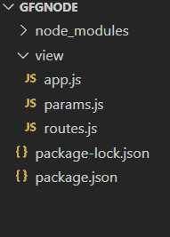

# 如何在 Node.js 中为 ExpressJS 路由器 url 设置 Regex？

> 原文:[https://www . geesforgeks . org/how-setup-regex-for-express js-router-URL-in-node-js/](https://www.geeksforgeeks.org/how-to-setup-regex-for-expressjs-router-url-in-node-js/)

**ExpressJS Router** 是一个充当中间件的类，用于提供路由处理或确定应用程序如何响应特定 URI 的各种 HTTP 方法的客户端请求。

**创建快递 App 并安装模块:**

**步骤 1:** 使用以下命令创建**包。**

```
npm init
```

**第二步:**可以访问[安装快递](https://www.npmjs.com/package/express)链接，查看如何安装快递模块。您可以使用以下命令安装此软件包:

```
npm install express
```

**步骤 3:** 在 ***视图*** 文件夹中创建***app . js******params . js***和 ***routes.js*** 文件。项目目录如下所示:



项目结构

#### 在网址中设置 Regex:

我们可以通过以下两点轻松地为我们的快速路由器设置 Regex:

*   为了使我们的路由与特定的正则表达式相匹配，我们可以将正则表达式放在两个正斜杠之间，如下所示***/<routeRegex>/***
*   由于每条路线都包含 **/** ，所以无论我们在 Regex 内部使用 **/** 的地方，都要在它之前使用反斜杠 ***\ /*** 。

**示例:**在下面的代码中，我们正在设置 regex，因为当收到 HTTP get 请求来路由 ***/home*** 时，会向客户端呈现一个响应*主页*。

```
router.get(/\/home/ , (req,res)=>{
    res.send('Homepage');
)
```

现在创建一个 ***routes.js*** 文件，该文件将包含使用 Regex 对不同路由的不同请求。

## routes.js

```
// Requiring module
const express = require('express');
const router = express.Router();

// Route which matches /abc or /adc
router.get(/\/a[b|d]c/, (req, res) => {
    res.send("<h1>Route First</h1");
})

// Routes that matches /a(any single digit)/ 
// followed by 2 times c or 3 times c or
// /a(any single digit) / followed by 2 
// times c or 3 times c
router.get(/\/a[0-9]\/c{2,3}/, (req, res) => {
    res.send("<h1>Route Second</h1");
})

// Routes that ends with /Hello followed by 
// a letter in [a-z] any no. of times and 
// ends with "OK" 
router.get(/^\/Hello[a-z]*OK$/, (req, res) => {
    res.send('<h1>Route Third</h1>')
})

// Routes that must end with string "Hello" 
// and can have any no. of any character 
// before that
router.get(/\/*Hello$/, (req, res) => {
    res.send('<h1>Route Fourth</h1>')
})

module.exports = router;
```

#### **在网址参数中设置正则表达式:**

要为网址参数设置正则表达式，我们可以在参数名称后面的括号内提供正则表达式。在下面的文件中，我们已经为网址参数实现了 Regex。

## params.js

```
// Requiring module
const express = require('express');
const router = express.Router();

// Setting up regex for name and contact parameters
router.get('/user/:name([a-zA-Z]+)/:contact([6-9][0-9]{9})', (req, res) => {
    const name = req.params.name;
    const contact = req.params.contact;
    res.send({
        "username": name,
        "contact": contact
    })
})

module.exports = router;
```

## app.js

```
// Requiring modules
const express = require('express');

const app = express();
const router = express.Router();

const route = require('./routes');
const param = require('./params');

// Using routers as middleware to
// use route.js and params.js
app.use('/', route);
app.use('/', param);

// Starting server on port 8000
app.listen(8000, () => {
    console.log("Server is listening on port 8000");
})
```

**运行应用程序的步骤:**使用以下命令运行 **app.js** 文件。

```
node app.js
```

**输出:**

*   显示在 ***routes.js*** 文件中定义的所有路由的功能。


routes.js 的执行

*   显示在 ***参数*** 文件中定义的路线的功能。


params.js 执行